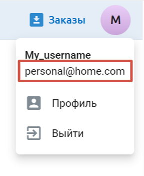
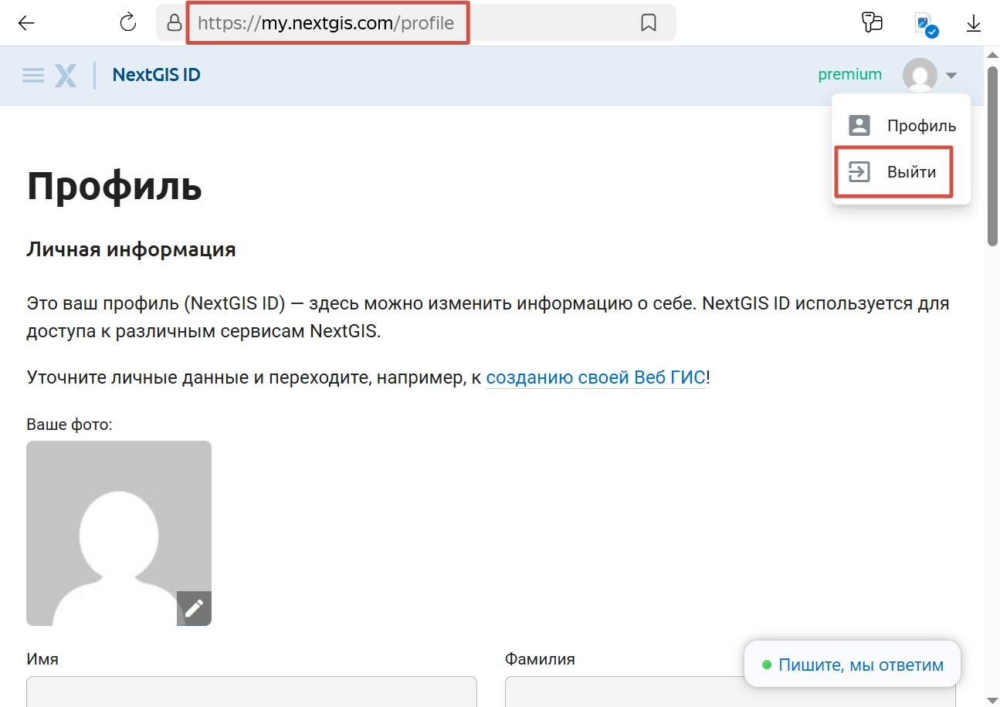
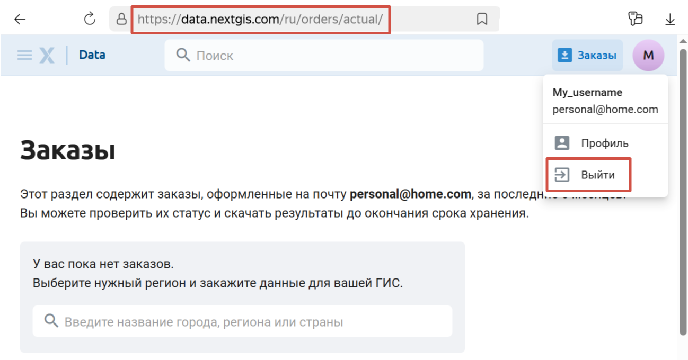
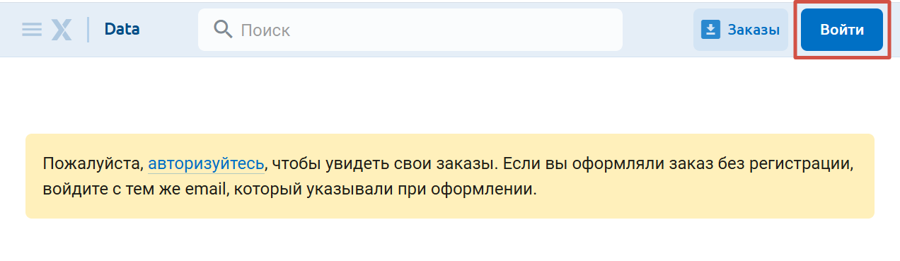
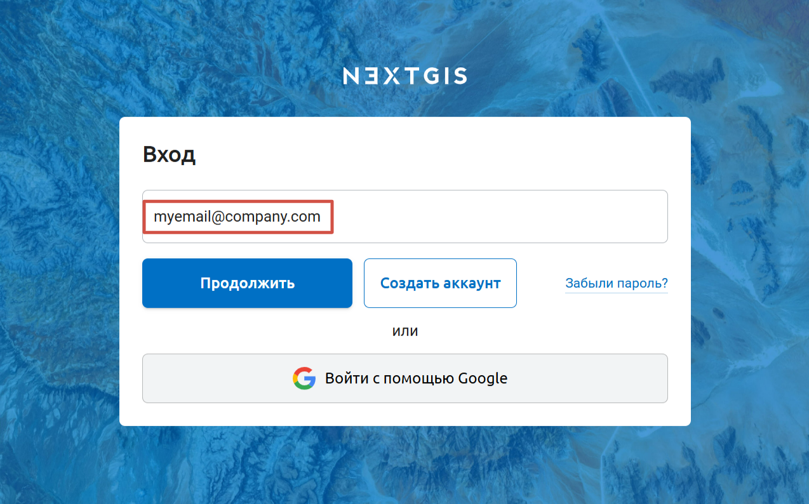
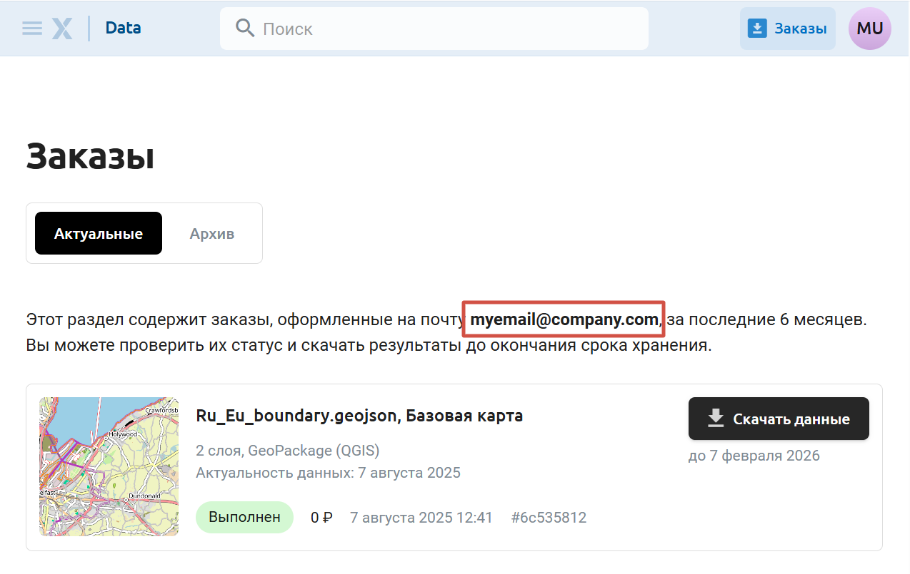

Как сменить аккаунт
======================

Если на странице заказов вы не видите своих заказов, возможно, вы вошли не под тем пользователем.

Заказы привязаны к конкретному адресу электронной почты. У вас может быть несколько аккаунтов NextGIS, но на странице Заказы можно скачать только те данные, которые были заказаны на адрес, использованный при входе.

Нажмите на аватар в правом верхнем углу. Отобразится адрес электронной почты, под которым вы авторизованы. Если это не тот адрес, на который вы заказывали данные, нужно выйти из аккаунта и войти в другой.

   Адрес электронной почты авторизованного пользователя

.. important:: Чтобы зайти с использованием другого адреса электронной почты, нужно выйти из аккаунта в двух местах: на сайте data.nextgis.com и в профиле на my.nextgis.com. Ниже этот процесс описан по шагам.

Чтобы сменить аккаунт, сделайте следующее:

1. В меню пользователя нажмите **Профиль**. Он откроется в новой вкладке. Нажмите на аватар в правом верхнем углу и выберите **Выйти**.

   Выход из аккаунта в профиле NextGIS ID

Откроется окно входа. Не вводите в него ничего. 

2. Вернитесь во вкладку, в которой открыт сайт data.nextgis.com, кликните по аватару и в меню пользователя также нажмите **Выйти**.

   Выход из аккаунта на data.nextgis.com

3. Теперь справа должна быть синяя кнопка **Войти**. Нажмите её. 

   Вход на сайте data.nextgis.com

Вы будете перенаправлены на страницу входа. Введите тот адрес электронной почты, на который заказывали данные.

   Ввод адреса электронной почты, на которой были заказаны данные.

Если у вас нет аккаунта на эту почту, нажмите **Создать аккаунт**. На указанный адрес будет выслан код подтверждния для регистрации. 

Если у вас уже есть аккаунт на эту почту, нажмите **Продолжить** и введите пароль от него.

Если у вас есть аккаунт NextGIS ID, но **нет пароля**, потому что ранее при регистрации был выбран вариант авторизации через Google, и вы заказали данные именно на эту почту @gmail.com, нажмите "Войти с помощью Google". 

4. На странице `Заказы <https://data.nextgis.com/ru/orders/actual/>`_ вы увидите список всех заказов, сделанных на указанную электронную почту. 

   Список заказов, сделанных на указанный адрес электронной почты

Здесь вы можете скачать данные, заказанные за последние шесть месяцев, а также повторить заказ.