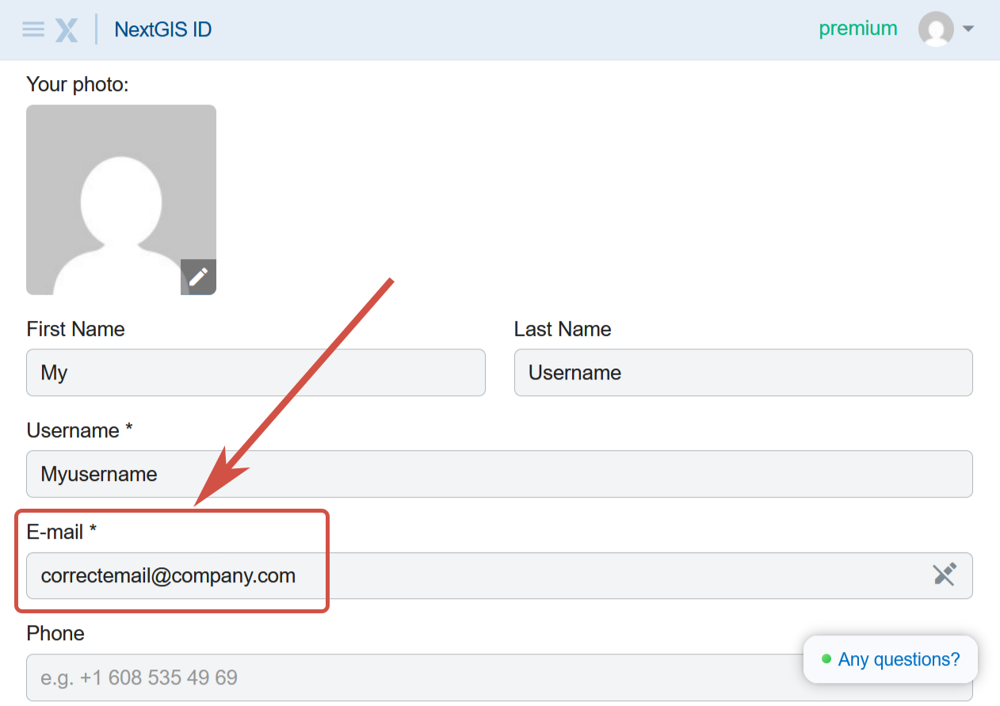

How to switch accounts
======================

If you don't see your orders on the Orders page, you may be logged in under a different account.

Click on the userpic in the top right corner. You'll see the email address used for the current logged in user. If it is not the email you entered while purchasing the data, you need to sign out and sign in with that email instead.

.. figure:: _static/check_user_en.png
   :name: check_user_pic
   :align: center
   :width: 7cm

   Email of the logged in user

To switch between accounts, complete the following steps:

1. On data.nextgis.com click **Sign out**.

.. figure:: _static/data_logout_en.png
   :name: data_logout_pic
   :align: center
   :width: 20cm

   Signing out at data.nextgis.com

2. Go to https://my.nextgis.com/profile. Click on the userpic in the top right corner and click **Sign out** again.

.. figure:: _static/my_logout_en.png
   :name: my_logout_pic
   :align: center
   :width: 20cm

   Signing out from NextGIS ID

3. You'll be redirected to the sign in page. Enter the email address you used to purchase data.

.. figure:: _static/my_login_en.png
   :name: my_login_pic
   :align: center
   :width: 20cm

   Entering the email used for the data order

If you already have an account with this email, click **Continue** and enter your password.

If you don't have an account with this email, click **Create account**. A confirmation code will be sent to your email to complete the registration. 

4. After authorization you are redirected to the profile page. Make sure that now you are signed in with the correct email.

   Email displayed in the user profile

5. Now to to https://data.nextgis.com/ru/orders/actual/. There should be a blue **Sign in** button in the top right corner. Click on it. You'll automatically log in with the email entered at my.nextgis.com.

.. figure:: _static/data_login_en.png
   :name: data_login_pic
   :align: center
   :width: 20cm

   Signing in on data.nextgis.com

6. On the Orders page you'll find the list of all the data purchased using that email address. 

.. figure:: _static/orders_correct_email_en.png
   :name: orders_correct_email_pic
   :align: center
   :width: 20cm

   List of orders made using the email adress indicated above

On this page you can download the data you ordered during the past six months or quickly repeat an older order.
