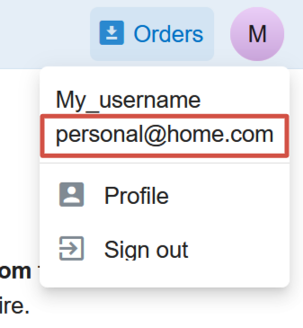
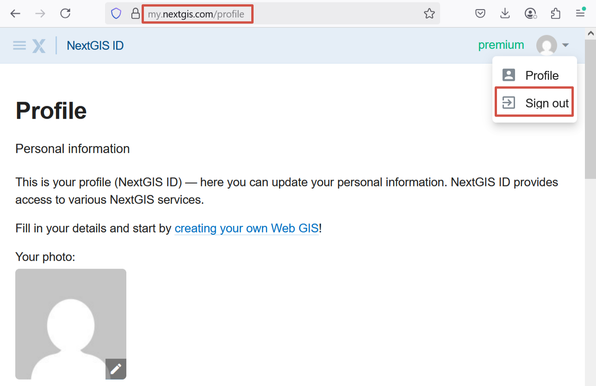
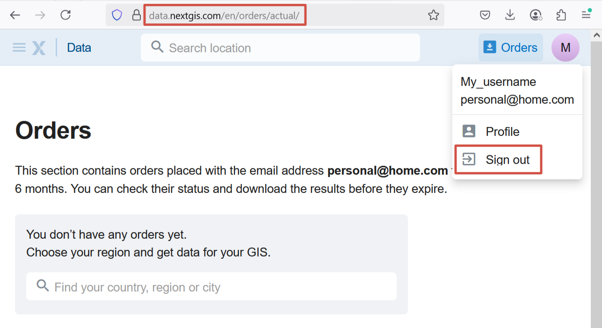
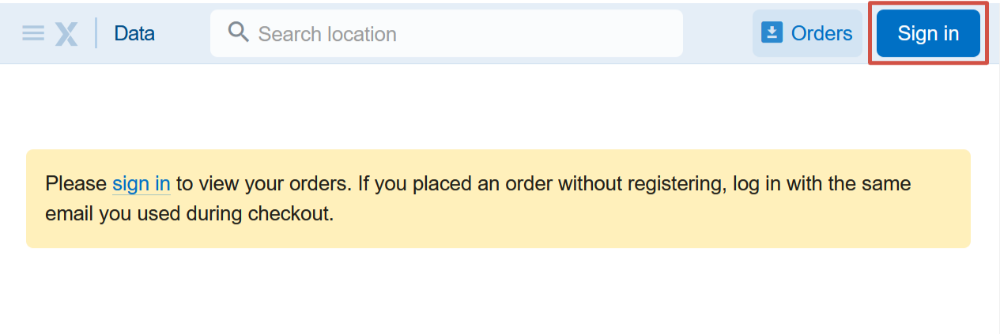
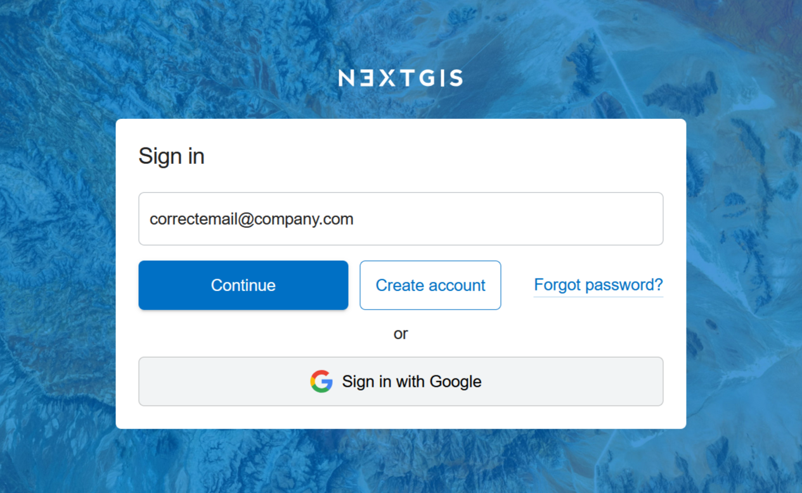
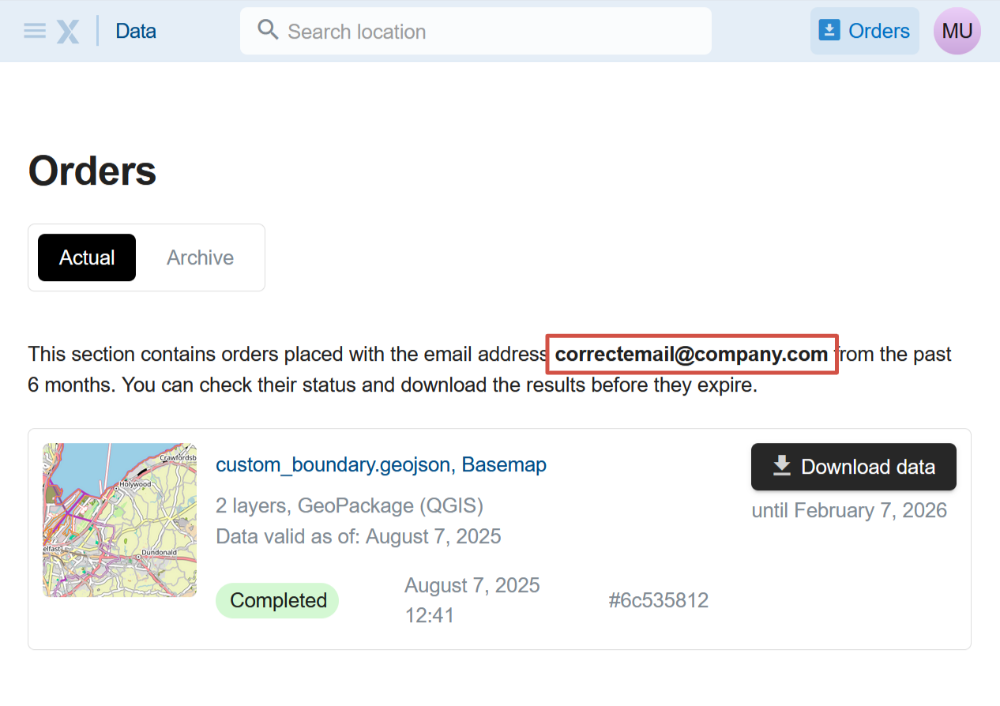

How to switch accounts
======================

If you don't see your orders on the Orders page, you may be logged in under a different account.

Orders are associated with the email used during the purchase. You can have multiple NextGIS accounts, but the Orders page only displays the data purchased to the email that is the login of the current user.

Click on the userpic in the top right corner. You'll see the email address used for the current logged in user. If it is not the email you entered while purchasing the data, you need to sign out and sign in with that email instead.

   Email of the logged in user

.. important:: To log in with a different email, you need to sing out on two pages: data.nextgis.com and your profile on my.nextgis.com. See the step-by-step instructions below.

To switch between accounts, complete the following steps:

1. In the user menu select **Profile**. It opens in a new tab. Click on the userpic in the top right corner and click **Sign out**.

   Signing out from NextGIS ID

A sing-in page opens. But DO NOT enter anything. 

2. Return to the tab where you have data.nextgis.com open. Click on the userpic and select **Sign out** in the user menu.

   Signing out at data.nextgis.com

3. There should be a blue **Sign in** button in the top right corner. Click on it. 

   Signing in on data.nextgis.com

You'll be redirected to the sign in page. Enter the email address you used to purchase data.

   Entering the email used for the data order

If you don't have an account with this email, click **Create account**. A confirmation code will be sent to your email to complete the registration. 

If you already have an account with this email, click **Continue** and enter your password.

If you have NextGIS ID, but **don't have a password**, because you've chosen to sign in with Google as you registered, and you've entered that @gmail.com email for your order, use the option "Sign in with Google". 

4. On the `Orders <https://data.nextgis.com/en/orders/actual/>`_ page you'll find the list of all the data purchased using that email address. 

   List of orders made using the email address indicated above

On this page you can download the data you ordered during the past six months or quickly repeat an older order.
