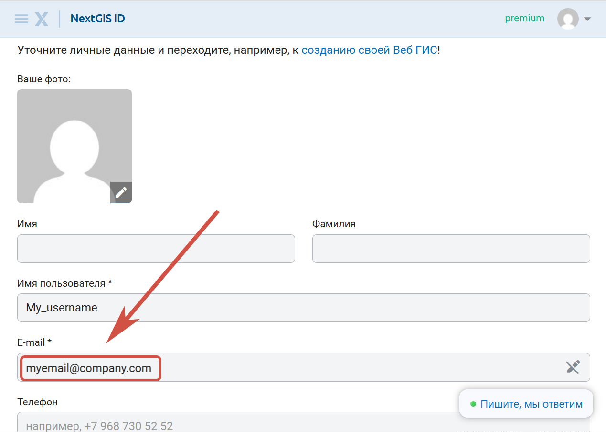

Как выйти из аккаунта
======================

Если на странице заказов вы не видите своих заказов, возможно, вы вошли не под тем пользователем.

Нажмите на аватар в правом верхнем углу. Отобразится адрес электронной почты, под которым вы авторизованы. Если это не тот адрес, на который вы заказывали данные, нужно выйти из аккаунта и войти в другой.

.. figure:: _static/check_user_ru.png
   :name: check_user_pic
   :align: center
   :width: 7cm

   Пользователь авторизован под личным аккаунтом вместо рабочего

Чтобы сменить аккаунт, сделайте следующее:

1. На сайте data.nextgis.com нажмите **Выйти**.

.. figure:: _static/data_logout_ru.png
   :name: data_logout_pic
   :align: center
   :width: 20cm

   Выход из аккаунта на data.nextgis.com

2. Перейдите на https://my.nextgis.com/profile. Нажмите на аватар в правом верхнем углу и снова нажмите **Выйти**.

.. figure:: _static/my_logout_ru.png
   :name: my_logout_pic
   :align: center
   :width: 20cm

   Выход из аккаунта в профиле NextGIS ID

3. Вы будете перенаправлены на страницу входа. Введите тот адрес электронной почты, на который заказывали данные.

.. figure:: _static/my_login_ru.png
   :name: my_login_pic
   :align: center
   :width: 20cm

   Ввод адреса электронной почты, на которой были заказаны данные.

Если у вас уже есть аккаунт на эту почту, нажмите **Продолжить** и введите пароль от него.

Если у вас нет аккаунта на эту почту, нажмите **Создать аккаунт**. На указанный адрес будет выслан код подтверждния для регистрации. 

4. После авторизации вы снова попадёте на страницу профиля. Проверьте, что теперь вы авторизованы под нужным адресом электронной почты.

   Емейл пользователя, отображаемый в профиле

5. Теперь перейдите на https://data.nextgis.com/ru/orders/actual/. Справа должна быть синяя кнопка **Войти**. Нажмите её. Вы будете авторизованы.

.. figure:: _static/data_login_ru.png
   :name: data_login_pic
   :align: center
   :width: 20cm

   Вход на сайте data.nextgis.com

6. На странице заказов вы увидите список всех заказов, сделанных на указанную электронную почту. 

.. figure:: _static/orders_correct_email_ru.png
   :name: orders_correct_email_pic
   :align: center
   :width: 20cm

   Список заказов, сделанных на указанный адрес электронной почты

Здесь вы можете скачать данные, заказанные за последние шесть месяцев, а также повторить заказ.