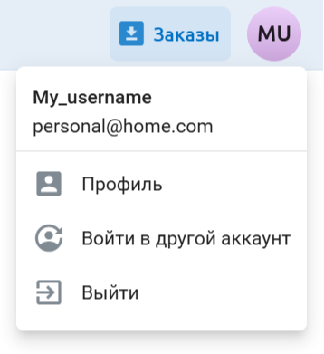

Как сменить аккаунт
======================

Если на странице заказов вы не видите своих заказов, возможно, вы вошли не под тем пользователем.

Заказы привязаны к конкретному адресу электронной почты. У вас может быть несколько аккаунтов NextGIS, но на странице Заказы можно скачать только те данные, которые были заказаны на адрес, использованный при входе.

Нажмите на аватар в правом верхнем углу. Отобразится адрес электронной почты, под которым вы авторизованы. 

   Адрес электронной почты авторизованного пользователя

Если это не тот адрес, на который вы заказывали данные, нажмите **Войти в другой аккаунт**.

Вы будете перенаправлены на страницу входа. Введите тот адрес электронной почты, на который заказывали данные.

.. figure:: _static/my_login_ru.png
   :name: my_login_pic
   :align: center
   :width: 20cm

   Ввод адреса электронной почты, на которой были заказаны данные.

* Если у вас нет аккаунта на эту почту, нажмите **Создать аккаунт**. На указанный адрес будет выслан код подтверждния для регистрации. 

* Если у вас уже есть аккаунт на эту почту, нажмите **Продолжить** и введите пароль от него.

* Если у вас есть аккаунт NextGIS ID, но **нет пароля**, потому что ранее при регистрации был выбран вариант авторизации через Google, и вы заказали данные именно на эту почту @gmail.com, нажмите "Войти с помощью Google". 

На странице `Заказы <https://data.nextgis.com/ru/orders/actual/>`_ вы увидите список всех заказов, сделанных на указанную электронную почту. 

.. figure:: _static/orders_correct_email_ru.png
   :name: orders_correct_email_pic
   :align: center
   :width: 20cm

   Список заказов, сделанных на указанный адрес электронной почты

Здесь вы можете скачать данные, заказанные за последние шесть месяцев, а также повторить заказ.