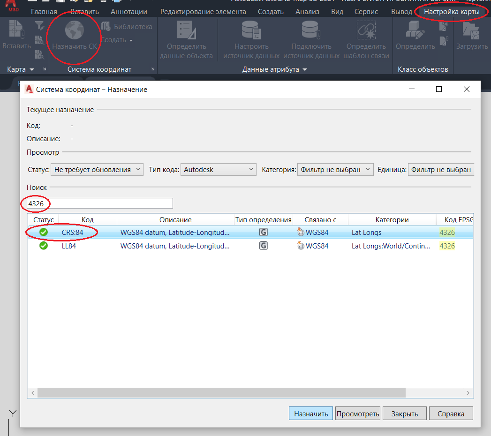
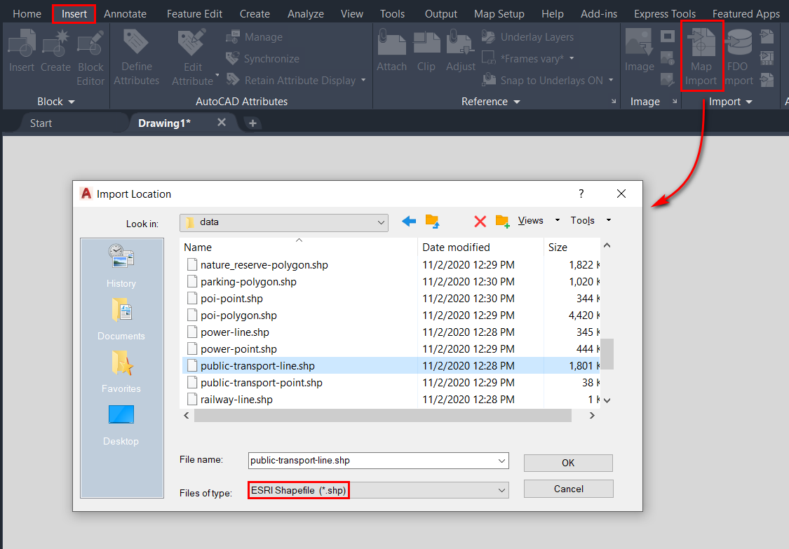
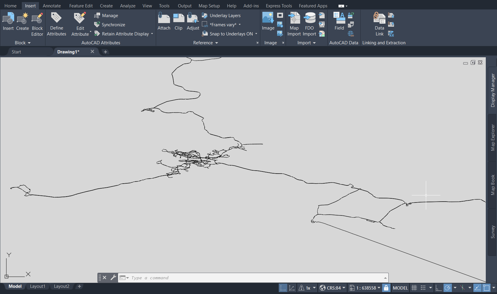

.. _data_map3d:

How to add a layer in AutoCAD Map 3D
===========================

* `Order data <https://data.nextgis.com/en/>`_ for your area of interest in Shape (QGIS) format.
* Wait for an email with the download link. Download and unpack the data.
* Launch AutoCAD Map 3D, select the "Map Setup" tab > "Assign" (Coordinate system), in pop-up window in the search bar enter the EPSG code - 4326 and select CRS:84 coordinate system from the suggested results.

* Select the tab "Insert" > "Map Import". In pop-up window from the drop-down list select the "Files of type" - ESRI Shapefile (*.shp) and choose the layer of interest.

* The layer will be added to the AutoCAD Map 3D workspace. 

