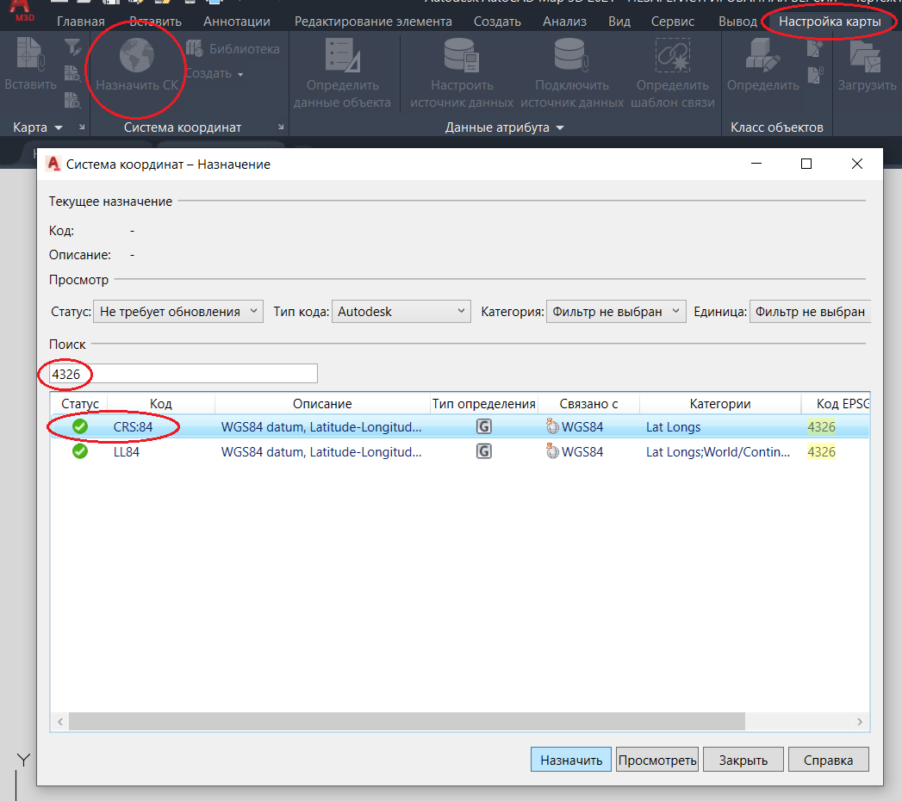
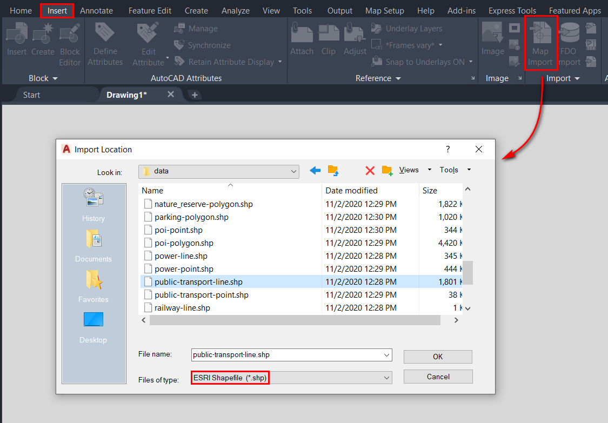

.. _data_map3d:

How to add a layer in AutoCAD Map 3D
======================================

* `Order data <https://data.nextgis.com/en/>`_ for your area of interest in GeoPackage (QGIS) format.
* Go to the `orders <https://data.nextgis.com/en/orders/actual/>`_ page and download the archive when it's complete.
* **Unpack** the archive.
* Launch AutoCAD Map 3D, select the "Map Setup" tab > "Assign" (Coordinate system), in pop-up window in the search bar enter the EPSG code - 4326 and select CRS:84 coordinate system from the suggested results.

* Select the tab "Insert" > "Map Import". In pop-up window from the drop-down list select the correct format "Files of type" - GeoPackage (\*.gpkg) and choose the layer of interest.

* The layer will be added to the AutoCAD Map 3D workspace. 

.. figure:: _static/map3d3.png
   :name: map3d3
   :align: center
   :width: 16cm
