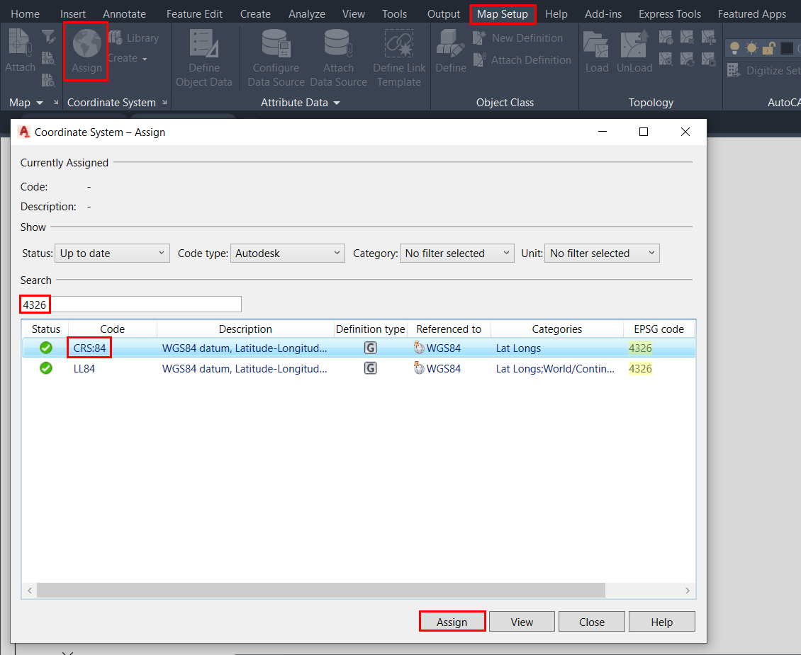

.. _data_map3d:

Как добавить слой в AutoCAD Map 3D
===========================

* `Закажите данные <https://data.nextgis.com/ru/>`_ на интересующую Вас территорию в формате ESRI Shape.
* Дождитесь получения результата, скачайте, распакуйте архив с данными.
* Запустите AutoCAD Map 3D, выберите вкладку «Настройка карты» > «Назначить СК», в открывшемся окне в строке поиска введите код EPSG - 4326 и из предложенных результатов выберите систему координат CRS:84.

* Выберите вкладку «Вставить» > «Импорт» > «Импорт карты».

.. figure:: _static/map3d2.png
   :name: map3d2
   :align: center
   :width: 16cm

* В открывшемся окне в выпадающем списке установите «Тип файла» - ESRI Shapefile (*.shp) и выберите интересующий слой.

* Слой добавлен в рабочее пространство AutoCAD Map 3D.

