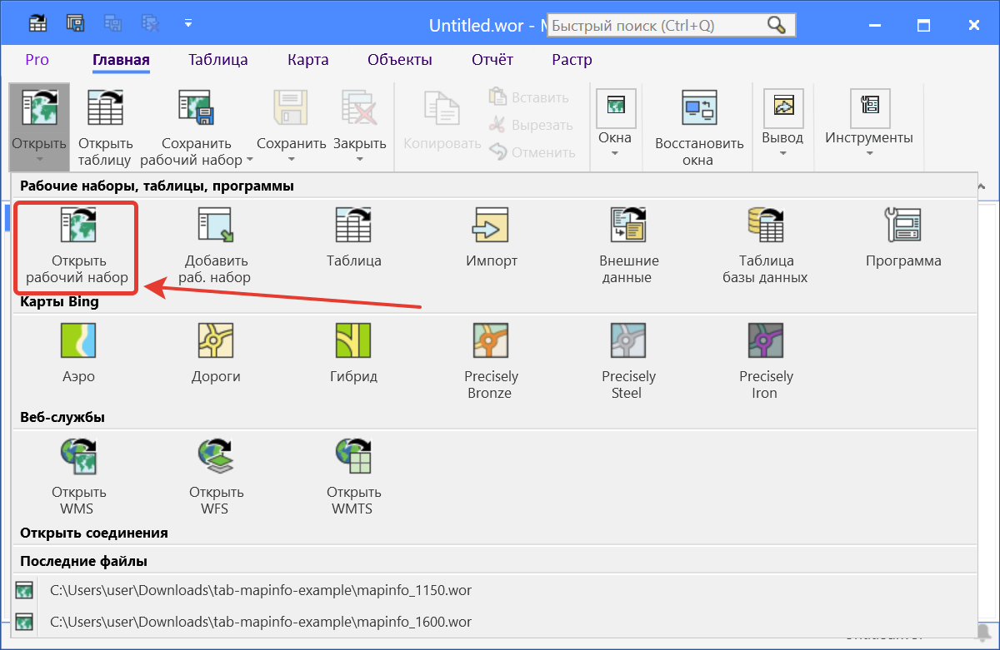
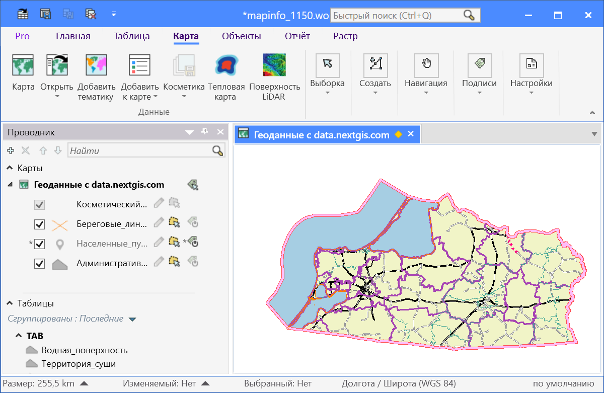

.. sectionauthor:: Юлия Григоренко <grigorenko.j@gmail.com>

.. _data_mapinfo:

Как открыть проект базовой карты в Mapinfo
===========================================

* `Закажите данные <https://data.nextgis.com/ru/>`_ на интересующую Вас территорию в формате MapInfo TAB.
* Дождитесь получения результата, скачайте, распакуйте архив с данными.
* Запустите MapInfo, нажмите «Другой набор» в стартовом окне или выберите в основном окне программы ``Главная ‣ Открыть ‣ Открыть рабочий набор`` и выберите файл в формате .wor.

   
   Открытие проекта

* Проект открыт в программе.

   
   Проект базовой карты в рабочем окне программы MapInfo
