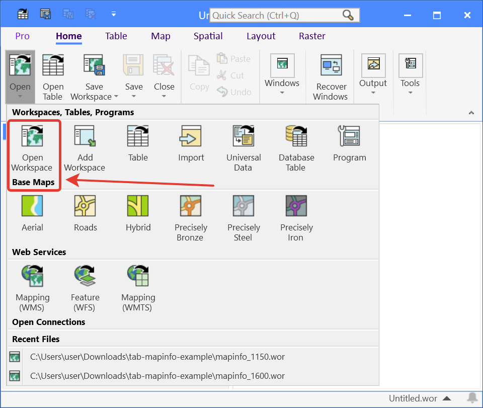
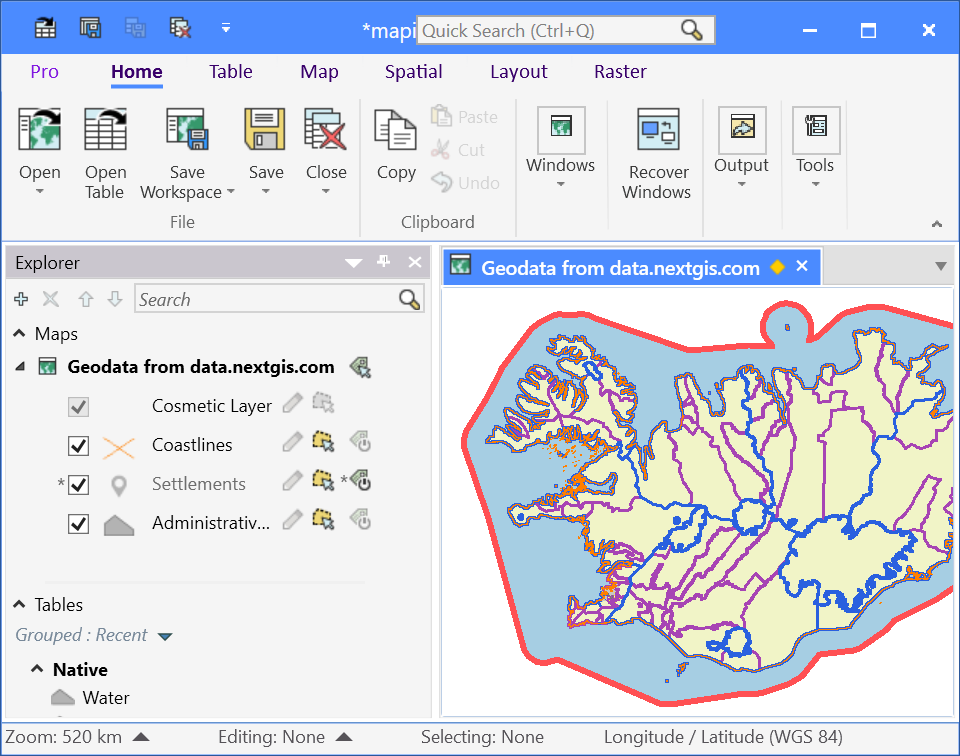

.. sectionauthor:: Юлия Григоренко <grigorenko.j@gmail.com>

.. _data_mapinfo:

How to open your project in MapInfo
===========================================

*  `Order data <https://data.nextgis.com/en/>`_ for your area of interest in MapInfo TAB format.
* Wait for an email with the download link. Download and unpack the data.
* Launch MapInfo, press “Other workspaces” in the start window or select ``Home ‣ Open ‣ Open workspace`` and choose a .wor file.

   
   Opening the project

* Your project is opened in the program.

   
   Basemap project in the MapInfo main window
