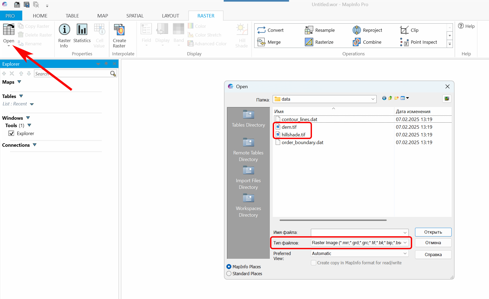

Как открыть растр в MapInfo
=============================

Растровые файлы в продуктах Рельеф, Космоснимки и Ландшафты имеют тип данных Int16, который поддерживаются в версиях MapInfo 15.2 и выше. Теневая отмывка рельефа содержит данные в формате Byte и может быть открыта в MapInfo 15.0.

Чтобы открыть растровый файл, нажмите **Открыть**, затем установите тип файлов "растровое изображение" / "raster image" и выберите нужный.

   Выбор растровых файлов

Файлы будут добавлены в программу. 

.. figure:: _static/mapinfo_opened_dem_ru.png
   :name: mapinfo_opened_dem_pic
   :align: center
   :width: 20cm

   Данные рельефа в программе MapInfo