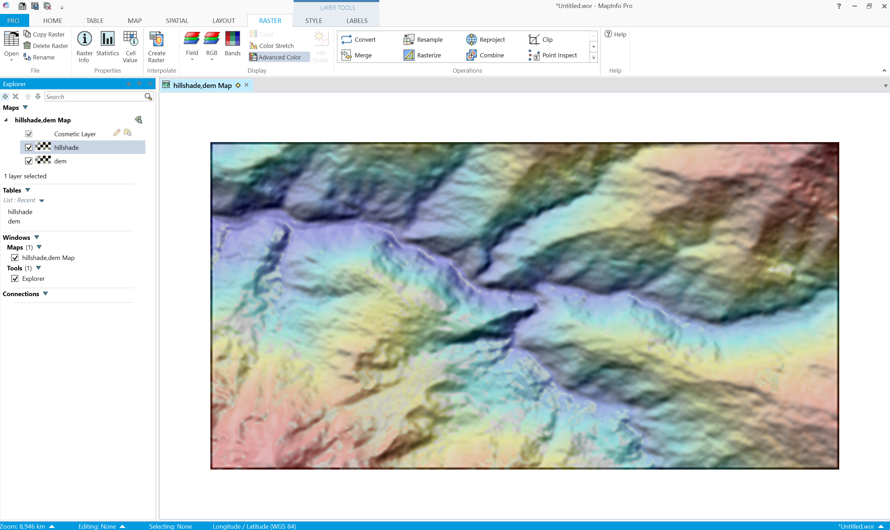

How to open raster data in MapInfo
====================================

Raster data in Elevation, Satellite and Landcover datasets is Int16 which is supported by MapInfo 15.2 and up. Hillshade has Byte format so can also be opened in MapInfo 15.0.

To open a raster file click **Open**, then select the file type "Raster image" and select the file(s).

   Selecting raster file

   Elevation raster data in MapInfo