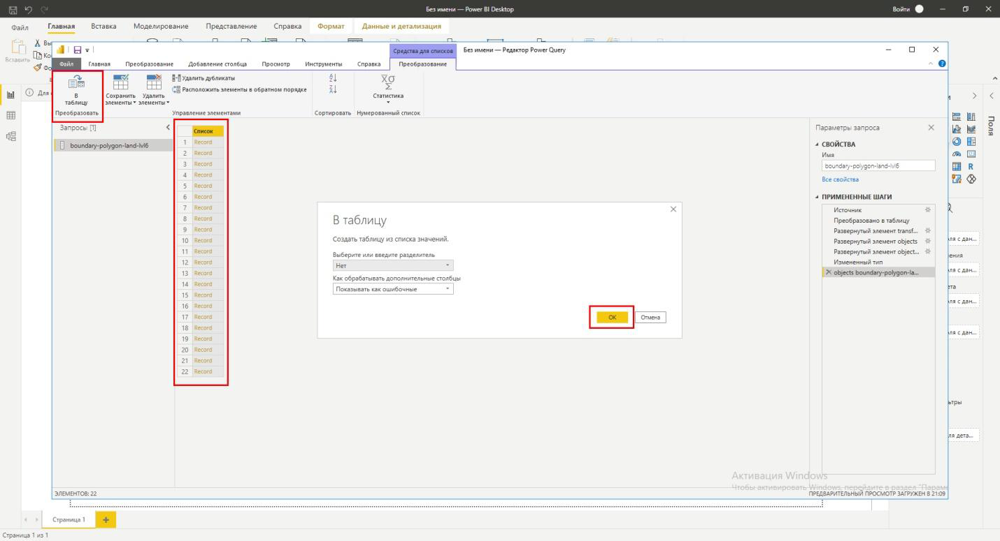
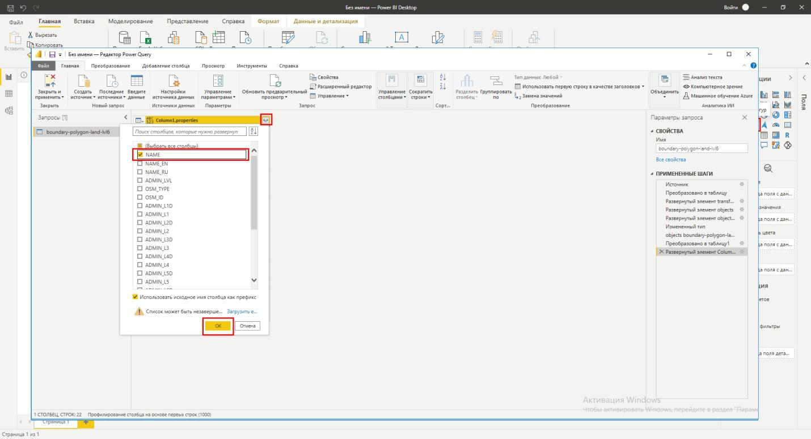
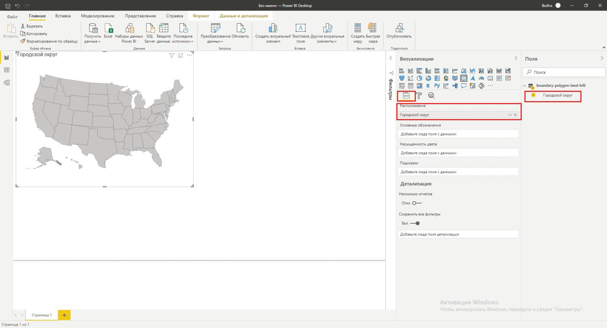

.. _data_power_bi:

Как загрузить данные в Microsoft Power BI
==========================================

* `Закажите данные <https://data.nextgis.com/ru/>`_ на интересующую Вас территорию, например, в формате GeoJSON.
* Дождитесь получения результата, скачайте, распакуйте архив с данными.
* Конвертируйте желаемый слой в формат **TopoJSON**. Для конвертации воспользуйтесь онлайн конвертером `MapShaper <https://mapshaper.org/>`_.
* В начале работы с Power BI необходимо подключить способ визуализации **Shaрe Map** (Карта фигур в российской версии). 
  Для этого в выпадающем меню **Файл** перейти последовательно в **Параметры и настройк** - **Параметры**. 
  Слева выбрать пункт **Предварительные версии возможностей** и справа отметить опцию **Визуальный элемент Карта фигур**.
  

   
   
* В основном окне Отчета слева выберите иконку способа визуализации **Карта фигур**. В окне Отчета появится окно для визуализации карты.

.. figure:: _static/BI2.png
   :name: BI2
   :align: center
   :width: 16cm
   
* Теперь необходимо добавить полученный ранее файл TopoJSON. Для этого в верхней панели последовательно выбрать **Получить данные** - **Другие** - **JSON** и 
  нажать внизу кнопку **Подключить**. В открывшемся окне выбрать ранее преобразованный файл и открыть его.
  

   
* После загрузки данных вы будете перенаправлены в окно редактора запросов. В котором  необходимо преобразовать загруженные данные для визуализации. 
  В таблице данных выбираете **список объектов** и дважды кликаете, чтобы открыть его.

* Выбранный список объектов нужно преобразовать в таблицу.

* В получившейся таблице проводите настройку элементов для визуализации. В верхней части таблицы нажимаете на **двойную стрелку**.
  В выпадающем списке выбираете **properties**. Нажимаете *ОК*
  

   
* В таблице свойств данных опять нажимаете на **двойную стрелку**. В выпадающем списке выбираете желаемые атрибуты для визуализации. Нажимаете *OК*

* На следующем шаге при желании можете переименовать название атрибута.
  После этого применяете и сохраняете все преобразования, нажимая кнопку в левом верхнем углу редактора запросов.

   
* Данные подготовлены. Теперь можете их визуализировать. В разделе **Поля** справа отмечаете выбранное и подготовленное на предыдущих этапах поле.
  Оно автоматически подгружается в подменю *Расположение* в разделе *Визуализация*. Но в окне визуализации подгружена карта по умолчанию.
  

   
* Вам необходимо подгрузить вашу собственную карту в формате TopoJSON. В разделе **Визуализация** заходите в подменю **Формат**. 
  Там в разделе **Фигура** нажимаете **Добавить сопоставление** и подгружаете подготовленную карту в формате TopoJSON

.. figure:: _static/BI0.png
   :name: BI10
   :align: center
   :width: 16cm

* Карта загружена.

