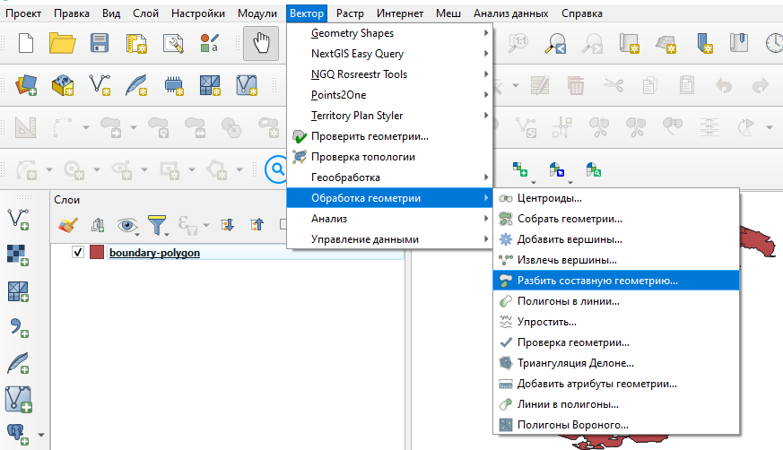
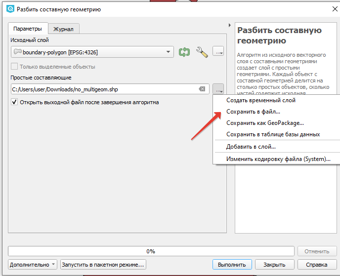

.. _data_multi_to_polygon:

Как превратить мультиполигоны в полигоны
=========================================

* `Закажите данные <https://data.nextgis.com/ru/>`_ на интересующую Вас территорию, например, в формате GeoJSON.
* Дождитесь получения результата, скачайте, распакуйте архив с данными.
* Откройте слой, геометрию которого вы хотите изменить с мультиполигонов на полигоны (в качестве примера далее рассмотрена работа в `NextGIS QGIS <https://nextgis.ru/nextgis-qgis/>`_).
* В верхнем меню выберите Вектор > Обработка геометрии > Разбить составную геометрию.

* Выберите из списка нужный слой.
* Во втором поле выберите пункт *Сохранить в файл* и укажите локальный путь для сохранения.

* Нажмите *Выполнить*
