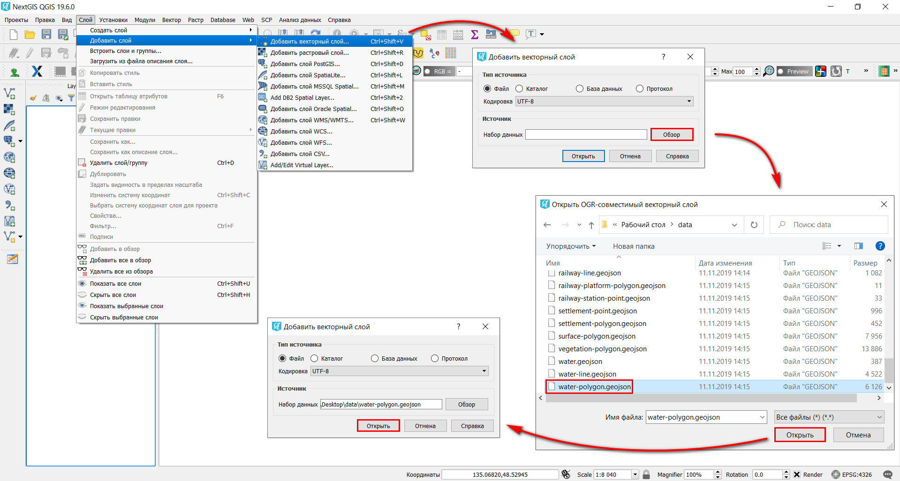
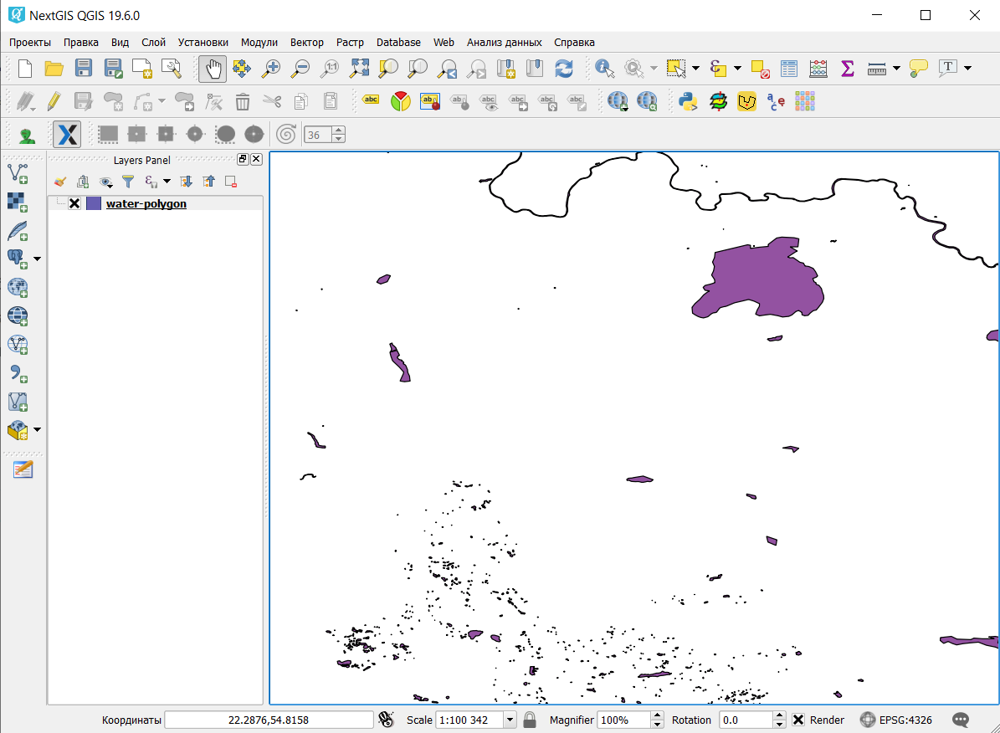
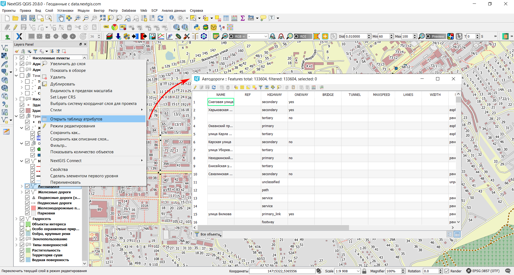

.. _data_open_layer:

Как открыть нужный слой
=======================

* `Закажите данные <https://data.nextgis.com/ru/>`_ на интересующую Вас территорию в формате Geopackage.
* Дождитесь получения результата, `скачайте <https://data.nextgis.com/ru/orders/actual/>`_ и **распакуйте** архив с данными.
* Скачайте и установите `NextGIS QGIS <https://nextgis.ru/nextgis-qgis/>`_, можно также использовать обычный QGIS.
* Чтобы открыть слой данных, запустите QGIS и в главной панели меню выберите «Слой» > «Добавить слой» > «Добавить векторный слой». В открывшемся окне перейдите в папку, куда вы распаковали данные, и выберите нужный слой. Посмотреть, что означают названия файлов, можно `тут <https://docs.google.com/spreadsheets/d/1F83dtRH8c7O83E55ox3Kfh8Ibbh2TFL70nF5Iw_33d0/edit?usp=sharing/>`_.

* Слой будет добавлен в QGIS и готов к работе.

   
* Для просмотра атрибутов определенного слоя, щелкните по нему правой кнопкой мыши и в контекстном меню выберите «Открыть таблицу атрибутов». Откроется окно с атрибутами (характеристиками) объектов, принадлежащих слою. Ознакомиться с перечнем атрибутов для всех слоев можно |location_link|.

.. |location_link| raw:: html

   <a href="https://docs.google.com/spreadsheets/d/1F83dtRH8c7O83E55ox3Kfh8Ibbh2TFL70nF5Iw_33d0/edit#gid=1897387324" target="_blank">здесь</a>

