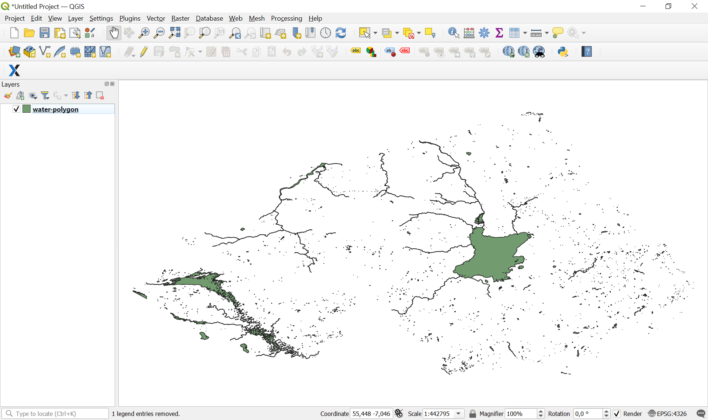

.. _data_open_layer:

How to open a particular layer
==============================

* `Order data <https://data.nextgis.com/en/>`_ for your area of interest in ESRI Shape format (QGIS).
* Wait for an email with the download link. Download and unpack the data.
* Download and install `QGIS <https://qgis.org/en/site/forusers/download.html>`_ or `NextGIS QGIS <https://nextgis.com/nextgis-qgis/>`_.
* To open the particular layer, start NextGIS QGIS and from the main menu bar select "Layer" > "Add Layer" > "Add Vector Layer". In pop-up window go to the folder where you unpacked the archive with the data and select the necessary layer. You can check `here <https://docs.google.com/spreadsheets/d/1F83dtRH8c7O83E55ox3Kfh8Ibbh2TFL70nF5Iw_33d0/edit#gid=906616778>`_ what the file names mean.

   
* The layer will be added to QGIS and ready to go. 

   
* To view the attributes of a specific layer, right-click on it and select "Open Attribute Table" from the context menu. A window with the attributes (characteristics) of the objects belonging to the layer will appear. See the list of attributes for all layers |location_link|.

.. |location_link| raw:: html

   <a href="https://docs.google.com/spreadsheets/d/1F83dtRH8c7O83E55ox3Kfh8Ibbh2TFL70nF5Iw_33d0/edit#gid=906616778" target="_blank">here</a>
   

