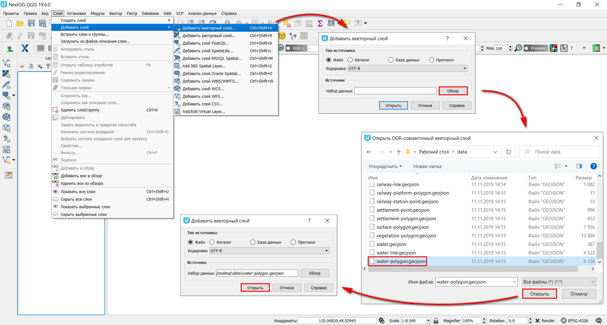
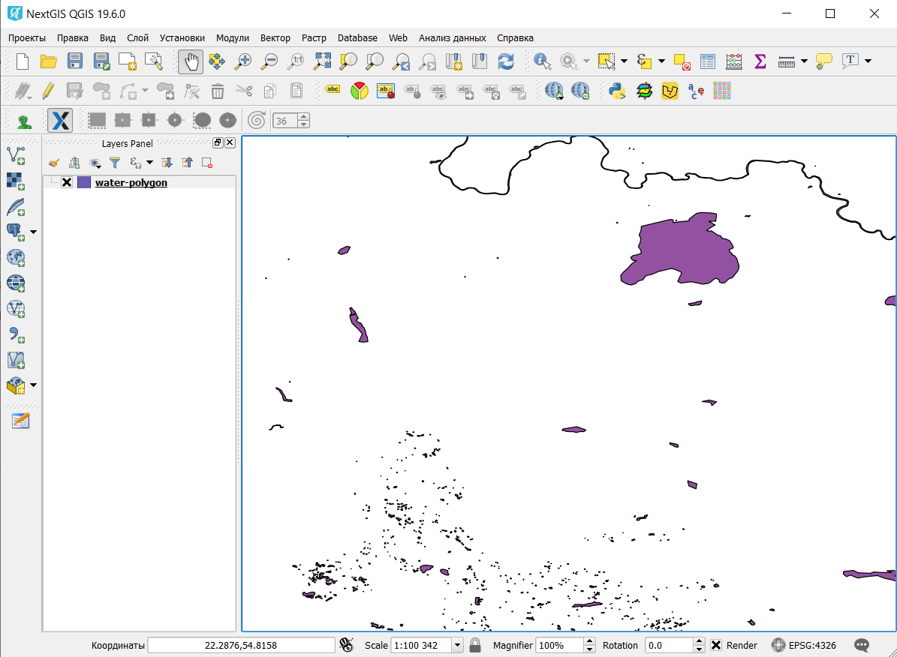

.. _data_open_map:

Как открыть карту
===========================

* `Закажите данные <https://data.nextgis.com/ru/>`_ на интересующую Вас территорию в формате GeoJSON.
* Дождитесь получения результата, скачайте, распакуйте архив с данными.
* Скачайте и установите настольное приложение `NextGIS QGIS <https://nextgis.ru/nextgis-qgis/>`_.
* Запустите приложение NextGIS QGIS. Чтобы открыть готовый ГИС-проект (включает все слои с настроенными стилями), нажмите “Проекты” > “Открыть” и в появившемся окне выберите сохраненный файл “data.qgs”.

.. figure:: _static/open_map1.png
   :name: open_map1
   :align: center
   :width: 16cm

* Проект будет добавлен в NextGIS QGIS; данные готовы к работе.

.. figure:: _static/open_map2.png
   :name: open_map2
   :align: center
   :width: 16cm

* Чтобы открыть отдельно один или несколько слоев, запустите приложение NextGIS QGIS и в главной панели меню выберите “Слой” > “Добавить слой” > “Добавить векторный слой”. В открывшемся окне выберите один из сохраненных ранее слоев в формате GeoJSON.

* Слой будет добавлен в NextGIS QGIS и готов к работе.

