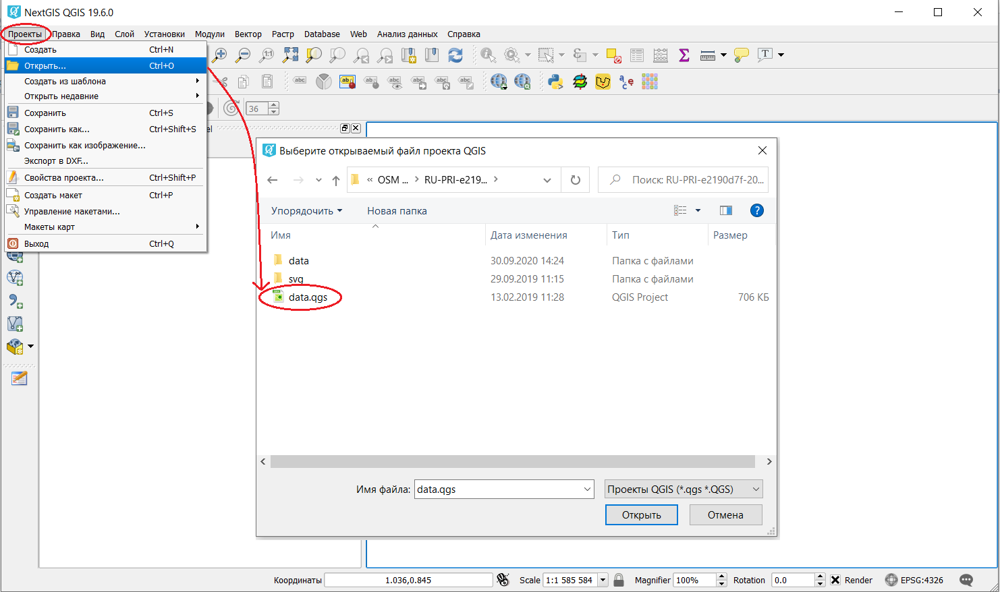
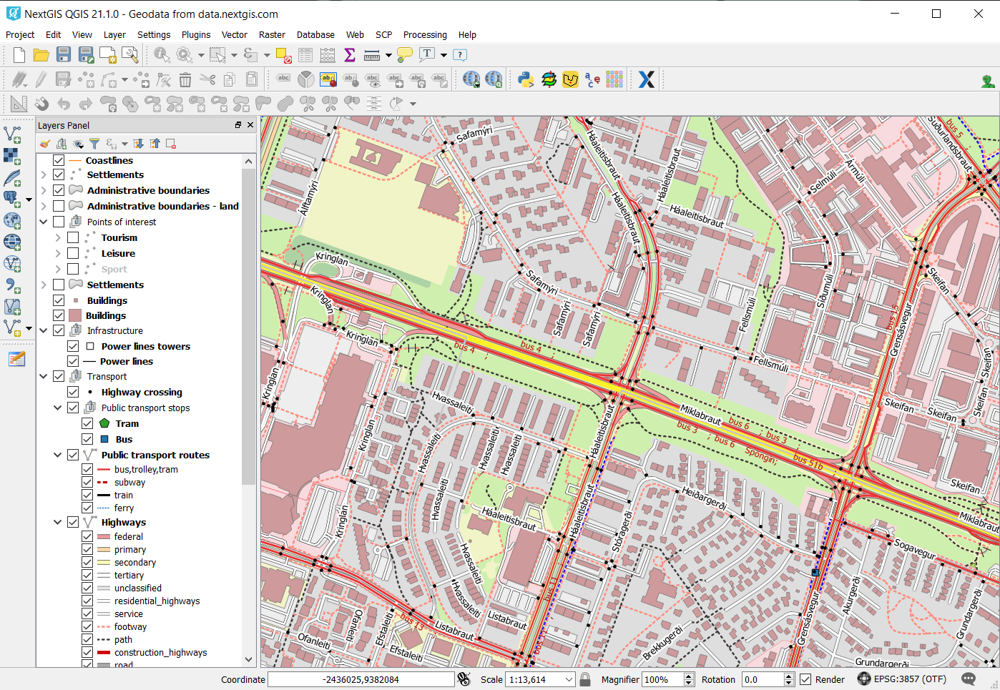

.. _data_open_map:

Как открыть карту (проект) целиком
==================================

* `Закажите данные <https://data.nextgis.com/ru/>`_ на интересующую Вас территорию в формате ESRI Shape (QGIS).
* Дождитесь получения результата, скачайте, распакуйте архив с данными.
* Скачайте и установите `NextGIS QGIS <https://nextgis.ru/nextgis-qgis/>`_.
* Запустите NextGIS QGIS. Чтобы открыть готовый ГИС-проект (включает все слои с настроенными стилями), нажмите «Проекты» > «Открыть» и в появившемся окне выберите сохраненный файл «data.qgs».

* Проект будет добавлен в NextGIS QGIS; данные готовы к работе.

