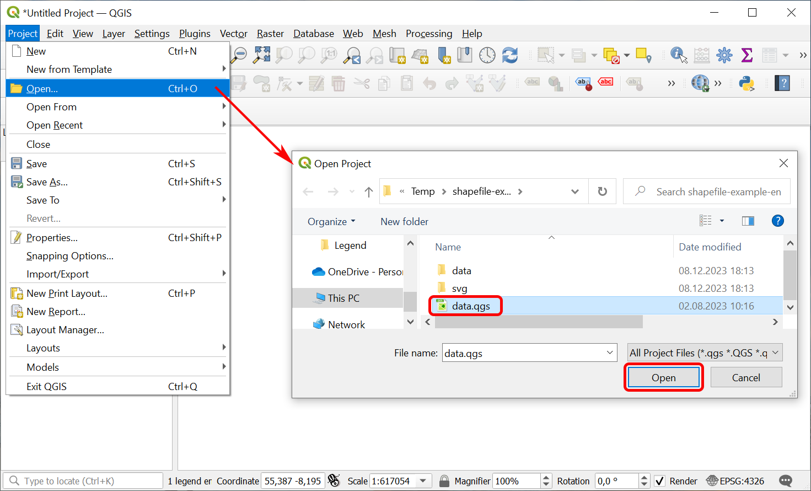
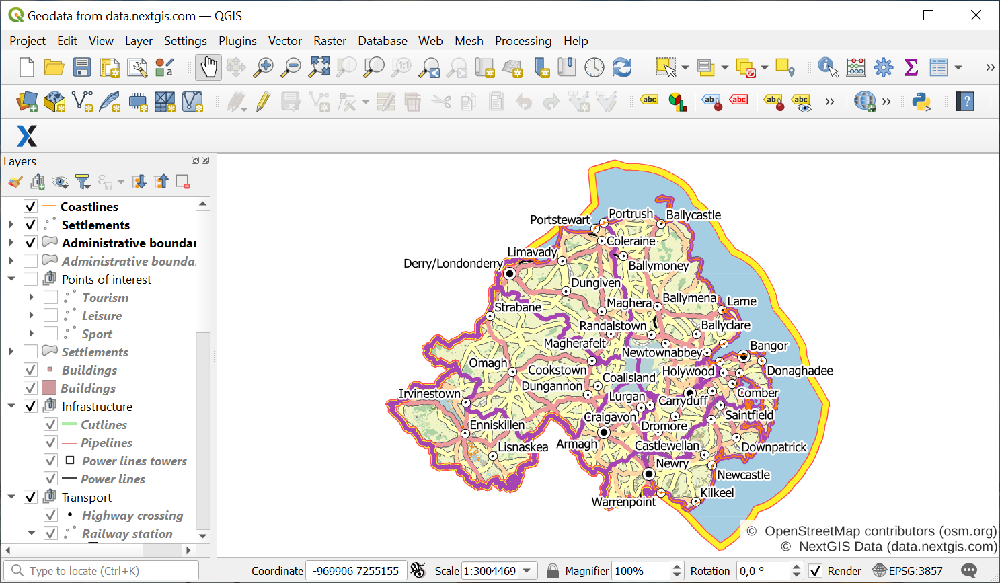

.. _data_open_map:

How to open the entire map (project)
====================================

* `Order data <https://data.nextgis.com/en/>`_ for your area of interest in ESRI Shape format (QGIS).
* Wait for an email with the download link. Download and unpack the data.
* Download and install `QGIS <https://qgis.org/en/site/forusers/download.html>`_ or `NextGIS QGIS <https://nextgis.com/nextgis-qgis/>`_.
* Launch QGIS. To open a preset GIS project (which includes all layers with customized styles), click "Project" > "Open" and in pop-up window select the saved file "data.qgs".

   
* The project will be added to QGIS; data is ready to go.

