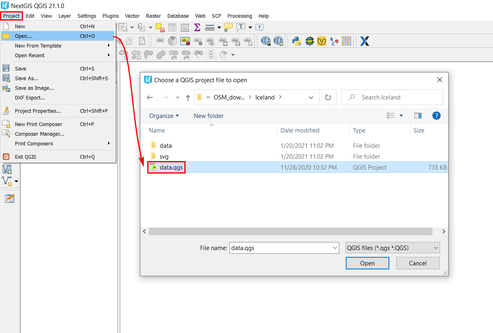
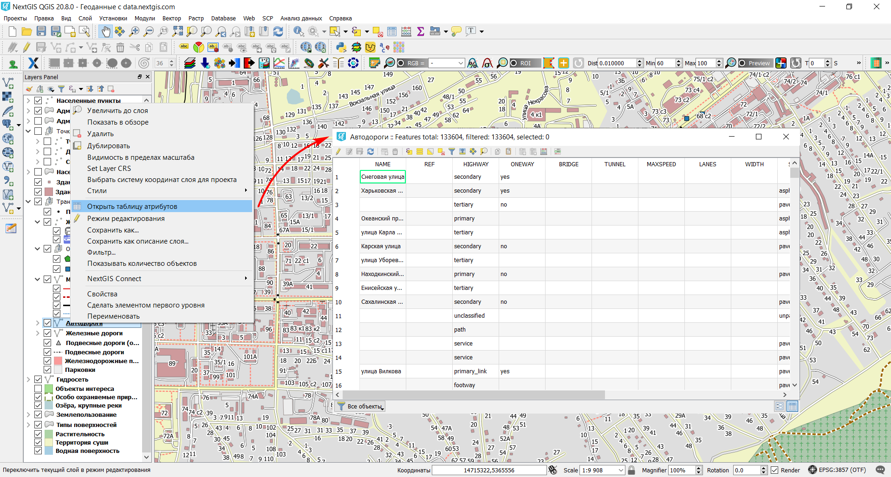

.. _data_open_map:

Как открыть карту (проект) целиком
==================================

* `Закажите данные <https://data.nextgis.com/ru/>`_ на интересующую Вас территорию в формате ESRI Shape (QGIS).
* Дождитесь получения результата, скачайте, распакуйте архив с данными.
* Скачайте и установите `NextGIS QGIS <https://nextgis.ru/nextgis-qgis/>`_.
* Запустите NextGIS QGIS. Чтобы открыть готовый ГИС-проект (включает все слои с настроенными стилями), нажмите «Проекты» > «Открыть» и в появившемся окне выберите сохраненный файл «data.qgs».

* Проект будет добавлен в NextGIS QGIS; данные готовы к работе.

Как открыть нужный слой
=======================

* `Закажите данные <https://data.nextgis.com/ru/>`_ на интересующую Вас территорию в формате ESRI Shape (QGIS).
* Дождитесь получения результата, скачайте, распакуйте архив с данными.
* Скачайте и установите `NextGIS QGIS <https://nextgis.ru/nextgis-qgis/>`_.
* Чтобы открыть слой данных, запустите NextGIS QGIS и в главной панели меню выберите «Слой» > «Добавить слой» > «Добавить векторный слой». В открывшемся окне перейдите в папку куда вы распаковали данные и выберите нужный слой. Посмотреть что означают названия файлов можно `тут <https://data.nextgis.com/ru/layers/>`_.

.. figure:: _static/open_map3.png
   :name: open_map3
   :align: center
   :width: 16cm

* Слой будет добавлен в NextGIS QGIS и готов к работе.

   
* Для просмотра атрибутов определенного слоя, щелкните по нему правой кнопкой мыши и в контекстном меню выберите «Открыть таблицу атрибутов». Откроется окно с атрибутами (характеристиками) объектов, принадлежащих слою. Ознакомиться с перечнем атрибутов для всех слоев можно |location_link|.

.. |location_link| raw:: html

   <a href="https://docs.google.com/spreadsheets/d/1F83dtRH8c7O83E55ox3Kfh8Ibbh2TFL70nF5Iw_33d0/edit#gid=1897387324" target="_blank">здесь</a>

