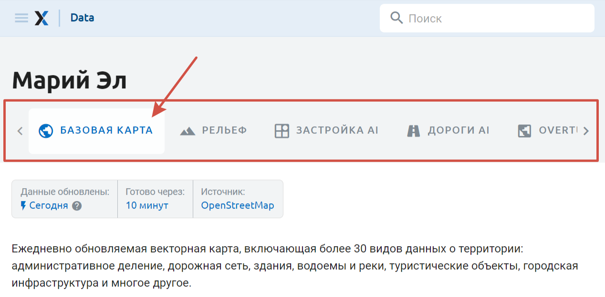
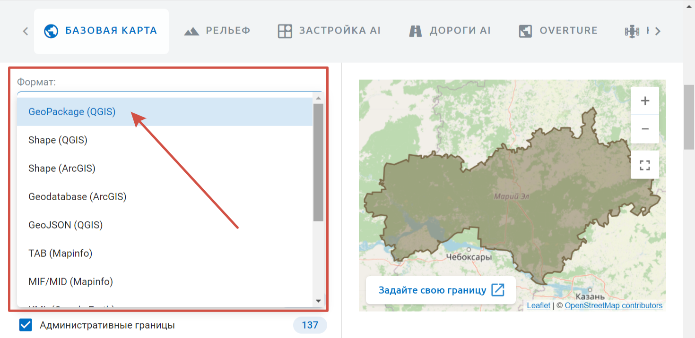
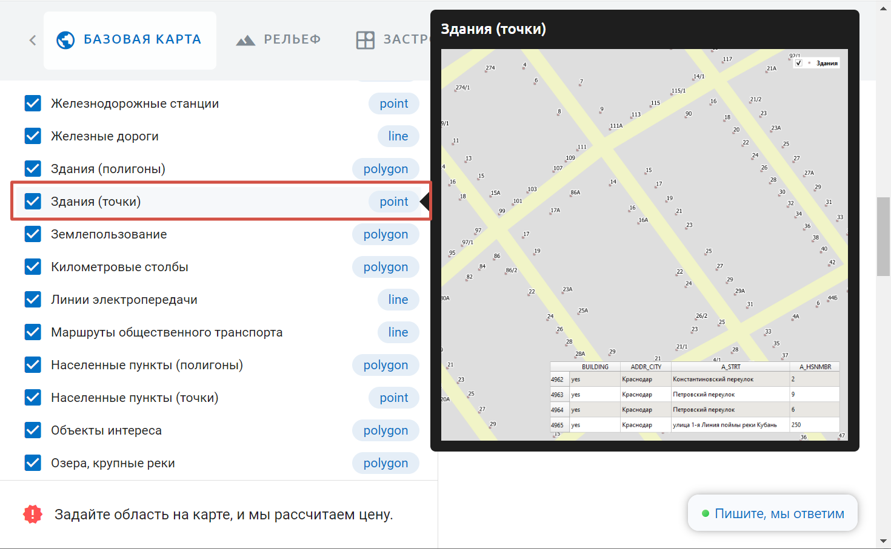
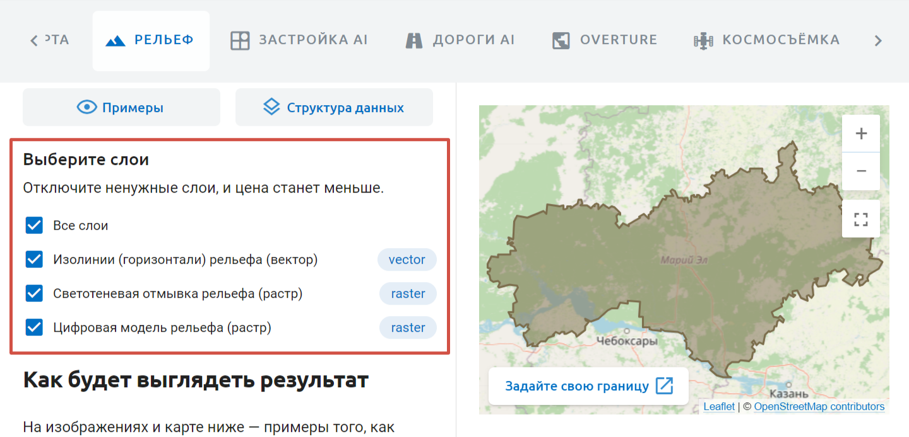
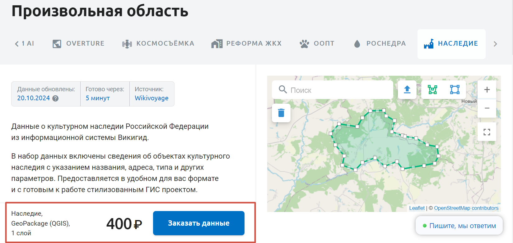
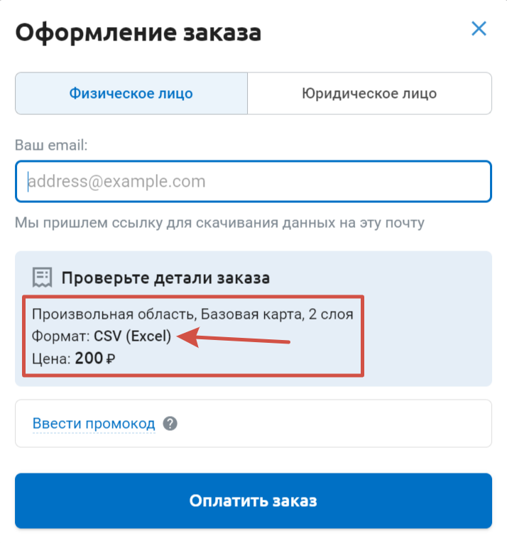

Как заказать данные
====================

.. _data_area:

Выбрать территорию
----------------------

Есть несколько способов выбрать область, на которую вы хотите заказать данные.

1. Нужный регион вы можете найти в `каталоге <https://data.nextgis.com/ru/catalog/subdivisions/?country=RU>`_. Выберите регион, чтобы увидеть его границы и цену выгрузки. 

2. В `строке поиска <https://data.nextgis.com/ru/>`_ на главной странице или на странице выбора области `справа на карте <https://data.nextgis.com/ru/region/custom/base>`_ введите нужное название и выберите подходящий регион из предлагаемого списка.

3. Также можно `нарисовать свою область <https://data.nextgis.com/ru/region/custom/base/>`_ полигоном на карте или загрузить границу из файла.

.. figure:: _static/data_area_select_ru.png
   :name: 
   :align: center
   :width: 20cm

* |button_area_rect| - выделить область прямоугольником;
* |button_area_draw| - нарисовать произвольный полигон;
* |button_data_upload| - загрузить файл границы;
* |button_clear_area| - снять выделение;
* |button_area_fullscreen| - отрыть карту на весь экран для точного выделения области.

.. |button_data_upload| image:: _static/button_data_upload.png
   :width: 6mm
.. |button_area_draw| image:: _static/button_area_draw.png
   :width: 6mm
.. |button_area_rect| image:: _static/button_area_rect.png
   :width: 6mm
.. |button_area_fullscreen| image:: _static/button_area_fullscreen.png
   :width: 6mm
.. |button_clear_area| image:: _static/button_clear_area.png
   :width: 6mm

.. _data_type:

Выбрать тип данных
-------------------

Можно заказать следующие данные:

* `Базовая карта OpenStreetMap <https://data.nextgis.com/ru/region/custom/base/>`_
* `Базовая карта Overture <https://data.nextgis.com/ru/region/custom/overture/>`_
* `Рельеф <https://data.nextgis.com/ru/region/custom/dem/>`_
* `Застройка AI <https://data.nextgis.com/ru/region/custom/msbld/>`_
* `Дороги AI <https://data.nextgis.com/ru/region/custom/msrd/>`_
* `Ландшафты <https://data.nextgis.com/ru/region/custom/landcover/>`_
* `Космосъёмка <https://data.nextgis.com/ru/region/custom/sat/>`_
* `Реформа ЖКХ <https://data.nextgis.com/ru/region/custom/gkh/>`_
* `Особо охраняемые природные территории <https://data.nextgis.com/ru/region/custom/oopt/>`_
* `Наследие <https://data.nextgis.com/ru/region/custom/heritage/>`_

На каждой странице доступны ссылки на структуру данных и примеры.

.. _data_format:

Выбрать формат
---------------

В выпадающем меню "Формат" выберите нужный. 

Формат по умолчанию для векторных слоёв - GeoPackage (QGIS).

Вы можете просмотреть список форматов для каждого типа данных, а также скачать и протестировать `примеры <https://data.nextgis.com/ru/about/#formats>`_ во всех доступных форматах.

.. _data_layers:

Выбрать слои
--------------

Данные могут включать в себя один или несколько слоёв. Чтобы увидеть, что именно входит в каждый слой, ознакомьтесь со структурой данных.

Если навести курсор на слой, вы увидите пример скрина. Обратите внимание, что это просто иллюстрация, данные на конкретную территорию могут не содержать объектов в этом слое.

При заказе Базовой карты OSM и Рельефа можно выбрать, какие из слоёв вам нужны, и отключить остальные.

Для Рельефа также можно выбрать шаг изолиний.

.. _data_order:

Оформление заказа
------------------

После того, как вы выбрали нужные данные, внизу страницы вы увидите детали и цену заказа. Нажмите **Заказать данные**.

Поле email является обязательным. Результат заказа будет доступен для скачивания на странице `Заказы <https://data.nextgis.com/ru/orders/actual>`_ - чтобы увидеть его, вам необходимо войти / создать аккаунт на `my.nextgis.com <https://data.nextgis.com/login>`_ с помощью email, указанным во время покупки. Если на момент заказа у вас уже есть аккаунт на `my.nextgis.com <https://data.nextgis.com/login>`_, рекомендуем вам авторизоваться до покупки.

Проверьте ещё раз детали заказа. Особенно обратите внимание на выбор формата. При переходе между вкладками и других действиях страница могла обновиться, сбросив сделанный вами выбор.

Ниже можно ввести промокод на скидку, если он у вас есть.

Убедившись, что данные заказа верные, нажмите **Оплатить заказ**.

Заказ можно сделать как от физического, так и от `юридического лица <https://data.nextgis.com/ru/faq/#pricebywire>`_.

`Подробнее об оплате и документах <https://data.nextgis.com/ru/faq/#paydocs>`_.

Обратите внимание, что через русскоязычный интерфейс сайта предлагается оплата в рублях. Если вы хотите оплатить заказ картой, выпущенной в другой валюте, переключитесь на английский интерфейс.

.. _data_donwload:

Получение заказа
------------------

Авторизуйтесь на сайте data.nextgis.com. Если у вас ещё нет NextGIS ID, зарегистрируйтесь на тот адрес электронной почты, который указывали при заказе.

В правом верхнем углу появится кнопка **Заказы**. Нажмите её, чтобы попасть в свой личный кабинет NextGIS Data. В нём будут отображаться все заказы, сделанные на указанный адрес электронной почты. Здесь вы можете посмотреть статус готовности заказа и скачать данные, а также повторить заказ, чтобы получить новые данные на ту же территорию.

.. figure:: _static/data_orders_list_ru.jpg
   :name: data_orders_list_pic
   :align: center
   :width: 20cm

Также вы можете `подключить уведомления в Telegram <https://docs.nextgis.ru/docs_ngcom/source/create.html#telegram>`_ в личном кабинете NextGIS.
