How to order data
====================

.. _data_area:

Select area
----------------------

You can select your area of interest in one of several ways:

1. Browse the `catalog <https://data.nextgis.com/en/catalog/subdivisions/>`_. Select a region to view its boundaries and prices. 

2. Type the name of the region into the `search bar <https://data.nextgis.com/en/>`_ on the main page or `on the map <https://data.nextgis.com/en/region/custom/base>`_ of the custom area page.

3. You can also `draw a custom polygon area <https://data.nextgis.com/ru/region/custom/base/>`_ on the map or upload a boundary from a file.

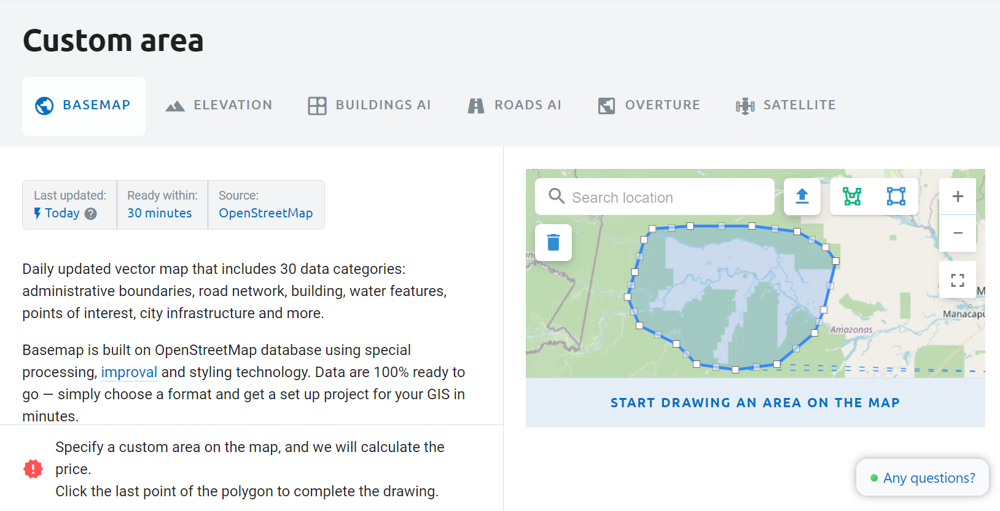

* |button_area_rect| - draw a rectangle to select area;
* |button_area_draw| - draw a custom polygon to select;
* |button_data_upload| - upload boundaries from file;
* |button_clear_area| - clear selection;
* |button_area_fullscreen| - full-screen map mode.

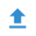

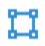
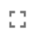
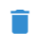

.. _data_type:

Select data type
-------------------

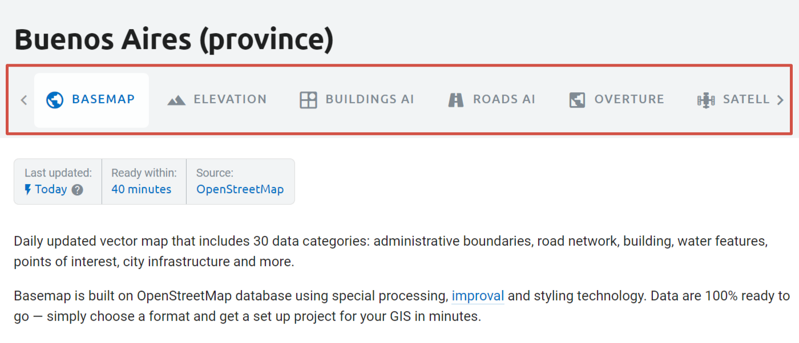

Data types you can order:

* `OpenStreetMap Basemap <https://data.nextgis.com/en/region/custom/base/>`_
* `Ouverture Basemap <https://data.nextgis.com/en/region/custom/overture/>`_
* `Elevation <https://data.nextgis.com/en/region/custom/dem/>`_
* `Buildings AI <https://data.nextgis.com/en/region/custom/msbld/>`_
* `Roads AI <https://data.nextgis.com/en/region/custom/msrd/>`_
* `Satellite <https://data.nextgis.com/ru/region/custom/sat/>`_
 
 
 
* Coming soon - Heritage

On each page you can download samples and check out data structure.

.. _data_format:

Select format
---------------

Select format from a dropdown menu. 

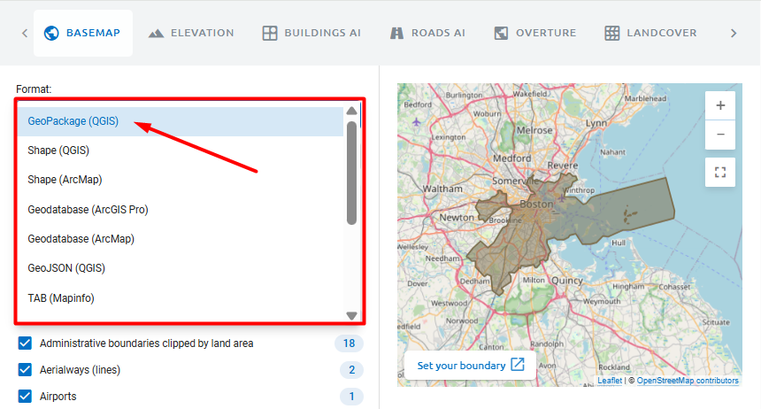

By default vector data is in GeoPackage (QGIS).

You can view the list of formats for each data type and download `samples <https://data.nextgis.com/en/about/#formats>`_ in all available formats.

.. _data_layers:

Select layers
--------------

Data sets contain one or more layers. See the data structure to find what kind of information is stored in each layer.

Hover over the layer name to see a sample screenshot. Keep in mind that it is only an illustration, data for a particular area may have no features in that layer.

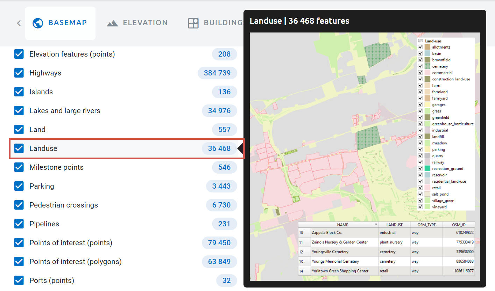

For OSM Basemap and Elevation you can choose which layers to order and deselect others.

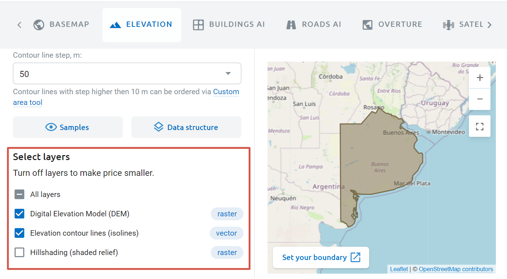

For Elevation you can also choose contour line step.

.. _data_order:

Purchase
------------------

After selecting an area you'll see the price and the order details at the bottom of the page. Click **Order data**.

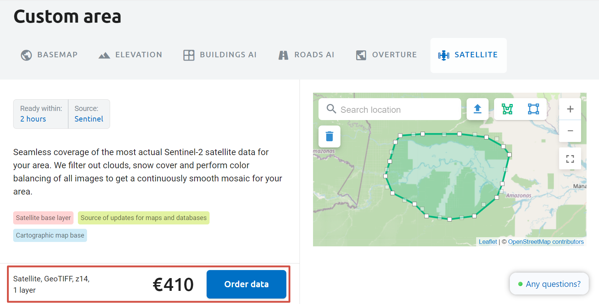

Enter the email you want to use to receive the download link. If you have NextGIS ID, enter the email you used for registration.

Check the details of your order. Make sure the format is indicated correctly. Switching between tabs and other actions may cause the page to refresh and reset the default format.

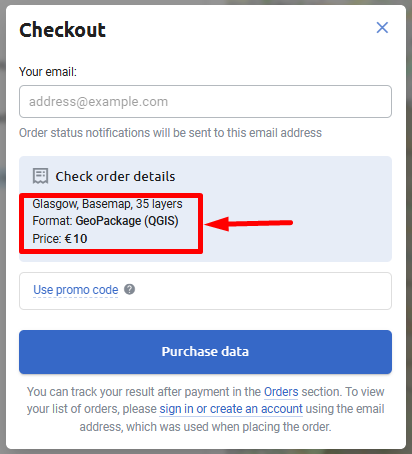

Enter a discount code if you have one.

After making sure that all information is correct press **Purchase data**.

If you’re purchasing data on behalf of the organisation, we can issue an invoice addressed to this organisation.

`More on payment methods <https://data.nextgis.com/en/faq/#pay>`_

Payment is made in euros, if your card has another currency, the conversion is handled by the bank.   

.. _data_donwload:

Download data
------------------

Log in to data.nextgis.com. If you don't have NextGIS ID yet, sign up using the email address you entered for your data order.

After signing in click **Orders** in the top right corner. It will open your order history. In this section you can find all the orders made for that particular email address. You can see if the order is ready and download the data. Also you can repeat older orders to get actualized data for the same area.

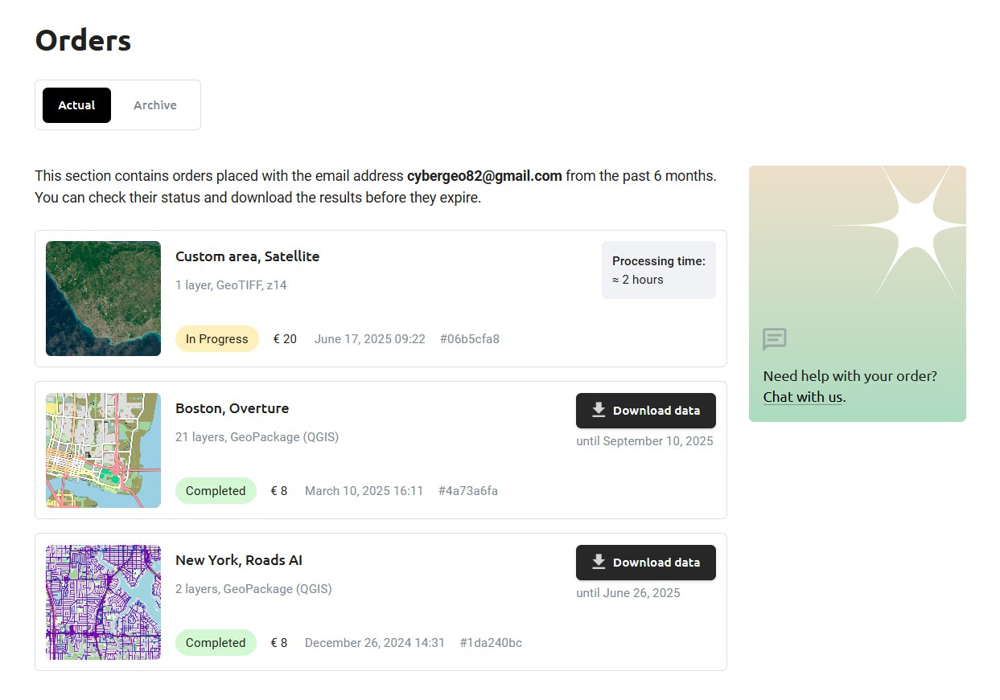

