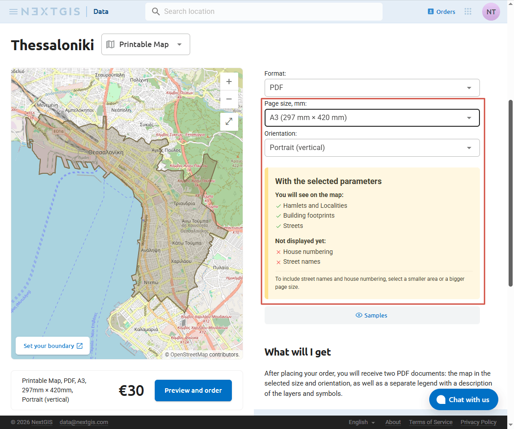
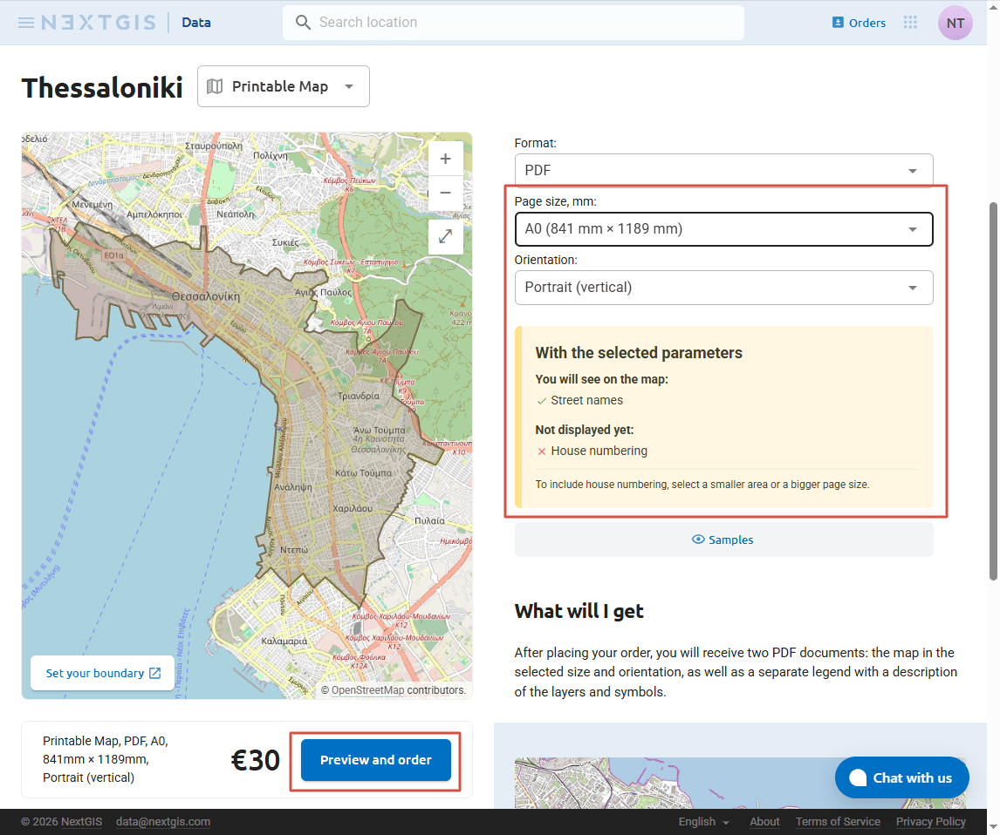
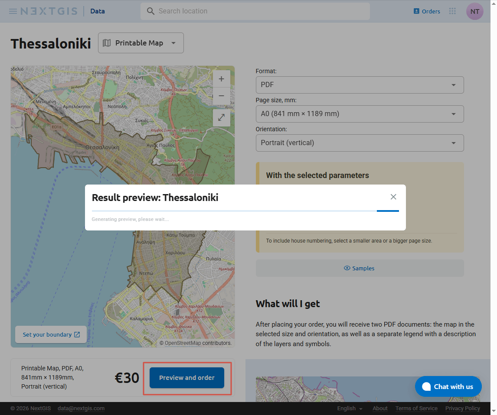
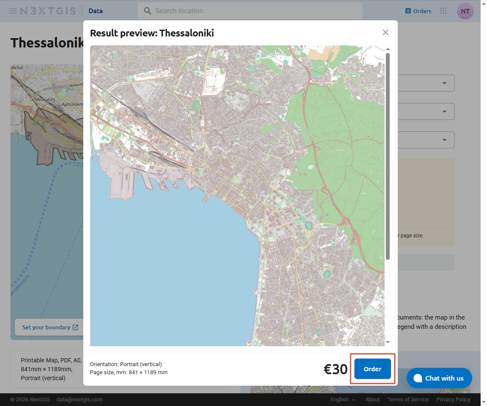
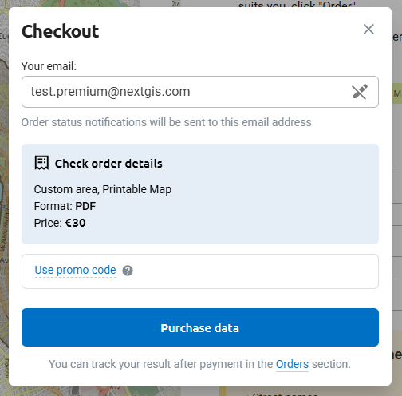

How to order printable map
==============================

If you want to print the map, but wish to avoid preparing the layout yourself in QGIS, you can order the data as print-ready vector PDF file.

.. _data_area:

Select area
----------------------

You can select your area of interest in one of several ways:

1. Brows the `catalog <https://data.nextgis.com/en/catalog/subdivisions/>`_. Select a region to view its boundaries and prices. 

2. Type the name of the region into the `search bar <https://data.nextgis.com/en/>`_ on the main page or `on the map <https://data.nextgis.com/en/region/custom/printmap>`_ of the custom area page.

3. You can also `draw a custom polygon area <https://data.nextgis.com/ru/region/custom/printmap/>`_ on the map or upload a boundary from a file.

.. figure:: _static/data_area_select_en.png
   :name: 
   :align: center
   :width: 20cm

* |button_area_rect| - draw a rectangle to select area;
* |button_area_draw| - draw a custom polygon to select;
* |button_data_upload| - upload boundaries from file;
* |button_clear_area| - clear selection;
* |button_area_fullscreen| - full-screen map mode.

.. |button_data_upload| image:: _static/button_data_upload.png
   :width: 6mm
.. |button_area_draw| image:: _static/button_area_draw.png
   :width: 6mm
.. |button_area_rect| image:: _static/button_area_rect.png
   :width: 6mm
.. |button_area_fullscreen| image:: _static/button_area_fullscreen.png
   :width: 6mm
.. |button_clear_area| image:: _static/button_clear_area.png
   :width: 6mm

Page settings
----------------

Double-check that Printable map is selected. If you used the catalog of regions, click "Basemap" next to the name of the region, then selet "Printable map" in the dropdown menu.

* **Page size** is set in millimeters. You can select one of the standard paper sizes or enter custom values.

* For standard paper sizes you can select the page orientation: **portrait (vertical)** or **landscape (horizontal)**. If the selected are is more wide that it is tall, choose landscape orientation.

After selecting the page parameters you'll see a yellow hint message with information on the details included in the map with this settings. 

   Thessaloniki on A3 page with portrait orientation. The map will show building footprints and streets. Street names and house numbers will not be displayed.

   Increased page size. On A0 street names will be visible. House numbers are still not included.

Click **Preview and order** to get an idea of what the final map is going to look like.

   Preview is being generated

If you're satisfied with the overall look of the map, click **Order**.

   Proceeding to order

If you wish to order a map with the sum of height and width over 2414 mm, email us at sales@nextgis.com. In your email include:

* Link to area you wish to print (use search bar to find your area of interest, go to the area page and copy the URL, for example, for Thessaloniki ``https://data.nextgis.com/en/region/custom/printmap/?bounds=%7B%22x_min%22:22.899464,%22y_min%22:40.585678,%22x_max%22:22.989905,%22y_max%22:40.653123%7D&regionCode=GR-CITY-002``). Alternatively, you can send as the boundary as a GeoJSON or GeoPackage file;
* Desired level of details;
* Page size.

.. _data_order:

Purchase
------------------

After selecting an area you'll see the price and the order details at the bottom of the page. Click **Order data**.

"Email" fiels is required. The result of your order will be available for download on `the Orders page <https://data.nextgis.com/en/orders/actual>`_– to view it, you need to sign in / create account at my.nextgis.com with the email you are using during purchase.  If you already have an account on `my.nextgis.com <https://data.nextgis.com/login>`_ at the moment of purchase, we recommend signing in before placing an order.

Check the details of your order. Make sure the paper size is indicated correctly. Switching between tabs and other actions may cause the page to refresh and reset the default format.

Enter a discount code if you have one.

After making sure that all information is correct press **Purchase data**.

If you’re purchasing data on behalf of the organisation, we can issue an invoice addressed to this organisation.

`More on payment methods <https://data.nextgis.com/en/faq/#pay>`_

The payment is made in euros, if your card has another currency, the conversion is handled by the bank. .

.. _data_donwload:

Download data
------------------

Log in to data.nextgis.com. If you don't have NextGIS ID yet, sign up using the email address you entered for your data order.

After signing in click **Orders** in the top right corner. It will open your order history. In this section you can find all the orders made for that particular email address. You can see if the order is ready and download the data. Also you can repeat older orders to get actualized data for the same area.

.. figure:: _static/data_orders_list_en.jpg
   :name: data_orders_list_pic
   :align: center
   :width: 20cm

