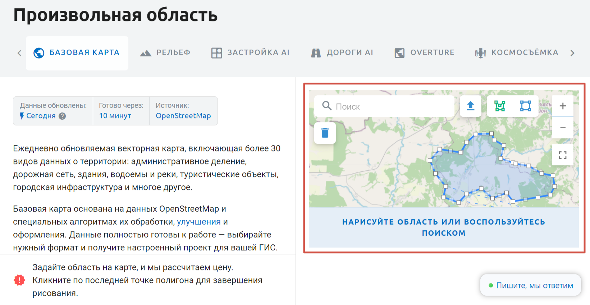
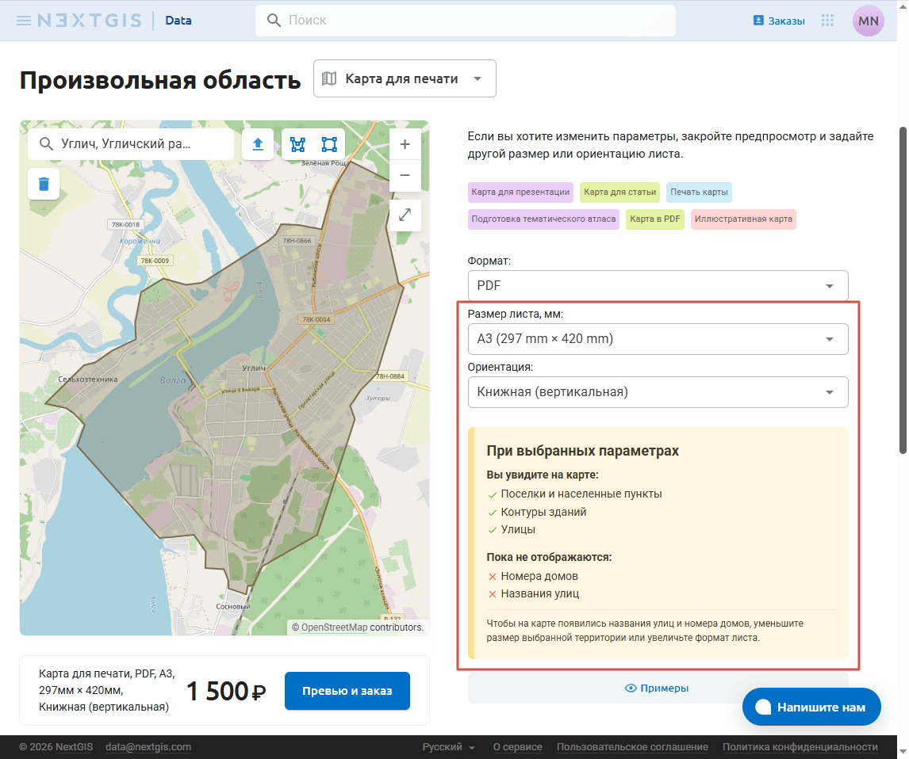
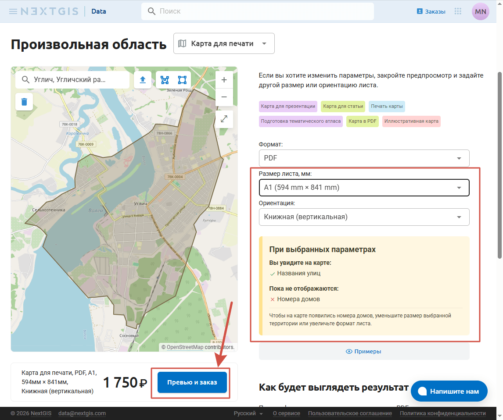
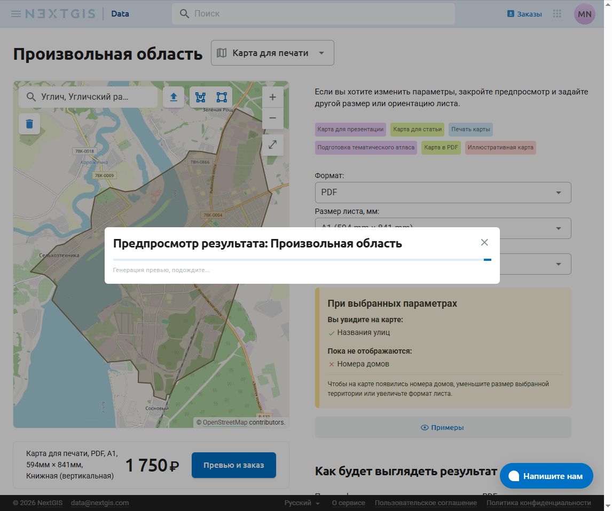
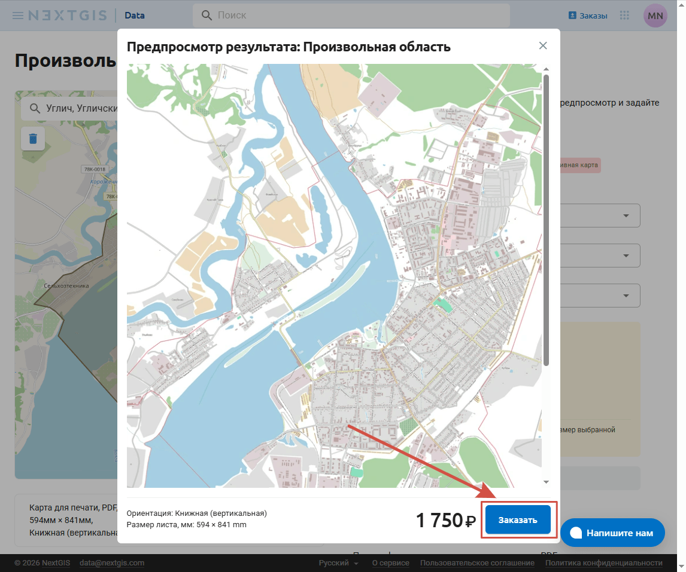
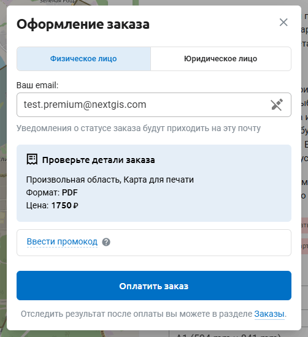
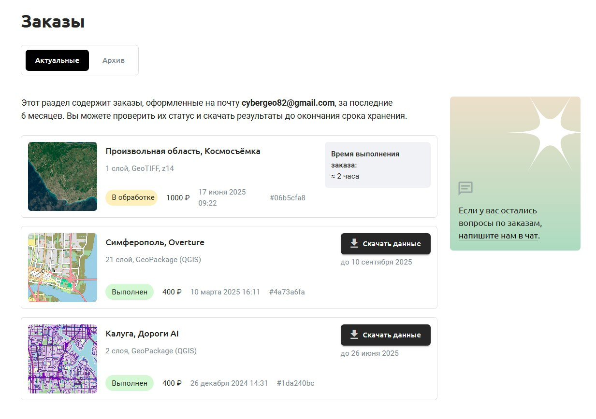

Как заказать карту для печати
==============================

Если вы хотите распечать карту на бумаге, но не хотите самостоятельно готовить макет в QGIS, вы можете заказать карту в виде векторного PDF.

.. _data_area:

Выбрать территорию
----------------------

Есть несколько способов выбрать область, на которую вы хотите заказать данные.

1. Нужный регион вы можете найти в `каталоге <https://data.nextgis.com/ru/catalog/subdivisions/?country=RU>`_. Выберите регион, чтобы увидеть его границы и цену выгрузки. 

2. В `строке поиска <https://data.nextgis.com/ru/>`_ на главной странице или на странице выбора области `справа на карте <https://data.nextgis.com/ru/region/custom/printmap>`_ введите нужное название и выберите подходящий регион из предлагаемого списка.

3. Также можно `нарисовать свою область <https://data.nextgis.com/ru/region/custom/printmap/>`_ полигоном на карте или загрузить границу из файла.

* |button_area_rect| - выделить область прямоугольником;
* |button_area_draw| - нарисовать произвольный полигон;
* |button_data_upload| - загрузить файл границы;
* |button_clear_area| - снять выделение;
* |button_area_fullscreen| - отрыть карту на весь экран для точного выделения области.

.. |button_data_upload| image:: _static/button_data_upload.png
   :width: 6mm
.. |button_area_draw| image:: _static/button_area_draw.png
   :width: 6mm
.. |button_area_rect| image:: _static/button_area_rect.png
   :width: 6mm
.. |button_area_fullscreen| image:: _static/button_area_fullscreen.png
   :width: 6mm
.. |button_clear_area| image:: _static/button_clear_area.png
   :width: 6mm

Настройки листа
----------------

Убедитесь, что выбран продукт "Карта для печати". Если вы переходили в регион из каталога, нажмите на "Базовая карта" рядом с его названием и выберите пункт "Карта для печати" в выпадающем меню.

* **Размер листа** задаётся в миллиметрах. Вы можете выбрать один из стандартных форматов или вписать свои значения.

* Для стандартных форматов можно также выбрать ориентацию листа: **книжную (вертикальную)** или **альбомную (горизонтальную)**. Если выбранная область более вытянутая по горизонтали - выбирайте альбомную ориентацию.

Под параметрами листа вы увидите подсказку на жёлтом фоне, где указано, насколько детальной получится карта. 

   Город Углич при размере листа А3 с книжной ориентацией. На карте будут отображаться контуры зданий, улицы. Но не будут отображаться номера домов и названия улиц

   Размер листа увеличен. При размере листа А1 названия улиц будут отображаться. Номера домов по-прежнему не будут видны.

Нажмите **Превью и заказ** чтобы получить представление о внешнем виде карты.

   Превью генерируется

Если вас всё устраивает, нажмите **Заказать**.

   Переход к оформлению заказа

Если вы хотите заказать лист, сумма сторон которого превышает 2414 мм, напишите нам на sales@nextgis.ru. В письме укажите:

* Ссылку на область, которую хотите напечатать (для этого наберите нужное название в поиске, перейдите к подходящему объекту и скопируйте ссылку из адресной строки, например г. Углич ``https://data.nextgis.com/ru/region/custom/printmap/?bounds={"x_min":47.8084019,"y_min":56.5829591,"x_max":48.1240258,"y_max":56.7115487}&osmId=W32728504``). Также вы можете прислать границу нужной области в виде файла;
* Желаемую степень детализации;
* Размер листа.

.. _data_order:

Оформление заказа
------------------

После того, как вы выбрали нужные данные, внизу страницы вы увидите детали и цену заказа. Нажмите **Заказать данные**.

Поле email является обязательным. Результат заказа будет доступен для скачивания на странице `Заказы <https://data.nextgis.com/ru/orders/actual>`_ - чтобы увидеть его, вам необходимо войти / создать аккаунт на `my.nextgis.com <https://data.nextgis.com/login>`_ с помощью email, указанным во время покупки. Если на момент заказа у вас уже есть аккаунт на `my.nextgis.com <https://data.nextgis.com/login>`_, рекомендуем вам авторизоваться до покупки.

Проверьте ещё раз детали заказа. Особенно обратите внимание на выбраный формат листа. При переходе между вкладками и других действиях страница могла обновиться, сбросив сделанный вами выбор.

Ниже можно ввести промокод на скидку, если он у вас есть.

Убедившись, что данные заказа верные, нажмите **Оплатить заказ**.

Заказ можно сделать как от физического, так и от `юридического лица <https://data.nextgis.com/ru/faq/#pricebywire>`_.

`Подробнее об оплате и документах <https://data.nextgis.com/ru/faq/#paydocs>`_.

Обратите внимание, что через русскоязычный интерфейс сайта предлагается оплата в рублях. Если вы хотите оплатить заказ картой, выпущенной в другой валюте, переключитесь на английский интерфейс.

.. _data_donwload:

Получение заказа
------------------

Авторизуйтесь на сайте data.nextgis.com. Если у вас ещё нет NextGIS ID, зарегистрируйтесь на тот адрес электронной почты, который указывали при заказе.

В правом верхнем углу появится кнопка **Заказы**. Нажмите её, чтобы попасть в свой личный кабинет NextGIS Data. В нём будут отображаться все заказы, сделанные на указанный адрес электронной почты. Здесь вы можете посмотреть статус готовности заказа и скачать данные, а также повторить заказ, чтобы получить новые данные на ту же территорию.

Также вы можете `подключить уведомления в Telegram <https://docs.nextgis.ru/docs_ngcom/source/create.html#telegram>`_ в личном кабинете NextGIS.
