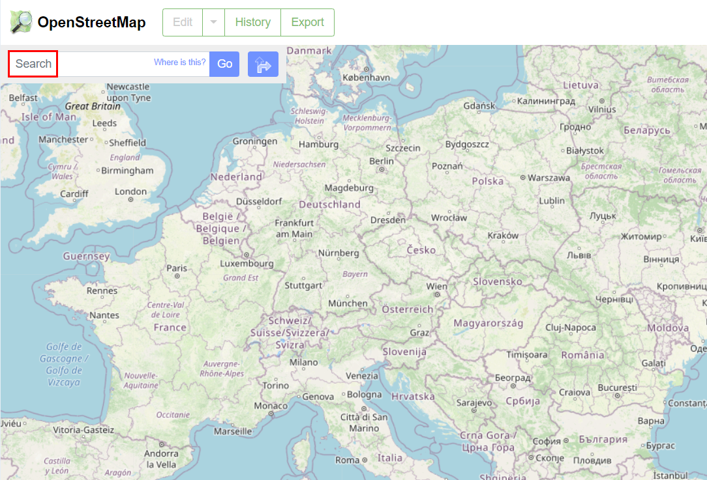
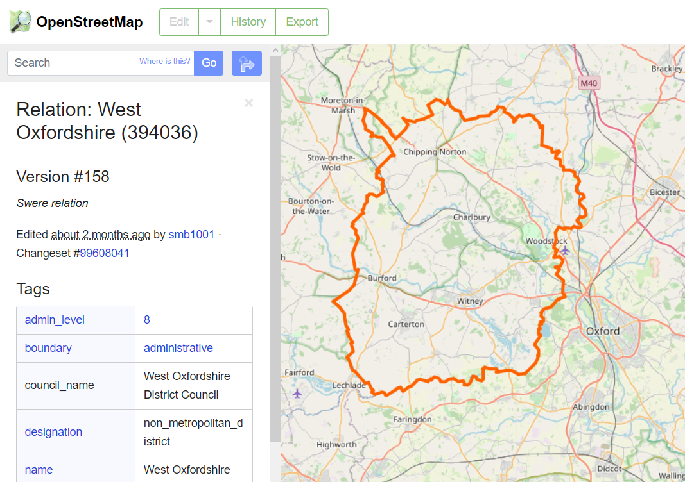

.. _data_osm_search:

Как на OpenStreetMap найти нужный мне объект
===========================

* Для начала Вам необходимо попасть на сайт OpenStreetMap. Для этого в адресной строке браузера введите osm.org или перейдите по этой `ссылке <https://www.openstreetmap.org>`_.

* В окне поиска введите название интересующего объекта, например, “Афипское городское поселение” и нажмите на кнопку “Найти”. Под поисковой строкой отобразятся результаты поиска, при полном совпадении будет обозначен тип объекта (в нашем случае - “Граница города”) и его полное имя. Кнопка “Еще результаты” отобразит другие близкие по названию объекты.

* Имя объекта кликабельно, при нажатии на него на карте отобразятся границы Афипского городского поселения. 

