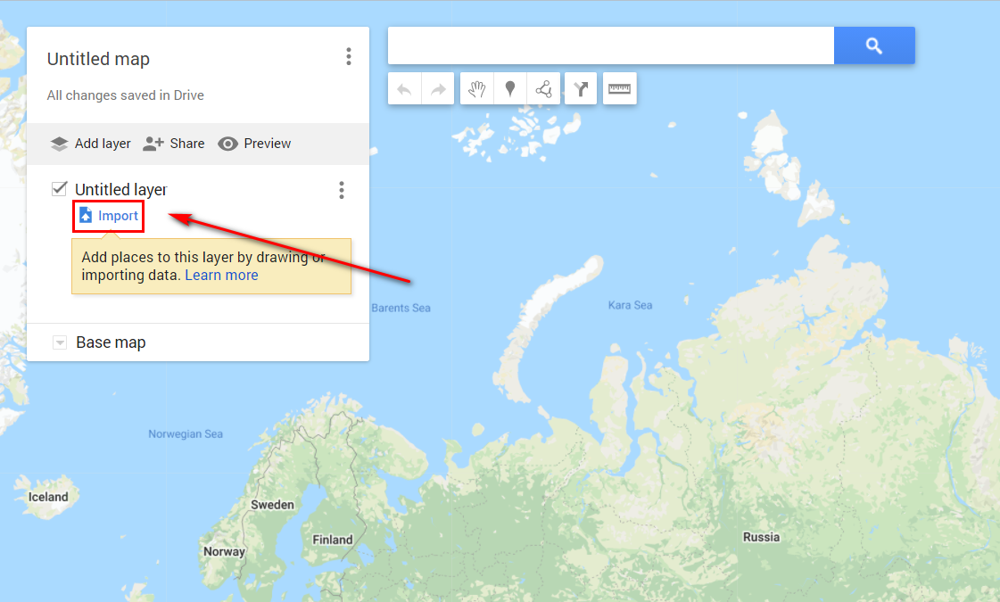

.. _data_other_soft:

Наши данные в других программах
===========================

.. _data_other_soft_google_mymaps:

Как загрузить данные на Google карты
-------------------------------

#. `Закажите данные <https://data.nextgis.com/ru/>`_ на интересующую Вас территорию, например, в формате GeoJSON.
#. Дождитесь получения результата, скачайте, распакуйте архив с данными.
#. Конвертируйте желаемый слой или слои в формат KML. Для конвертации можно воспользоваться любым онлайн конвертером, например, `GeoConverter <https://geoconverter.hsr.ch/vector>`_.
#. Импортируйте полученный файл KML на карту в сервисе Google My Maps.

..     figure:: _static/google_mymaps2.png
       :name: google_mymaps2
       :align: center
       :width: 16cm

#. Данные добавлены на карту

..     figure:: _static/google_mymaps3.png
       :name: google_mymaps3
       :align: center
       :width: 16cm

.. _data_other_soft_yandex_const:

Как загрузить данные на Google карты
-------------------------------
