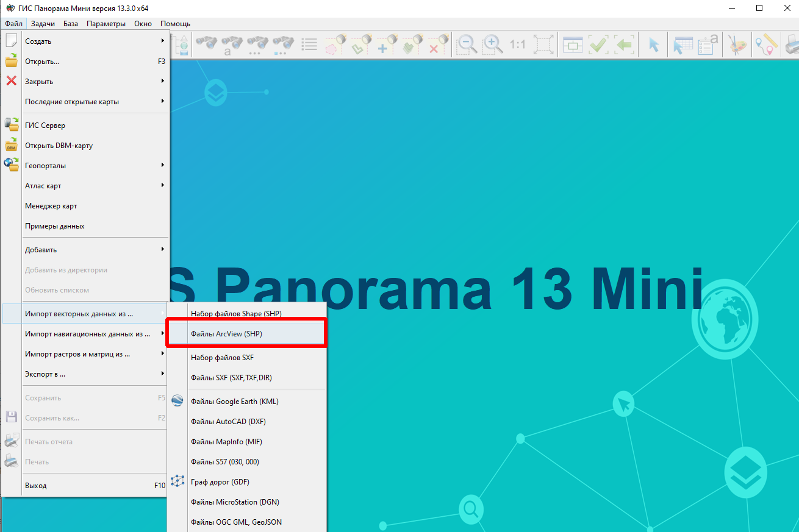
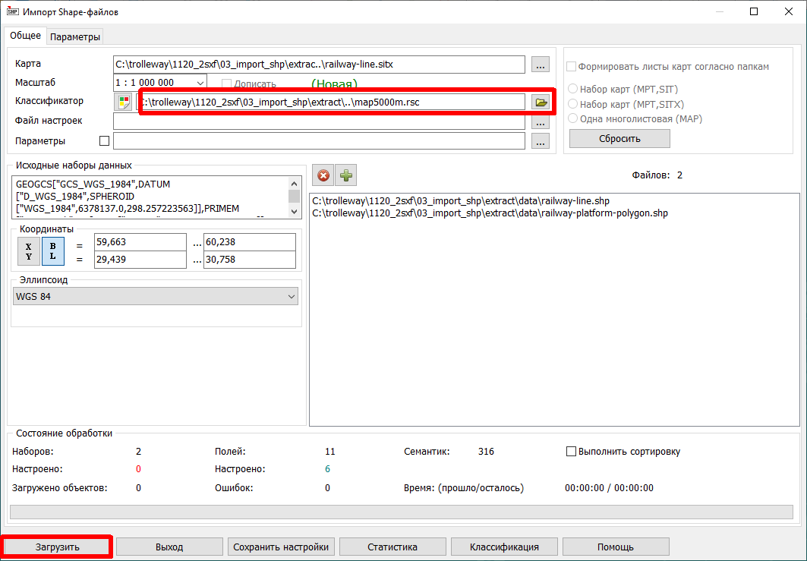
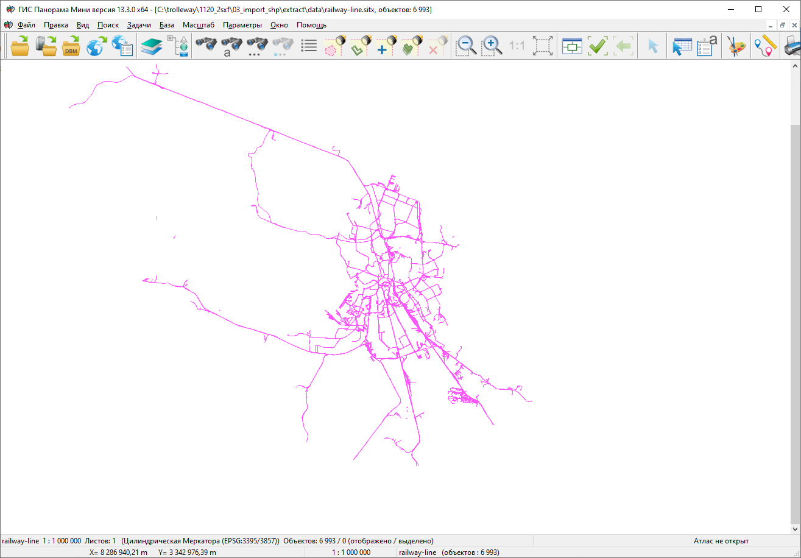

.. _data_panorama_mini:

Как загрузить данные в ГИС Панорама Мини
=============================

* `Закажите данные <https://data.nextgis.com/ru/>`_ на интересующую Вас территорию в формате ESRI Shape (QGIS).
* Дождитесь получения результата, скачайте, распакуйте архив с данными.
* Скачайте с сайта <https://gisinfo.ru/price/price_map.htm>ГИС Панорама файл классификатора map5000m.rscz 
* В программе ГИС Панорама Мини выберите пункт **Файл** → **Импорт векторных данных из** → **Файлы ArcView (SHP)**, и выберите в распакованных данных файлы shp.

* В открывшемся диалоге в поле **Классификатор** выберите загруженный с сайта ГИС Панорама файл map5000m.rscz, и нажмите кнопку **Загрузить**

   
* После обработки появится рендеринг ваших данных

   
.. note::
   Классификатор скачанный на предыдущим этапе нужен только для того, чтобы загрузить данные. К самим данным он не применяется. Для того, чтобы классифицировать данные вам нужно создать новый классификатор для своих задач.
