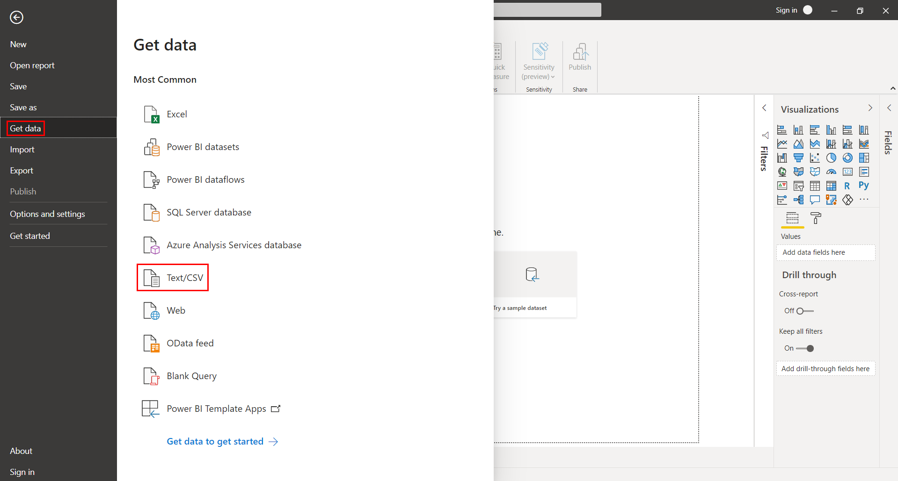
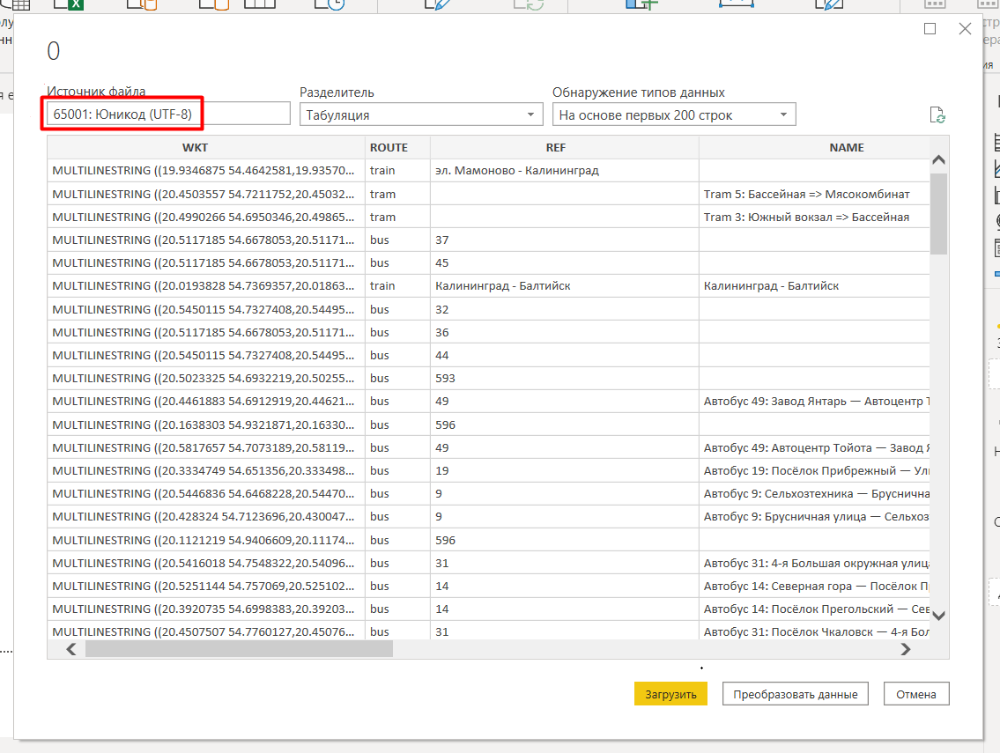
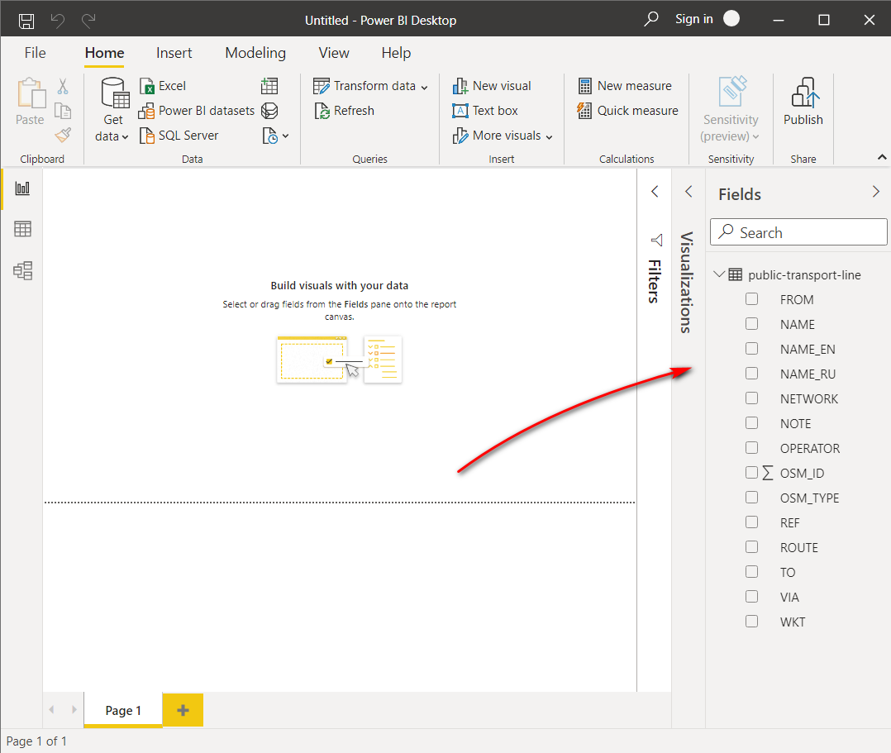

.. _data_power_bi:

Как загрузить текстовые данные в Power BI
===========================

* `Закажите данные <https://data.nextgis.com/ru/>`_ на интересующую Вас территорию в формате CSV.
* Дождитесь получения результата, скачайте, распакуйте архив с данными.
* В Power BI Desktop выберите «Главная» > «Получить данные» > «Текстовый или CSV-файл», нажмите «Подключить». 

* В открывшемся окне укажите путь к интересующему CSV-файлу.
* Далее в окне предварительного просмотра проверьте корректность отображения символов и табуляции. Если символы не распознаются Вашим устройством верно, убедитесь, что в поле «Источник файла» выбрана кодировка UTF-8. 

* После нажатия кнопки «Загрузить» данные готовы для анализа.

