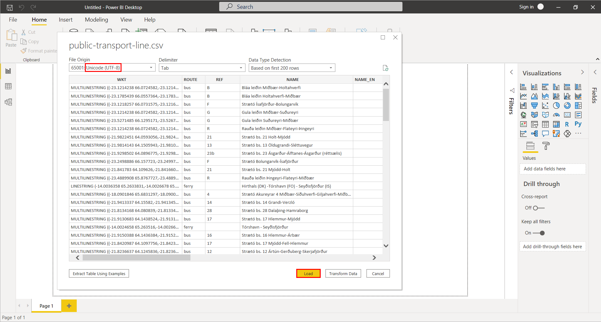

.. _data_power_bi:

How to upload text data into Microsoft Power BI
===================================================

* `Order data <https://data.nextgis.com/en/>`_ for your area of interest in CSV (Excel) format.
* Wait for an email with the download link. Download and unpack the data.
* In Power BI Desktop select "File" > "Get Data" > "Text/CSV".

.. figure:: _static/power_bi1.png
   :name: power_bi1
   :align: center
   :width: 16cm

* In the pop-up window specify path to the target CSV file.
* Next, in the preview window, check the correctness of symbols and tabs. If the characters are not recognized correctly by your device, make sure that UTF-8 encoding is selected in the "File Origin" field.

   
* After clicking "Load" button data is ready for analysis.

