.. _data_power_bi_map:

How to load vector layer into Microsoft Power BI
===========================

* `Order data <https://data.nextgis.com/en/>`_ for your area of interest, e.g. in GeoJSON (QGIS) format.
* Wait for an email with the download link. Download and unpack the data.
* Convert target layer to TopoJSON format. For the conversion you can use any online converter, for example, `MapShaper <https://mapshaper.org/>`_.
* First you should activate Shape map visual. Select "File" > "Options and settings" > "Options". In pop-up window select "Preview features" from the left list and then check the box next to "Shape map visual". Press "OK".

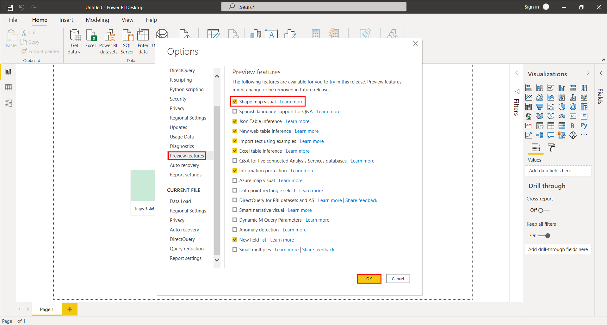
   
* From "Visualizations" panel select Shape map icon. Template with map appears in the left corner of the main workspace. 

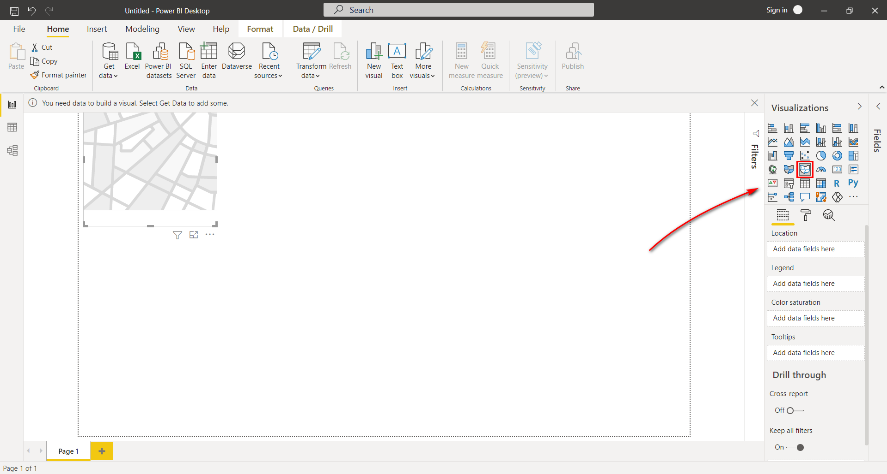
   
* Let's add prepared TopoJSON file into Power BI. From the main bar select "Get Data" > "All" > "JSON" and click on "Connect". In the next pop-up window specify path to the targer TopoJSON, press "Open" button. 

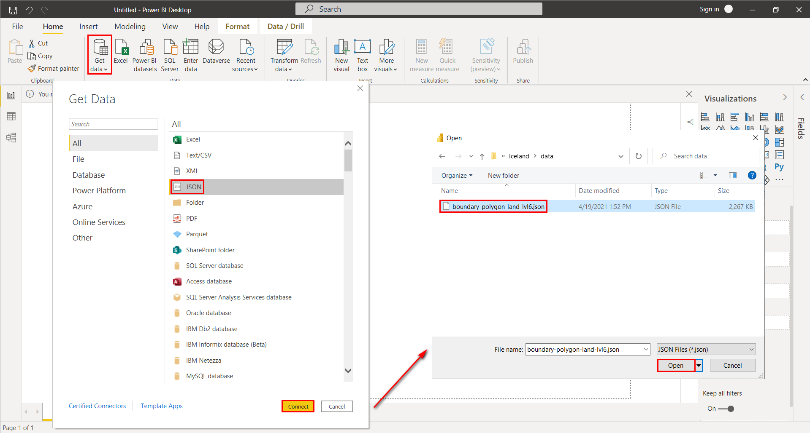
   
* When file became uploaded, Query Editor Window appears. Here you can prepare data for better visualization. In the table find column with object geometries and double click on it.

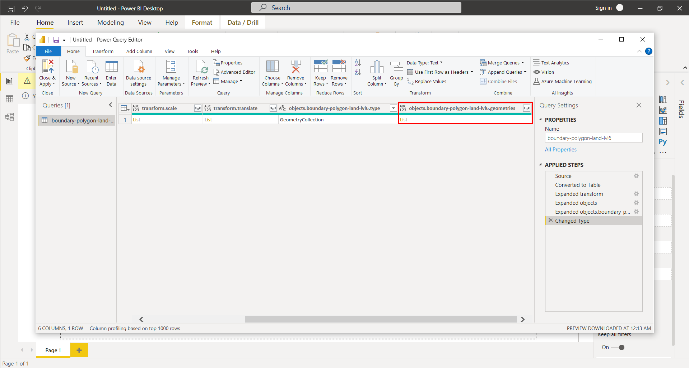
   
* Column with the objects expands in the lower part of the Query window. From the main menu select "Transform" > "Convert to list".

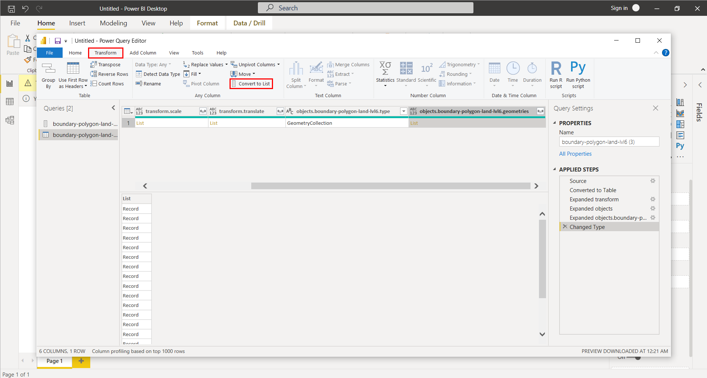

* Now list with objects is presented separately. Let's turn it into independent table. Select "Transform" > "To Table" and press "OK" in pop-up window.

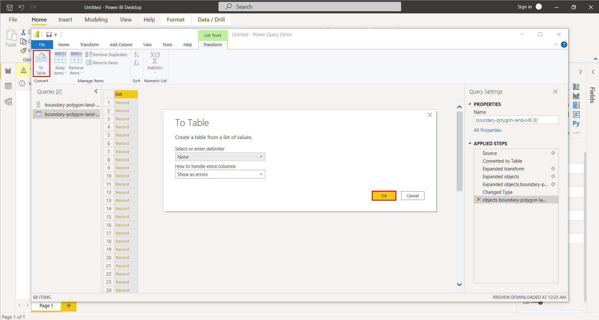
   
* In the new table set some parameters: press on the icon with forked arrow, and in the pop-up window check the box next to "properties", press "OK".

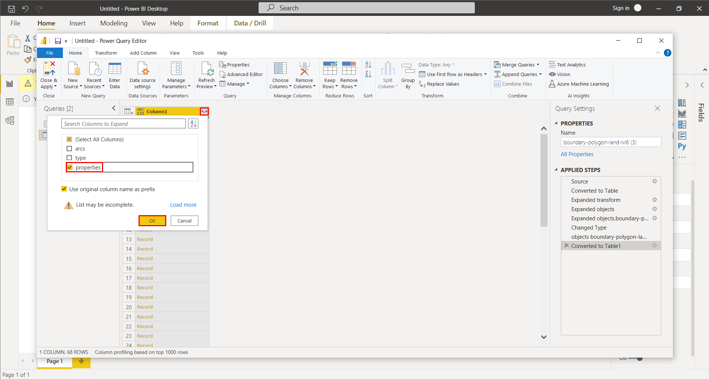
   
* Table is transformed, in the header of the column again press on the icon with forked arrow and select attributes you want to visualize. Press "OK". 

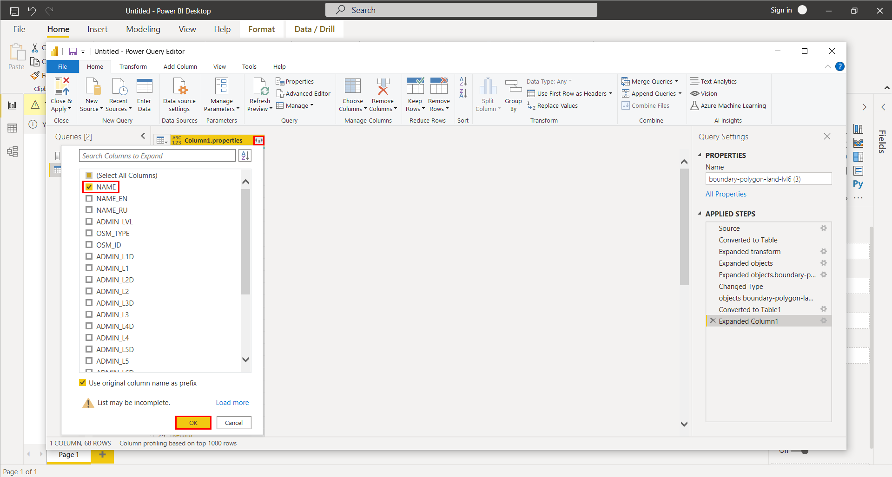
   
* You can rename column and then select "Close & Apply" from menu bar.

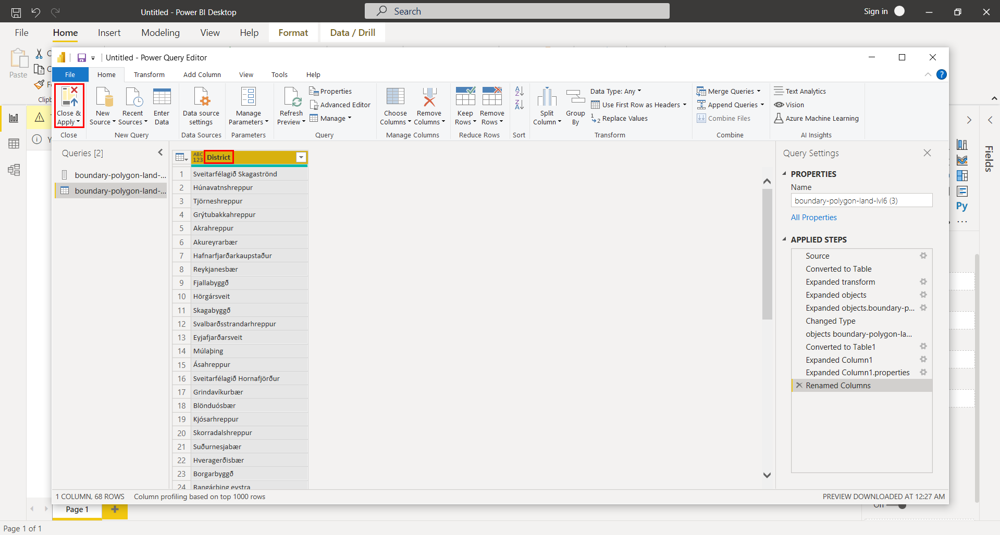

* Now data is ready for visualization. From the "Fields" panel select target field and drag it to "Location" gap. 

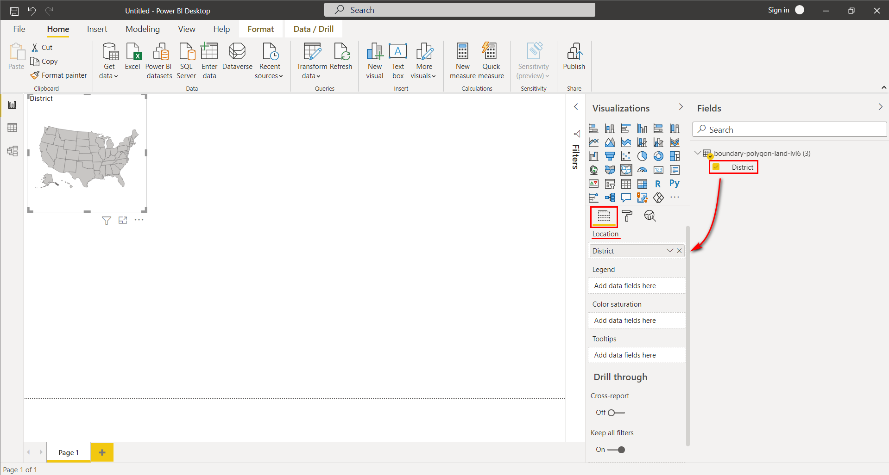
   
* Under "Visualizations" panel select "Format" tab > "Shape" > "+ Add map". In the pop-up window specify path to TopoJSON file.

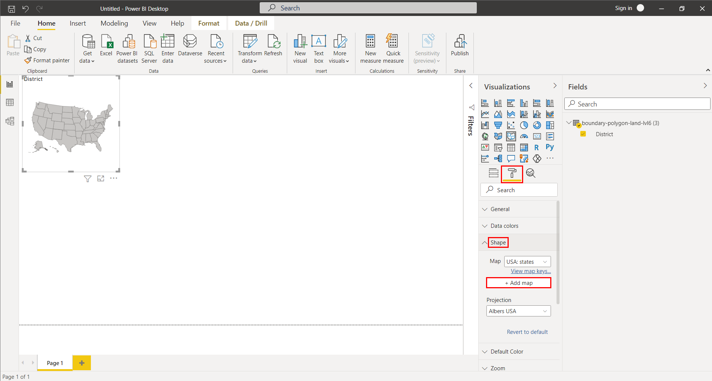

* Layer is loaded into workspace.

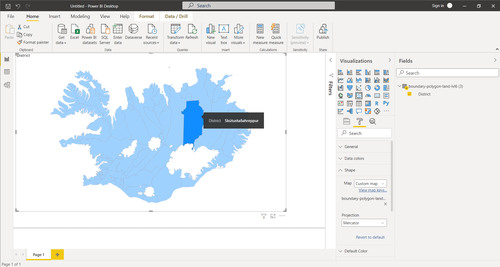
