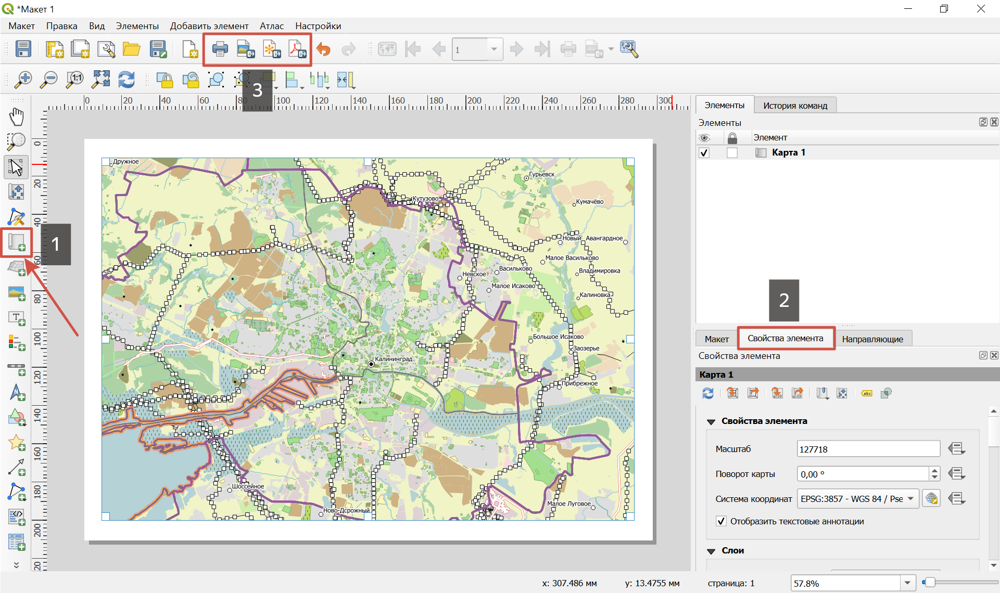

.. sectionauthor:: Юлия Григоренко <grigorenko.j@gmail.com>

.. _data_prepare_print:

Как подготовить карту для печати
=====================================

1. `Закажите данные <https://data.nextgis.com/ru/>`_ на интересующую Вас территорию, лучше всего в формате GeoPackage.

2. Дождитесь получения результата, скачайте, распакуйте архив с данными.

3. Создайте макет:

Откройте файл проекта в QGIS.

Перейдите к нужной области карты.

Откройте компоновщик карты через главное меню: Проект --> Создать макет.

Нажмите **Добавить карту** в панели инструментов слева.

Масштаб, охват карты и другие параметры можно настроить во вкладке "Свойства элемента". Подробнее о `создании макета <https://docs.nextgis.ru/docs_ngqgis/source/map_composer.html>`_.

   Макет карты для печати или сохранения. 1 - кнопка "Добавить карту"; 2 - вкладка "Свойства элемента"; 3 - кнопки вывода на печать и экспорта в разные форматы

4. Выведите на печать или сохраните в PDF/SVG или в виде изображения, выбрав соответствующую кнопку на панели инструментов.
