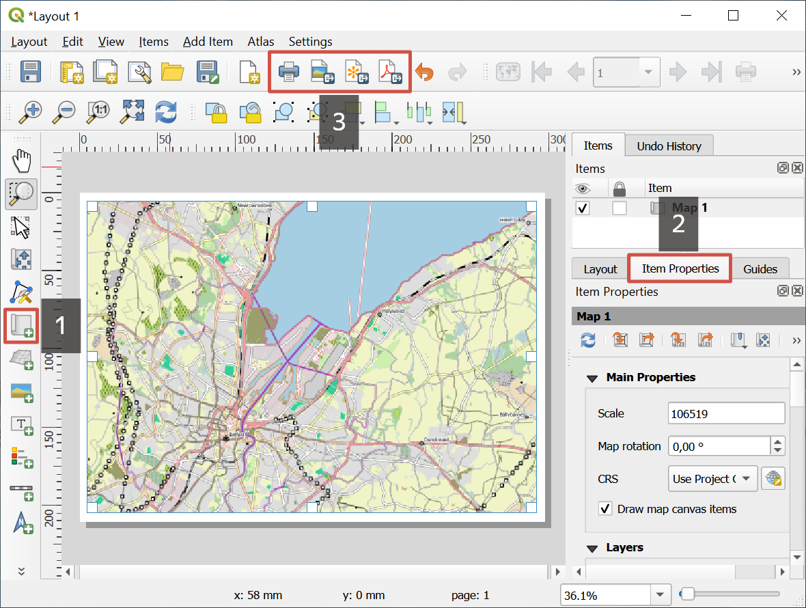

.. sectionauthor:: Юлия Григоренко <grigorenko.j@gmail.com>

.. _data_prepare_print:

How to prepare map for printing
=====================================

* `Order data <https://data.nextgis.com/en/>`_ for your area of interest, we recommend selecting GeoPackage format.

* Go to the `orders <https://data.nextgis.com/en/orders/actual/>`_ page and download the archive when it's complete.

* **Unpack** the archive.

* Prepare the layout:

Open the project file in QGIS.

Find the part of the map you want to print.

From the main menu go to: Project --> New print layout.

Press **Add map** button on the toolbar to the left.

You can set up scale, scope and other parameters of the map in the "Item Properties" tab on the right. .

   Map layout for printing or saving. 1 - Add Map; 2 - Item Properties; 3 - Print button and buttons for saving options

* Print the layout or save it, as PDF, SVG or image. The correspondent buttons are on the top toolbar.
