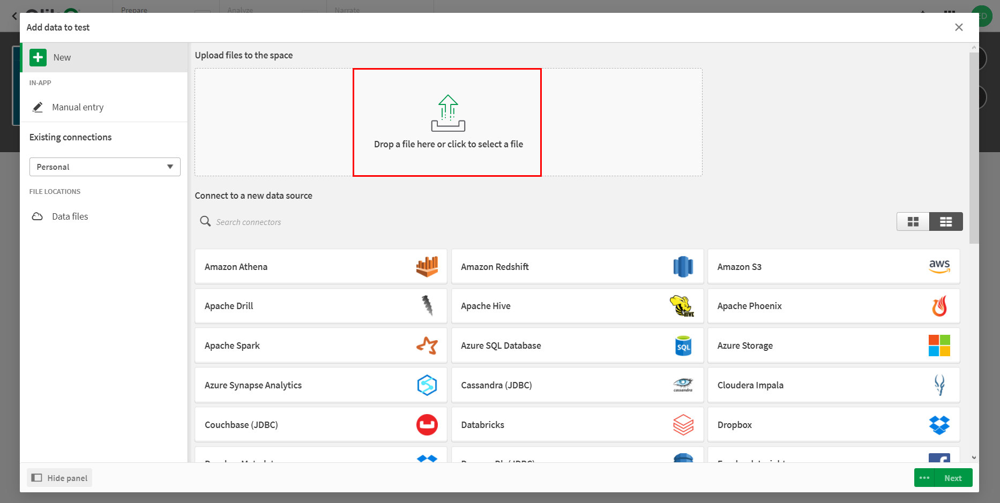
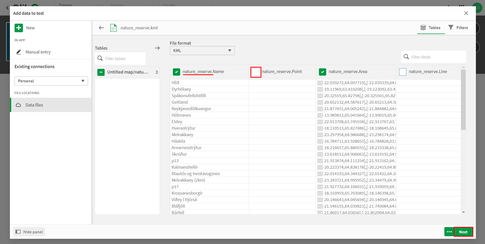
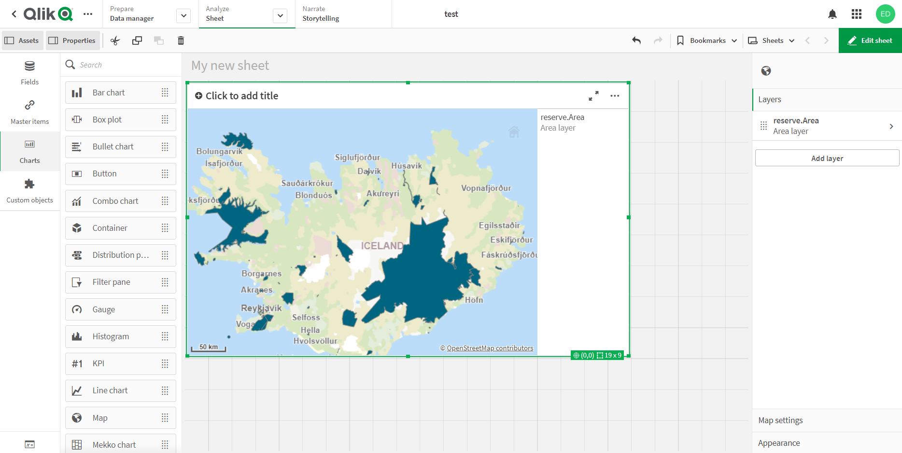

.. _data_qlik:

How to load data into Qlik Sense
===========================

* `Order data <https://data.nextgis.com/en/>`_ for your area of interest, e.g. in GeoJSON format.
* Wait for email with download link, download and unpack archive with data.
* Convert the desired layer or layers to KML format. For conversion, you can use any online converter, for example, `GeoConverter <https://geoconverter.hsr.ch/vector>`_.
* In created Qlik Sense app go to "Data manager" tab and select "Add data from files and other sources".

.. figure:: _static/qlik1.png
   :name: qlik1
   :align: center
   :width: 16cm

* In pop-up window add previously obtained KML file.

* On the next step it is recommended to uncheck the boxes opposite to empty fields and also to rename the fields which have long names. Then click "Next".

   
* After uploading the data you will be redirected to the sheet. Choose "Charts" > "Map" and drag the icon to add a map to the sheet.
 
.. figure:: _static/qlik4.png
   :name: qlik4
   :align: center
   :width: 16cm 

* Select "Layers" > "Add layer" from the menu located on the right side of the map.

.. figure:: _static/qlik5.png
   :name: qlik5
   :align: center
   :width: 16cm
   
* Select the layer type. In this example we are adding polygonal objects, so we select "Area layer". If you want to add a layer with point or line objects, select "Point layer" or "Line layer", respectively.

.. figure:: _static/qlik6.png
   :name: qlik6
   :align: center
   :width: 16cm
   
* In the "Data" > "Dimensions" tab, from the drop-down list, select the field of the loaded layer, which contains information about the coordinates of the objects.

.. figure:: _static/qlik7.png
   :name: qlik7
   :align: center
   :width: 16cm
   
* Layer is added to the map.

   
