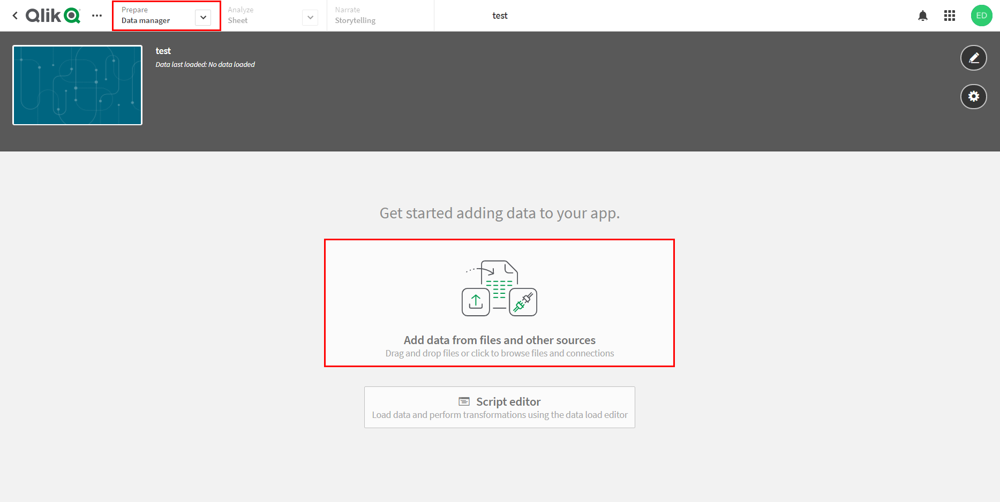
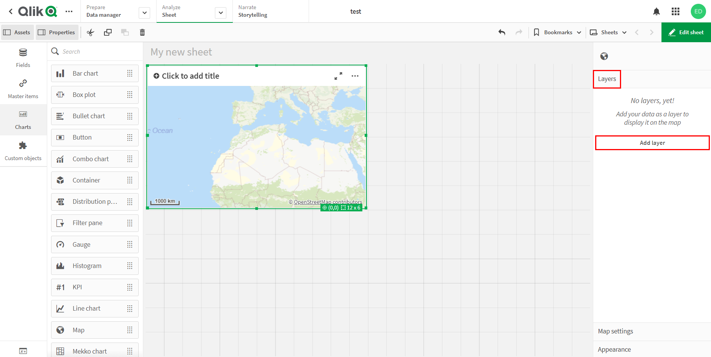

.. _data_qlik:

Как загрузить данные в Qlik Sense
===========================

* `Закажите данные <https://data.nextgis.com/ru/>`_ на интересующую Вас территорию, например, в формате GeoJSON.
* Дождитесь получения результата, скачайте, распакуйте архив с данными.
* Конвертируйте желаемый слой или слои в формат KML. Для конвертации можно воспользоваться любым онлайн конвертером, например, |location_link|.

.. |location_link| raw:: html

   <a href="https://geoconverter.hsr.ch/vector" target="_blank">GeoConverter</a>
* В созданном приложении Qlik Sense перейдите во вкладку «Диспетчер данных» и выберите «Добавьте данные из файлов и других источников».

* В появившемся окне добавьте полученный ранее файл KML.

.. figure:: _static/qlik2.png
   :name: qlik2
   :align: center
   :width: 16cm

* Далее рекомендуется снять галочки напротив пустых полей, а также - переименовать поля со слишком длинным названием. Затем нажмите «Добавить данные».

.. figure:: _static/qlik3.png
   :name: qlik3
   :align: center
   :width: 16cm
   
* После загрузки данных Вы будете перенаправлены на лист. Выберите «Диаграммы» > «Карта» и, потянув за иконку, добавьте карту на лист.
 

* В меню справа от карты выберите «Слои» > «Добавить слой».

   
* Выберите тип добавляемого слоя. В данном примеры мы рассматриваем добавление полигональных объектов, поэтому выбираем «Слой области». Если Вы хотите добавить на карту слой с точечными или линейными объектами, выбирайте «Слой точек» или «Слой линии», соответственно. 

   
* Во вкладке «Данные» > «Измерения» в выпадающем списке выберите поле, содержащее информацию о координатах объектов загружаемого слоя.

   
* Слой добавлен на карту.

.. figure:: _static/qlik8.png
   :name: qlik8
   :align: center
   :width: 16cm

