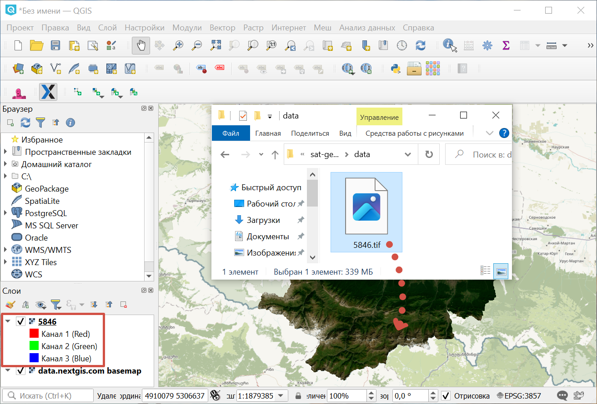

.. sectionauthor:: Юлия Григоренко <grigorenko.j@gmail.com>

.. _data_satellite_qgis:

Как открыть данные космической съемки в QGIS
=====================================

* `Закажите спутниковые данные <https://data.nextgis.com/ru/>`_ на интересующую территорию в формате GeoTIFF.
* Дождитесь получения результата, скачайте, распакуйте архив с данными.
* Скачайте и установите `QGIS <https://qgis.org/en/site/forusers/download.html/>`_ или `NextGIS QGIS <https://nextgis.ru/nextgis-qgis/>`_.
* Запустите QGIS.
* Перетащите из папки с распакованными данными файл с расширением tif в окно проекта.

   Перетаскивание файла спутниковых данных в QGIS

Если необходимо настроить слой при его добавке в QGIS, можно это сделать через меню ``Слой ‣ Добавить слой ‣  Добавить растровый слой``.
