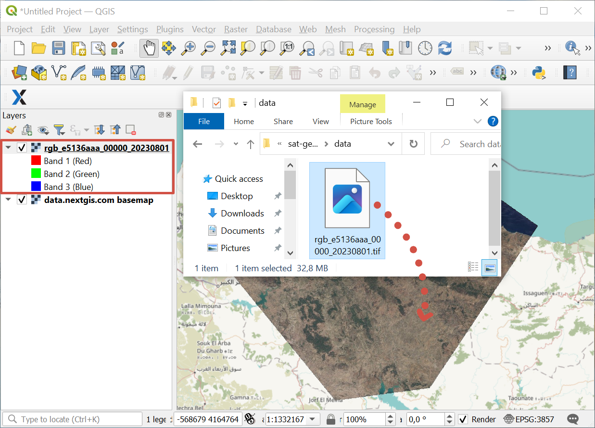

.. sectionauthor:: Юлия Григоренко <grigorenko.j@gmail.com>

.. _data_satellite_qgis:

* `Order satellite data <https://data.nextgis.com/en/>`_ for your area of interest in GeoTIFF format.
* Wait for an email with the download link. Download and unpack the data.
* Download and install `QGIS <https://qgis.org/en/site/forusers/download.html>`_ or `NextGIS QGIS <https://nextgis.com/nextgis-qgis/>`_.
* Launch QGIS.
* Drag and drop the upacked tif file from the folder to QGIS interface.

   Adding satellite data to QGIS

If you need to finetune the new layer, you can add it via menu: ``Layer ‣ Add Layer ‣ Add Raster Layer``.
