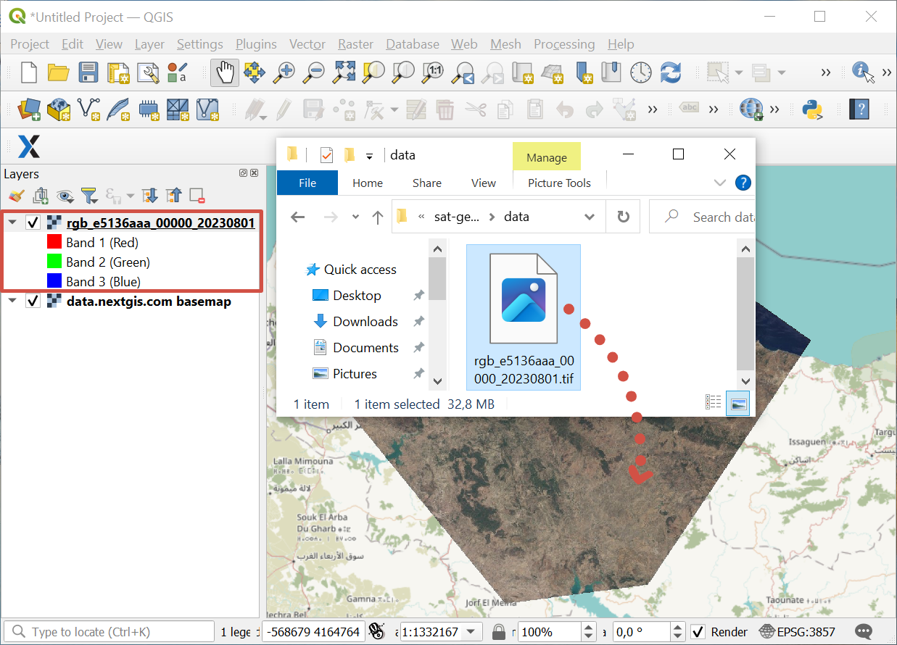

.. _data_satellite_qgis:

How to open satellite data in QGIS
===================================

* `Order satellite data <https://data.nextgis.com/en/>`_ for your area of interest in GeoTIFF format.
* Go to the `orders <https://data.nextgis.com/en/orders/actual/>`_ page and download the archive when it's complete.
* **Unpack** the archive.
* Download and install `QGIS <https://qgis.org/en/site/forusers/download.html>`_.
* Launch QGIS.
* Drag and drop the upacked tif file from the folder to QGIS interface.

   Adding satellite data to QGIS

If you need to finetune the new layer, you can add it via menu: ``Layer ‣ Add Layer ‣ Add Raster Layer``.
