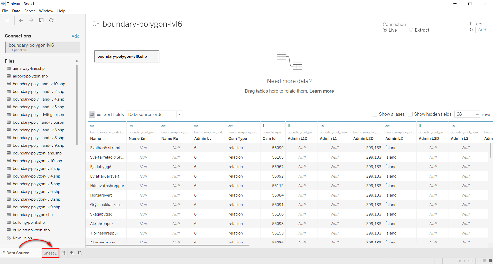

.. _data_tableau:

How to load layer into Tableau
===========================

* `Order data <https://data.nextgis.com/en/>`_ for your area of interest, e.g. in ESRI Shape format.
* Wait for email with download link, download and unpack archive with data.
* Launch Tableau, select "Connect" > "Spatial file" and choose the target layer in pop-up window.

.. figure:: _static/tableau1.png
   :name: tableau1
   :align: center
   :width: 16cm
   
* Data is opened in "Data Source" tab, switch to the worksheet tab ("Sheet 1").

   
* In the "Data" panel find "Geometry" field and drag it onto the workspace.

   
* Layer is loaded into Tableau.

.. figure:: _static/tableau4.png
   :name: tableau4
   :align: center
   :width: 16cm
