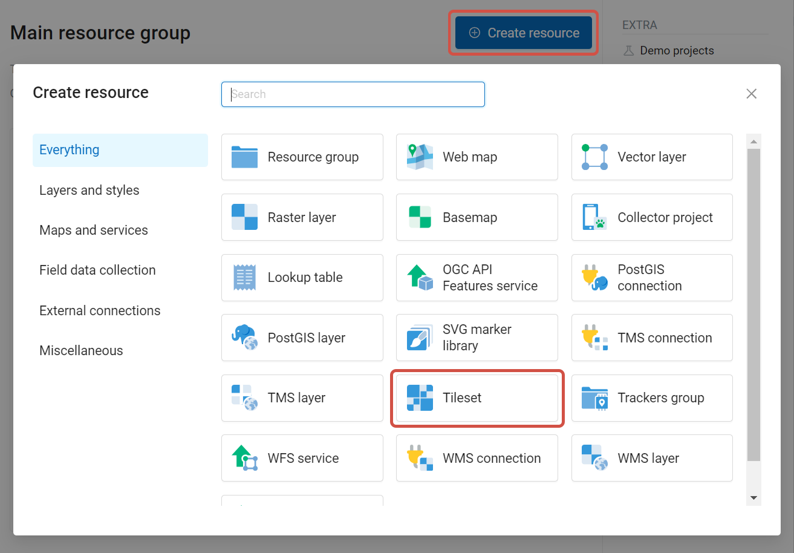

.. _data_tiles_to_ngw:

How to upload Tileset to NextGIS Web 
====================================================

* `Order data <https://data.nextgis.com/?next-product=tiles>`_ for your area of interest in PNG format.
* Go to the `orders <https://data.nextgis.com/en/orders/actual/>`_ page and download the archive when it's complete.
* `Create your Web GIS <https://docs.nextgis.com/docs_ngcom/source/create_webgis.html>`_ or `sign in to it <https://docs.nextgis.com/docs_ngcom/source/create_webgis.html#how-to-sign-in-to-your-web-gis>`_.
* To add a **Tileset**, select a Tileset in the "Create Resource" block of operations.

   Selecting Tileset resource type

Next, you need to enter the name of the tileset, which will be displayed in the administrative web interface.

The "Key" field is optional. On the appropriate tabs, you can add a resource description and metadata. Typically, metadata is used to develop third-party applications using APIs.

In the "Tileset" tab, you need to upload a tileset in a zip archive. Tiles must be in PNG or JPEG format and have a size of 256x256 pixels.

.. figure:: _static/create_tileset_upload_en.png
   :name: Tileset_add_en
   :align: center
   :width: 16cm

   Tileset tab

Click **Create** to complete the process.
