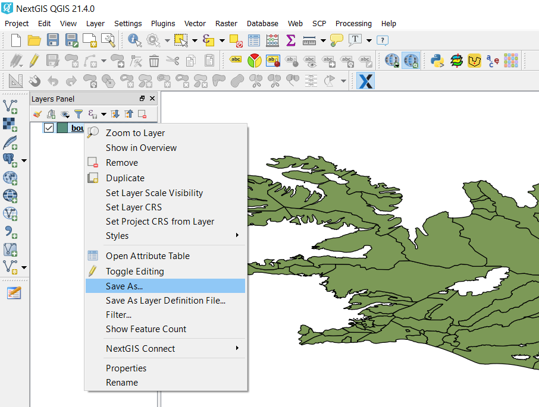
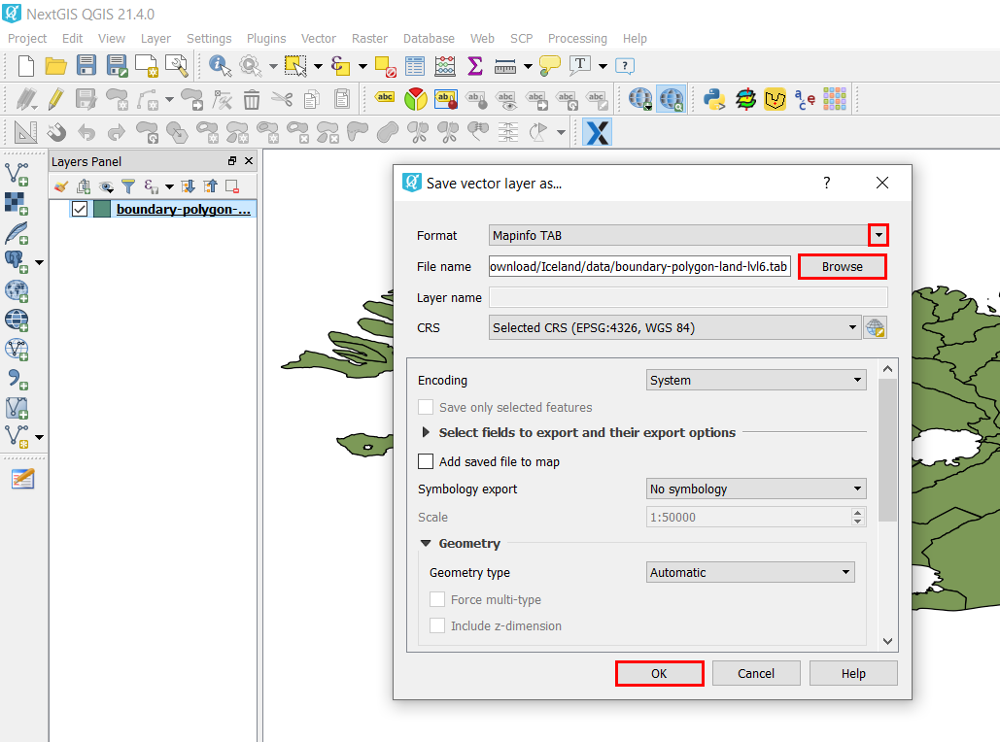
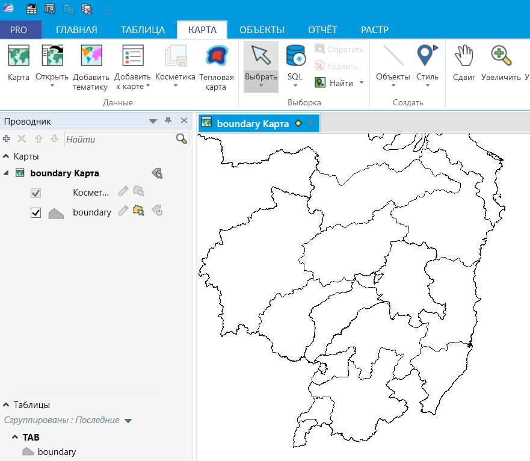

.. _data_type_change:

Как конвертировать файл в другой ГИС-формат
===========================

* `Закажите данные <https://data.nextgis.com/ru/>`_ на интересующую Вас территорию, например, в формате GeoJSON.
* Дождитесь получения результата, скачайте, распакуйте архив с данными.
* Откройте слой, у которого Вы хотите изменить формат, в одной из ГИС (в качестве примера далее рассмотрена работа в `NextGIS QGIS <https://nextgis.ru/nextgis-qgis/>`_).
* Щелкнув правой кнопкой мыши по слою в панели слоев, выберите «Сохранить как…». Таким образом Вы создадите копию слоя, но в желаемом формате.

* В открывшемся окне через выпадающий список выберите ГИС-формат, в котором хотите сохранить слой, а также укажите имя и месторасположение на компьютере нового файла. Подтвердите сохранение нового слоя, нажав на кнопку «ОК».

* Новый слой  будет создан в желаемом ГИС-формате.

