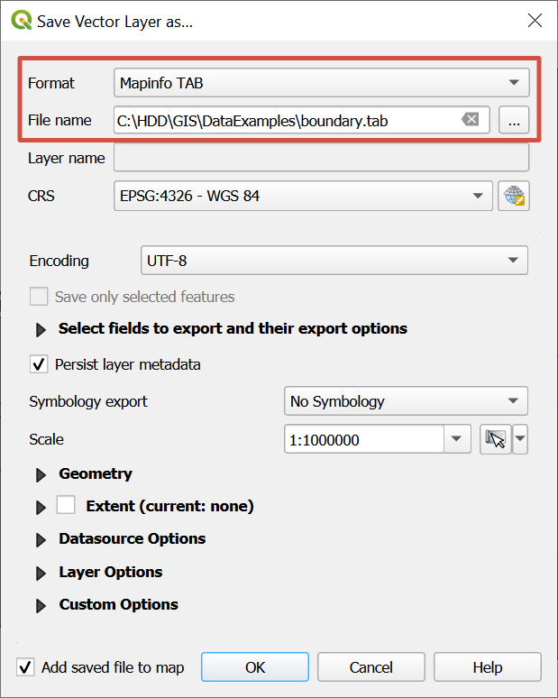

.. _data_type_change:

How to convert file to another GIS format
=========================================

* `Order data <https://data.nextgis.com/en/>`_ for your area of interest, e.g. in GeoJSON format.
* Go to the `orders <https://data.nextgis.com/en/orders/actual/>`_ page and download the archive when it's complete.
* **Unpack** the archive.
* Import target layer, which GIS format you want to change, in `QGIS <https://qgis.org/en/site/forusers/download.html>`_.
* Right-click on a target layer in Layers Panel, select option “Save as…”. Thus you’ll create a copy of the layer, but in desired GIS format.

.. figure:: _static/cs_change_select_save_en.png
   :name: type_change1
   :align: center
   :width: 24cm

* In the pop-up window set a format, a name and a path to a new file. Press “OK”.

* A new layer will be created in the desired GIS format.
