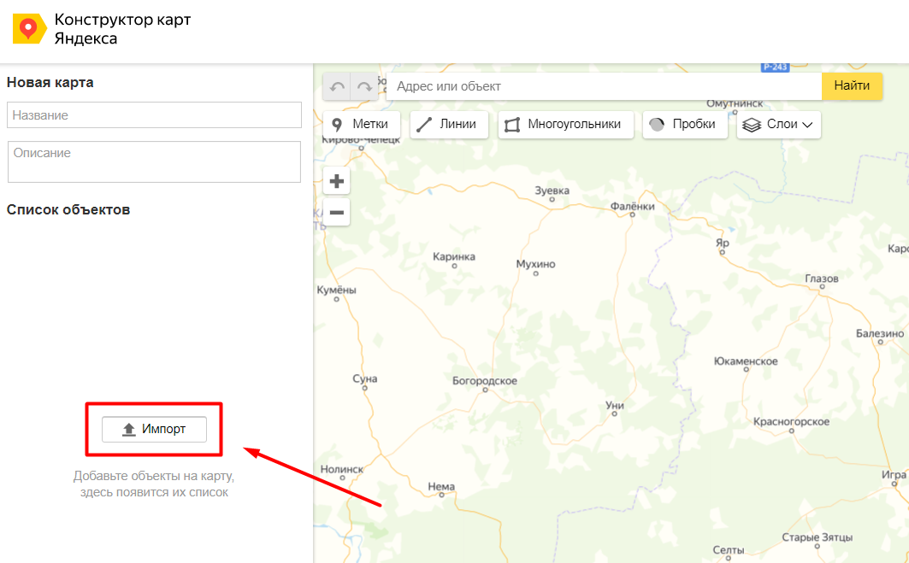
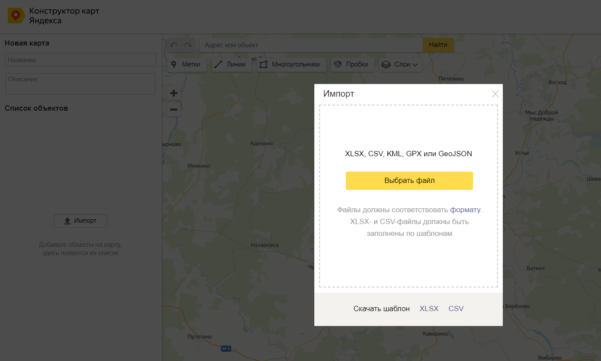
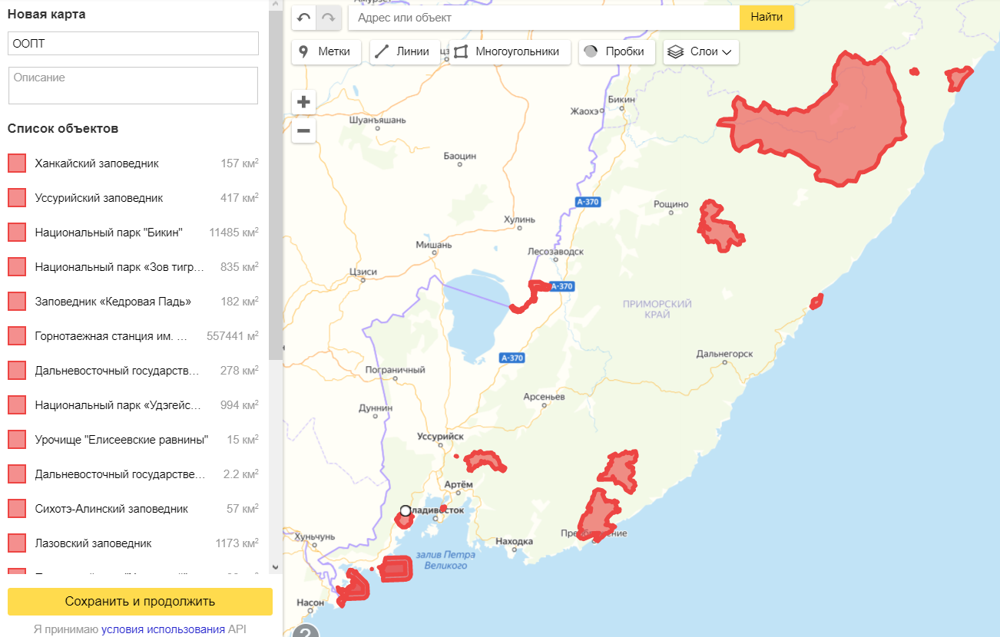

.. _data_yandex_const:

Как загрузить данные на Яндекс карты
===========================

.. note::

   Обратите внимание, что конструктор поддерживает в импортируемых файлах лишь те объекты, которые в состоянии отрисовать самостоятельно.
   Это объекты Point, LineString и Polygon. Описание поддерживаемого формата находится `здесь. <https://yandex.ru/support/maps-builder/concept/markers_5.html#markers_5__GeoJSON_import>`_ **Мультигеометрии** конструктор Яндекс карт **не поддерживает**.

* `Закажите данные <https://data.nextgis.com/ru/>`_ на интересующую Вас территорию в формате GeoJSON.
* Дождитесь получения результата, скачайте, распакуйте архив с данными.
* Импортируйте желаемый слой или слои на карту в сервисе Конструктор карт Яндекса.

* Данные добавлены на карту

