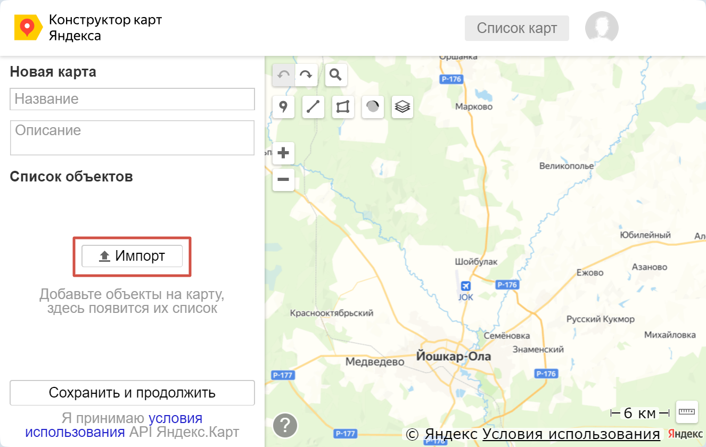
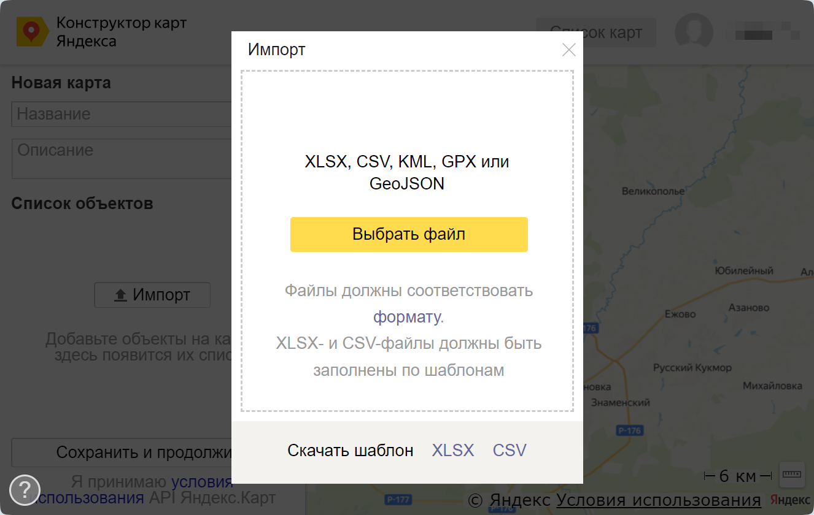
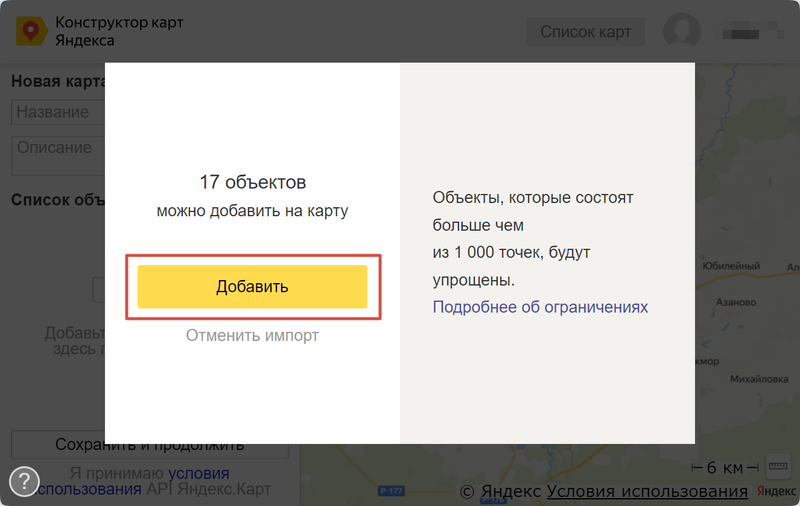
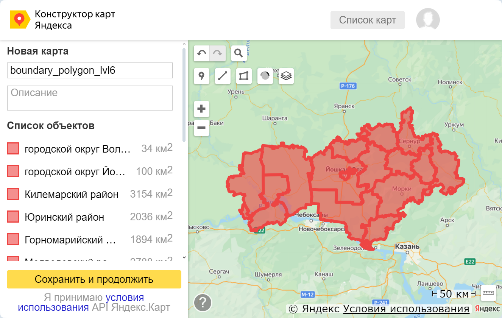

.. _data_yandex_const:

Как загрузить данные на Яндекс карты
===========================

* `Закажите данные <https://data.nextgis.com/ru/>`_ на интересующую Вас территорию в формате GeoJSON.
* Дождитесь получения результата, скачайте, распакуйте архив с данными.
* Импортируйте желаемый слой или слои на карту в сервисе Конструктор карт Яндекса.

* Данные добавлены на карту

   
.. note::

   Конструктор Яндекс карт не умеет рабоать с `мультиполигонами <https://yandex.ru/support/maps-builder/concept/markers_5.html#markers_5__GeoJSON_import>`_, т.е. полигонами которые состоят из нескольких частей.
   Это не проблема данных, это проблема конструктора Яндекс карт.
   Для работы вам может понадобиться разбить мультиполигоны на отдельные полигоны. Как это делать, можно посмотреть `здесь <https://data.nextgis.com/ru/howto/mult_to_polygon/>`_.
