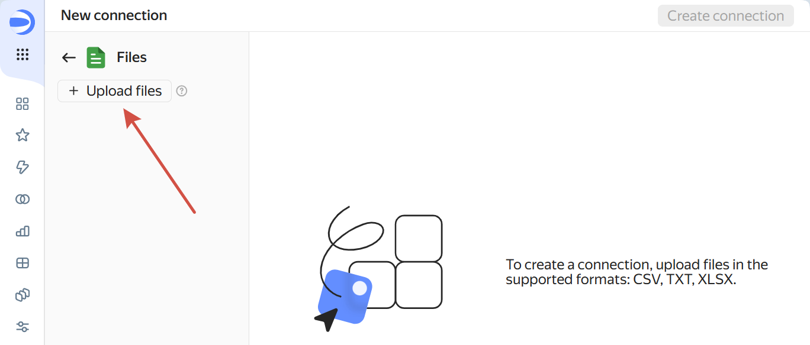
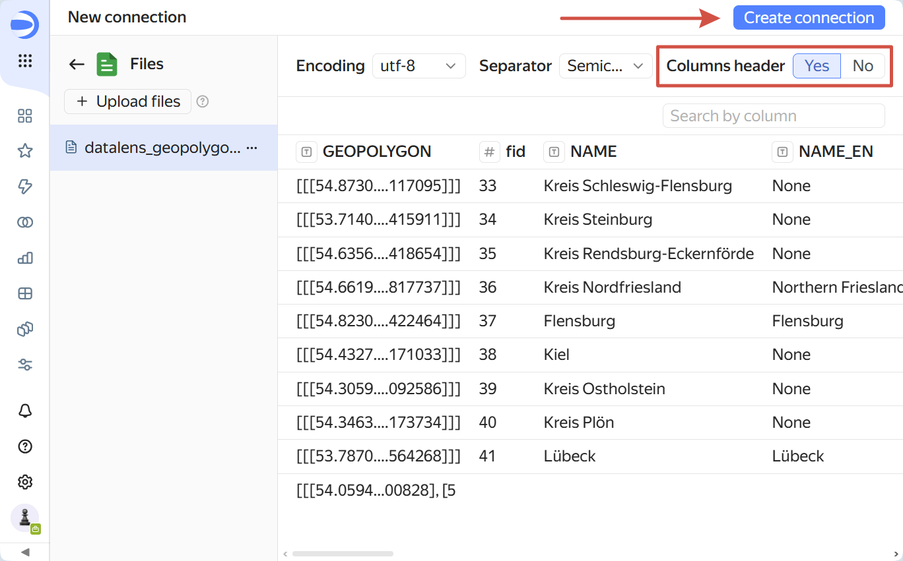
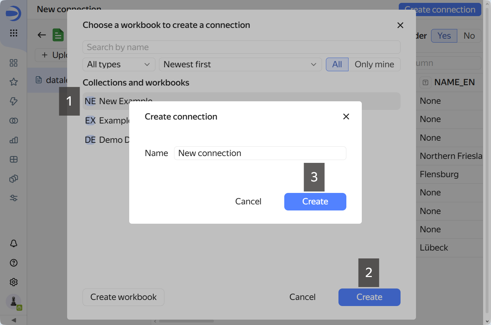
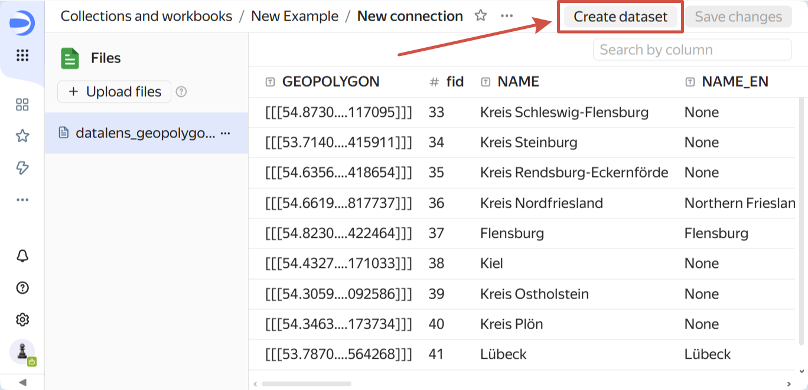
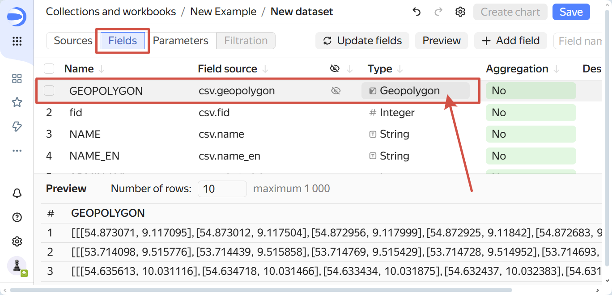
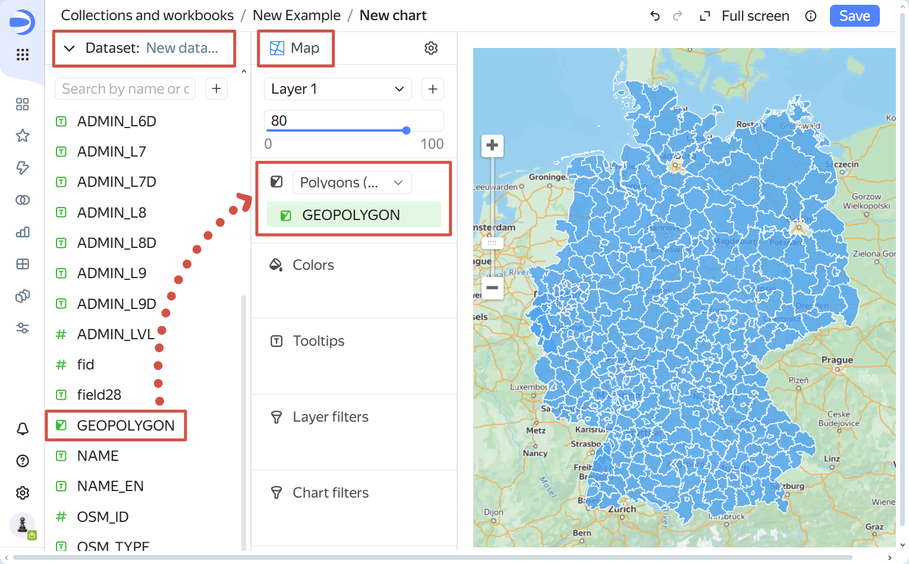
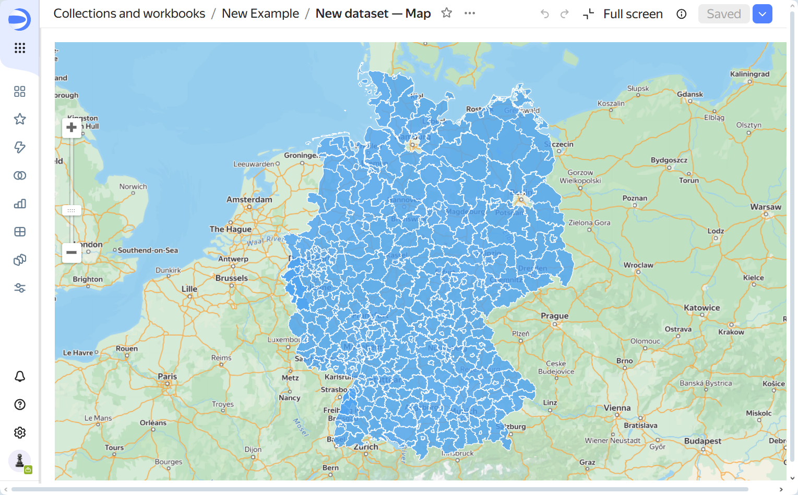

.. _data_yandex_datalens:

How to upload data to Yandex DataLens
=======================================

Prepare the file
----------------

* `Order data <https://data.nextgis.com/en/>`_ for your area of interest, for example in GeoPackage format. Most likely the product you need is the Basemap.
* Go to the `orders <https://data.nextgis.com/en/orders/actual/>`_ page and download the archive when it's complete.
* Select the layer, for example, administrative boundaries of the counties (boundary-polygon-lvl6) or settlements (settlement-point).
* Use the `free online converter <https://toolbox.nextgis.com/operation/vector2datalens>`_  to prepare vector layer for DataLens by converting it to a fitting format. The output of this converter is a CSV file.

Upload to DataLens
--------------------------

1. **Create connection**

On the main page of the `DataLens service <https://datalens.yandex.cloud>`_ click Connections: **Create**. Then select ``Files and services --> Files``.

In the top left corner click **Upload files**.

   Uploading file

After the file is uploaded, click **Create connection** in the top right corner.

.. note::
	Make sure that the "Columns header" is set to "Yes".

   Creating connection

Choose a workbook or create a new one. After selecting a workbook, click **Create**, enter the name for the new connection in the pop-up dialog and click **Create** in that dialog.

   Selecting workbook and entering connection name

2. **Create dataset**

Click **Create dataset** in top right corner and select the connection you've just created. 

   Creating a dataset

Go to the "Fields" tab. For the first field, set the type to *Geopolygon* / *Geopoints* using the dropdown menu.

   Field settings

Click **Save** in the top right corner. Enter a name for the new dataset and save it.

3. **Create a chart**

After the dataset is created, the button **Create chart** in the top right corner becomes active. Click it to create a new chart.

   Creating a chart

Select your **dataset** in the dropdown menu on the left.

In the section to the right use the dropdown menu to select *Map* as the **chart type**.

Below choose the **field type** in the dropdown menu so that it matches the geometry of your layer: **Polygons (Geopolygons)** or **Points (Geopoints)**. 

Drag the Geopolygon/Geopoint field to the "Polygons"/"Points" section to create the visualization.

Click **Create** button in the top right corner. Enter the name for the chart (the default value is 'Dataset name - Map') and save it.

   Resulting map

