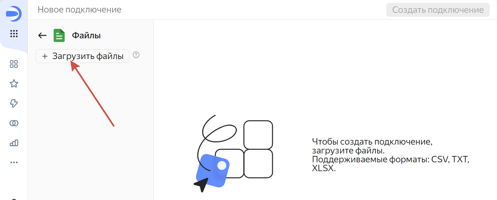
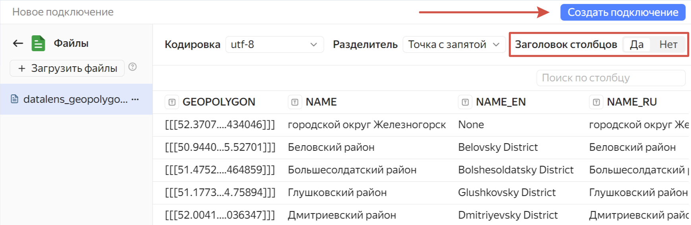
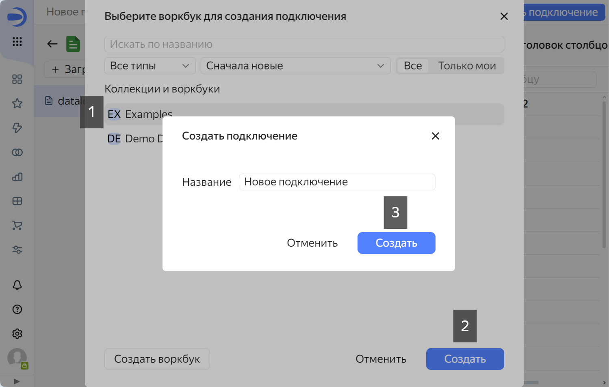
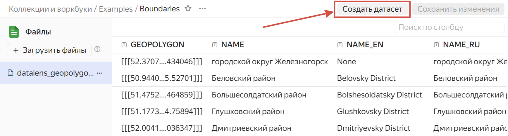
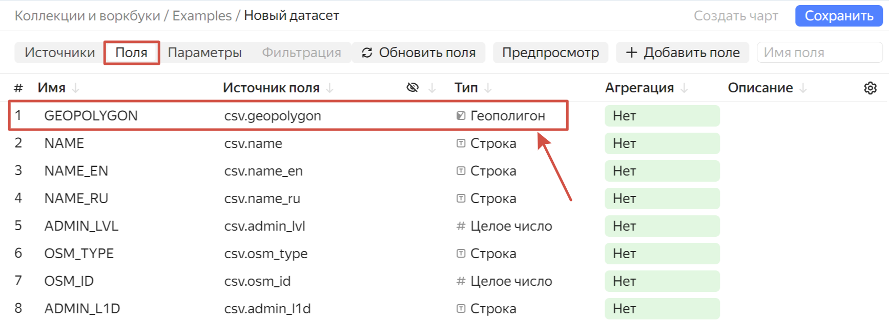
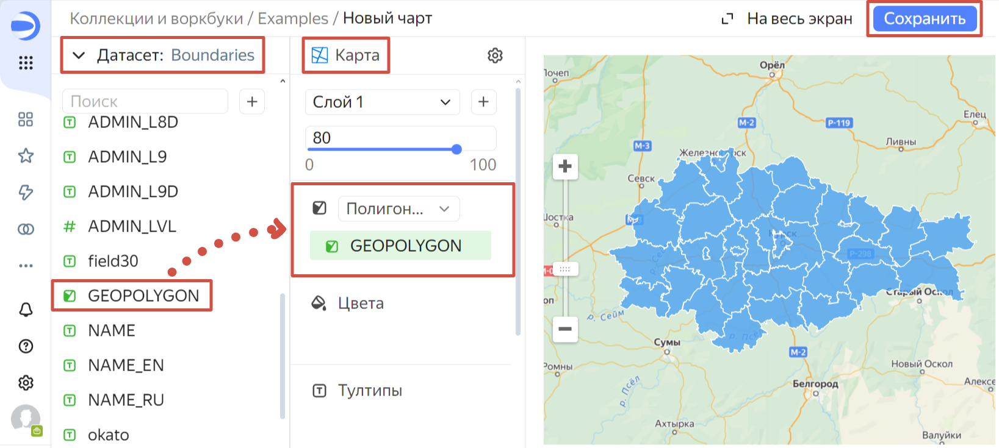
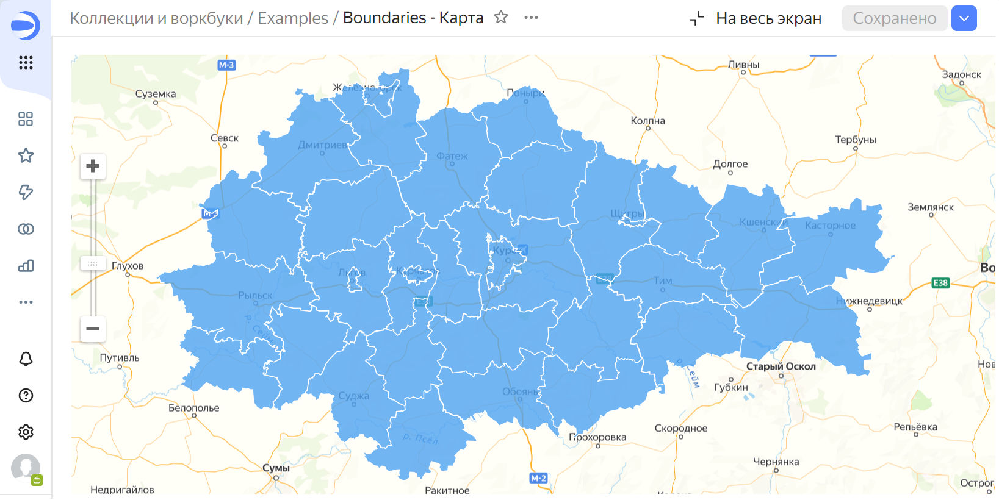

.. _data_yandex_datalens:

Как загрузить данные на Яндекс DataLens
=======================================

Подготовка файла
----------------

* `Закажите данные <https://data.nextgis.com/?next-product=base>`_ на интересующую Вас территорию в формате GeoJSON. Скорее всего вам нужен продукт Базовая карта.
* Дождитесь получения результата, скачайте, распакуйте архив с данными.
* Выберите нужный слой, например муниципальное деление (boundary-polygon-lvl6.geojson) или населенные пункты (settlement-point.geojson).
* Используйте `бесплатный конвертер <https://toolbox.nextgis.com/operation/vector2datalens>`_ "Подготовить векторный слой для DataLens" чтобы сконвертировать слой в формат, подходящий DataLens. На выходе вы получите файл CSV.

Загрузка данных в DataLens
--------------------------

1. **Создайте подключение**

С главной страницы сервиса `DataLens <https://datalens.yandex.cloud>`_ перейдите ``Создать подключение --> Файлы и сервисы --> Файл``

В левом верхнем углу выберите "Загрузить файлы".

   Загрузка файла

Когда файл загрузится, в правом верхнем углу нажмите **Создать подключение**.

.. note::
	Убедитесь, что включена опция "Заголовок столбцов".

   Переход к созданию подключения

Вам будет предложено выбрать вокрбук из существующих или создать новый. Выбрав воркбук, нажмите **Создать**, во всплывающем окне задайте название для нового соединения и нажмите **Создать** уже в нём.

   Выбор воркбука и названия для подключения

2. **Создайте датасет**

В правом верхнем углу нажмите **Создать датасет**.

   Переход к созданию датасета

Укажите созданное подключение. 

Перейдите во вкладку "Поля". Укажите для первого поля тип *Геополигон* (выбирается в выпадающем меню).

   Настройки полей

В верхнем правом углу нажмите **Сохранить**. Задайте имя для датасета и сохраните его.

3. **Создайте чарт**

После сохранения датасета в правом верхнем углу станет активной кнопка **Создать чарт**. нажмите на неё, чтобы перейти на страницу создания чарта (см. :numref:`DL_chart_pic`).

   Страница создания чарта

Выберите **датасет** при помощи выпадающего меню слева.

В поле правее выберите в выпадающем меню **тип чарта** - *карта*

Ниже выберите **тип поля** "Полигоны (Геополигоны)" если делаете карту с полигонами или "Точки (Геоточки)" если делаете карту с точками.

Перетащите поле Geopolygon или Geopoint в секцию "Полигоны/Точки", чтобы построить визуализацию.

Нажмите кнопку **Сохранить** в правом верхнем углу. Задайте название чарта (по умолчанию предлагается "Название датасета - карта") и сохраните.

   Итоговая карта
