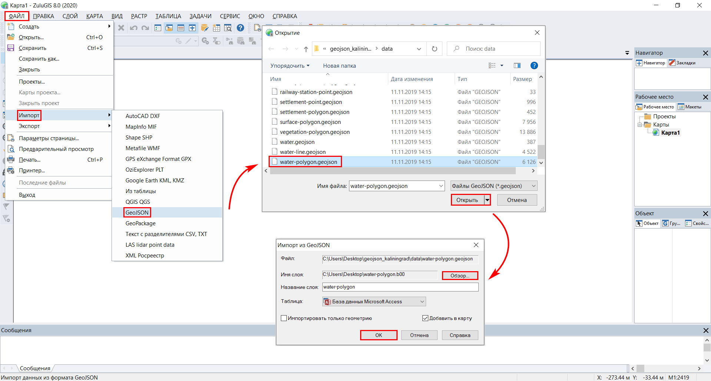
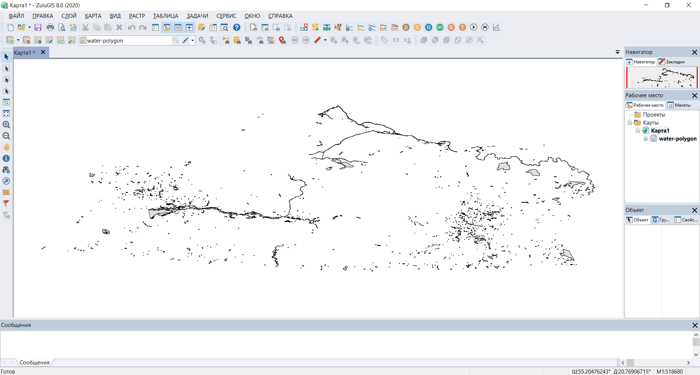

.. _data_zulu:

Как добавить слой в ZuluGIS
===========================

* `Закажите данные <https://data.nextgis.com/ru/>`_ на интересующую Вас территорию в формате GeoJSON.
* Дождитесь получения результата, скачайте, распакуйте архив с данными. 
* Запустите ZuluGIS, нажмите «Файл» > «Импорт» > «GeoJSON». В открывшемся окне выберите желаемый слой, нажмите «Открыть». После этого появится еще одно окно, в нем, с помощью кнопки «Обзор», укажите месторасположение нового слоя (слой GeoJSON будет конвертирован в слой с расширением .b00) и его имя. Нажмите «ОК».

* Слой добавлен на карту

